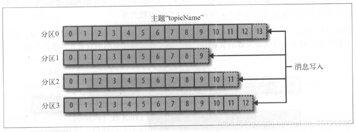

### Java分布式服务器开发面试题

#### 0.操作系统与网络编程

##### 1.内核空间和用户空间、内核态与用户态

###### 1.内核空间和用户空间

​		Linux使用两级保护机制：**0级供内核使用，3级供用户程序使用**。每个进程有各自的私有用户空间（0～3G），这个空间对系统中的其他进程是不可见的。最高的1GB字节虚拟内核空间则为所有进程以及内核所共享。

​		Linux简化了分段机制，使得**虚拟地址与线性地址总是一致**，因此，Linux的虚拟地址空间也为0～4G。Linux内核将这4G字节的空间分为两部分。将最高的1G字节（从虚拟地址0xC0000000到0xFFFFFFFF），供内核使用，称为**“内核空间”**。而将较低的3G字节（从虚拟地址 0x00000000到0xBFFFFFFF），供各个进程使用，称为**用户空间）**。因为每个进程可以通过系统调用进入内核，因此，Linux内核**由系统内的所有进程共享**。于是，从具体进程的角度来看，每个进程可以拥有**4G字节的虚拟空间**。

​		现在操作系统都是采用**虚拟存储器**，那么对 32 位操作系统而言，它的寻址空间（虚拟地址空间，或叫线性地址空间）为 4G（2的32次方）。也就是说一个进程的最大地址空间为 4G。操作系统的核心是内核(kernel)，它独立于普通的应用程序，可以访问受保护的内存空间，也有访问底层硬件设备的所有权限。为了保证保证内核的安全，现在的**操作系统一般都强制用户进程不能直接操作内核**。

​		具实现方式基本都是由操作系统将**虚拟地址空间划分为两部分，一部分为内核空间，一部分为用户空间**。针对 Linux 操作系统而言：

-   最高的 1G 字节(从虚拟地址 0xC0000000 到 0xFFFFFFFF)，**供内核使用，称为内核空间**。
-   而较低的 3G 字节(从虚拟地址 0x00000000 到 0xBFFFFFFF)由**各个进程使用**，称为**用户空间**。

​		**每个进程的 4G 地址空间中，最高 1G 都是一样的，即内核空间。只有剩余的 3G 才归进程自己使用。换句话说就是， 最高 1G 的内核空间是被所有进程共享的！**

###### 2.内核态与用户态

​		当一个任务（进程）执行系统调用而**陷入内核代码中执行时**，我们就称进程**处于内核运行态**（或简称为内核态）。此时处理器处于**特权级最高的（0级）内核代码中执行**。当进程处于内核态时，执行的内核代码会使用**当前进程的内核栈**。**每个进程都有自己的内核栈**。当进程在执行用户自己的代码时，则称其处于**用户运行态（用户态）**。即此时处理器在特权级最低的（3级）用户代码中运行。当正在执行用户程序而**突然被中断程序中断**时，此时用户程序也可以**象征性地称为处于进程的内核态**。因为中断处理程序将使用当前进程的内核栈。这与处于内核态的进程的状态有些类似。

-   **内核态**：cpu可以访问内存的**所有数据**，包括外围设备，例如硬盘，网卡，cpu也可以将自己从一个程序切换到另一个程序。
-   **用户态**：只能**受限的访问内存**，且**不允许访问外围设备**，占用cpu的能力被剥夺，**cpu资源可以被其他程序获取**。

###### 3.为什么要有用户态和内核态？

​		由于需要**限制不同的程序之间的访问能力**, 防止他们获取别的程序的内存数据, 或者获取外围设备的数据, 并发送到网络, CPU划分出两个**权限等级——**用户态和内核态。

​		当在系统中执行一个程序时，大部分时间是**运行在用户态下**的，在其需要操作系统帮助完成一些用户态自己没有特权和能力完成的操作时就会切换到内核态。

###### 4.用户态切换到内核态的3种方式（系统调用，异常，中断）

**（1）系统调用**

​		这是用户态进程**主动要求切换到内核态**的一种方式。用户态进程通过系统调用申请使用操作系统提供的服务程序完成工作。例如**fork（）就是执行了一个创建新进程的系统调用**。系统调用的机制和新是使用了操作系统为用户特别开放的一个中断来实现，如Linux的**int 80h中断**。

**（2）异常**

​		当cpu在执行运行在用户态下的程序时，发生了一些**没有预知的异常**，这时会触发由当前运行进程切换到处理此异常的内核相关进程中，也就是**切换到了内核态**，如**缺页异常**。

**（3）外围设备的中断**

​		当外围设备完成用户请求的操作后，会**向CPU发出相应的中断信号**，这时CPU会暂停执行下一条即将要执行的指令而转到与中断信号对应的处理程序去执行，如果前面执行的指令时用户态下的程序，那么转换的过程自然就会是**由用户态到内核态的切换**。如硬盘读写操作完成，系统会切换到硬盘读写的中断处理程序中执行后边的操作等。

​		这三种方式是系统在运行时由用户态切换到内核态的最主要方式，其中**系统调用可以认为是用户进程主动发起的，异常和外围设备中断则是被动的**。从触发方式上看，切换方式都不一样，但从最终实际完成由用户态到内核态的切换操作来看，步骤有事一样的，都相当于执行了一个中断响应的过程。系统调用实际上**最终是中断机制实现的**，而异常和中断的处理机制基本一致。


##### 2.进程、线程、协程相关

###### 1.进程切换

-   保存**处理机上下文**，包括程序计数器和其他寄存器。
-   更新PCB信息。
-   把进程的PCB移入相应的队列，如就绪、在某事件阻塞等队列。
-   选择另一个进程执行，并更新其PCB。
-   更新内存管理的数据结构。
-   恢复处理机上下文。

###### 2.进程阻塞

​		正在执行的进程，由于期待的某些事件未发生，如请求系统资源失败、等待某种操作的完成、新数据尚未到达或无新工作做等，则**系统将自动执行阻塞(Block)**，使自己由运行状态变为阻塞状态。所以进程的阻塞，是进程自身的一种主动行为，也只有处于运行态的进程（获得CPU），才可能将其转为阻塞状态。当进程进入阻塞状态，是不占用CPU资源的。

###### 3.进程与线程、协程

-   **进程**：具有一定独立功能的程序**关于某个数据集合上的一次运行活动**，进程是系统进行**资源分配的一个独立单位**。
-   **线程**：进程的一个实体,是**CPU调度和分派的基本单位**,它是比进程更小的能独立运行的基本单位.线程自己基本上不拥有系统资源,只拥有一点在运行中必不可少的资源(如程序计数器,一组寄存器和栈),但是它可与同属一个进程的其他的线程共享进程所拥有的全部资源.
-   **协程**：是一种**用户态的轻量级线程**，协程的调度完全由用户控制，属于线程内的用户定义分支。从技术的角度来说，“协程就是你可以暂停执行的函数”。协程拥有自己的**寄存器上下文和栈**。协程调度切换时，将寄存器上下文和栈保存到其他地方，在切回来的时候，恢复先前保存的寄存器上下文和栈，直接操作栈则**基本没有内核切换的开销**，可以**不加锁的访问全局变量**，所以上下文的切换非常快。

###### **4.进程与线程的关系**

​		**一个线程可以创建和撤销另一个线程**; **同一个进程中的多个线程之间可以并发执行**。相对进程而言，线程是一个更加接近于执行体的概念，它可以与同进程中的其他线程共享数据，但拥有自己的**栈空间**，拥有独立的**执行序列**。

​		进程和线程的主要差别在于它们是**不同的操作系统资源管理方式**。进程有**独立的地址空间**，一个进程崩溃后，在保护模式下不会对其它进程产生影响，而线程只是一个进程中的不同执行路径。线程有自己的**堆栈和局部变量**，但线程之间**没有单独的地址空间**，一个线程死掉就等于整个进程死掉，所以多进程的程序要比多线程的程序健壮，但在进程切换时，耗费资源较大，效率要差一些。**但对于一些要求同时进行并且又要共享某些变量的并发操作，只能用线程，不能用进程。**

###### **5.线程与协程的关系**

-   一个线程可以拥有**多个协程**，一个进程也可以单独拥有**多个协程**。
-   线程进程都是**同步机制**，而协程**则是异步**。
-   协程能保留**上一次调用时的状态**，每次过程重入时，就相当于**进入上一次调用的状态**。
-   线程是抢占式，而协程**是非抢占式的**，所以需要用户**自己释放使用权来切换到其他协程**，因此同一时间其实只有一个协程拥有运行权，**相当于单线程的能力**。
-   协程并不是取代线程, 而且**抽象于线程之上**, 线程是**被分割的CPU资源**, 协程是**组织好的代码流程**, 协程需要线程来承载运行, 线程是协程的资源, 但协程不会直接使用线程, **协程直接利用的是执行器(Interceptor)**, 执行器可以关联任意线程或线程池, 可以是当前线程, UI线程, 或新建新程。线程是协程的资源。协程通过Interceptor来间接使用线程这个资源。

 

##### 3.缓存 I/O与I/O多路复用 select、poll、epoll

​		缓存 I/O 又被称作标准 I/O，大多数文件系统的默认 I/O 操作都是缓存 I/O。在 Linux 的缓存 I/O 机制中，操作系统会将 I/O 的数据**缓存在文件系统的页缓存**（ page cache ）中，也就是说，数据会先被拷贝到操作系统内核的缓冲区中，然后才会从操作系统内核的缓冲区拷贝到**应用程序的地址空间**。

###### **1.缓存 I/O 的缺点**

​		数据在传输过程中需要在应用程序地址空间和内核进行多次数据拷贝操作，这些数据拷贝操作所带来的 CPU 以及内存开销是非常大的。

​		例子： 一次IO访问（以read举例），数据会先被拷贝到操作系统**内核的缓冲区**中，然后才会从操作系统内核的缓冲区拷贝到应用程序的地址空间。所以说，当一个read操作发生时，它会经历两个阶段：

-   **等待数据准备** (Waiting for the data to be ready)
-   将数据**从内核拷贝到进程中** (Copying the data from the kernel to the process)

​		因此linux系统产生**五种网络模式**的方案。

-   **阻塞 I/O**（blocking IO）BIO
-   **非阻塞 I/O**（nonblocking IO）NIO
-   **异步 I/O**（asynchronous IO）AIO
-   **I/O 多路复用**（ IO multiplexing）
-   **信号驱动 I/O**（ signal driven IO）

###### **2.阻塞I/O**：

​		一个函数在等待某些事情的返回值的时候会被 **阻塞**. 函数被阻塞的原因有很多: **网络I/O,磁盘I/O,互斥锁**等.事实上 每个函数在运行和使用CPU的时候都**或多或少都会被阻塞**(举个极端的例子来说明为什么对待CPU阻塞要和对待一般阻塞一样的严肃: 比如密码哈希函数 bcrypt, 需要消耗几百毫秒的CPU时间,这已经远远超过了一般的网络或者磁盘请求时间了).

###### **3.异步I/O**：函数在会在某些事情完成之前就返回，仅需在函数中触发这个事情的调用即可，而不再关心执行结果如何

**select、poll、epoll之间的区别**

​		select，poll，epoll都是**IO多路复用的机制**。I/O多路复用就**通过一种机制**，可以监视**多个描述符**，一旦某个描述符就绪（一般是**读就绪或者写就绪**），能够通知程序进行相应的读写操作。**但select，poll，epoll本质上都是同步I/O，因为他们都需要在读写事件就绪后自己负责进行读写，也就是说这个读写过程是阻塞的**，而异步I/O则无需自己负责进行读写，异步I/O的实现会负责**把数据从内核拷贝到用户空间**。

**(1) select==>时间复杂度O(n)**

​		它仅仅知道了，有I/O事件发生了，却并不知道是哪那几个流（可能有一个，多个，甚至全部），我们只能无差别轮询所有流，找出能读出数据，或者写入数据的流，对他们进行操作。所以**select具有O(n)的无差别轮询复杂度**，同时处理的流越多，无差别轮询时间就越长。

**(2) poll==>时间复杂度O(n)**

​		poll本质上和select没有区别，它将用户传入的数组**拷贝到内核空间**，然后查询每个fd对应的设备状态， **但是它没有最大连接数的限制**，原因是它是基于链表来存储的.

**(3) epoll==>时间复杂度O(1)**

​		**epoll可以理解为event poll**，不同于忙轮询和无差别轮询，epoll会把哪个流发生了怎样的I/O事件通知我们。所以我们说epoll实际上是**事件驱动（每个事件关联上fd）**的，此时我们对这些流的操作都是有意义的。**（复杂度降低到了O(1)）**

​		epoll跟select都能提供**多路I/O复用**的解决方案。在现在的Linux内核里有都能够支持，其中epoll是Linux所特有，而select则应该是POSIX所规定，一般操作系统均有实现

**select：**

​		select本质上是通过设置或者检查存放fd标志位的数据结构来进行下一步处理。这样所带来的缺点是：

-   1、 单个进程可监视的fd数量被限制，即能监听端口的大小有限。

      一般来说这个数目和系统内存关系很大，具体数目可以cat /proc/sys/fs/file-max察看。32位机默认是1024个。64位机默认是2048.

-   2、 对socket进行扫描时是线性扫描，即采用轮询的方法，效率较低：

     当套接字比较多的时候，每次select()都要通过遍历FD_SETSIZE个Socket来完成调度,不管哪个Socket是活跃的,都遍历一遍。这会浪费很多CPU时间。如果能给套接字注册某个回调函数，当他们活跃时，自动完成相关操作，那就避免了轮询，这正是epoll与kqueue做的。

-   3、需要维护一个用来存放大量fd的数据结构，这样会使得用户空间和内核空间在传递该结构时复制开销大

**poll：**

​		poll本质上和select没有区别，它将用户传入的数组拷贝到内核空间，然后查询每个fd对应的设备状态，如果设备就绪则在设备等待队列中加入一项并继续遍历，如果遍历完所有fd后没有发现就绪设备，则挂起当前进程，直到设备就绪或者主动超时，被唤醒后它又要再次遍历fd。这个过程经历了多次无谓的遍历。

**它没有最大连接数的限制**，原因是它是基于链表来存储的，但是同样有一个缺点：

1、大量的fd的数组被整体复制于用户态和内核地址空间之间，而不管这样的复制是不是有意义。          

2、poll还有一个特点是“水平触发”，如果报告了fd后，没有被处理，那么下次poll时会再次报告该fd。

**epoll:**

​		epoll有EPOLLLT和EPOLLET两种触发模式，LT是默认的模式，ET是“高速”模式。LT模式下，只要这个fd还有数据可读，每次 epoll_wait都会返回它的事件，提醒用户程序去操作，而在ET（边缘触发）模式中，它只会提示一次，直到下次再有数据流入之前都不会再提示了，无 论fd中是否还有数据可读。所以在ET模式下，read一个fd的时候一定要把它的buffer读光，也就是说一直读到read的返回值小于请求值，或者 遇到EAGAIN错误。还有一个特点是，epoll使用“事件”的就绪通知方式，通过epoll_ctl注册fd，一旦该fd就绪，内核就会采用类似callback的回调机制来激活该fd，epoll_wait便可以收到通知。

**epoll为什么要有EPOLLET触发模式？**

​		如果采用EPOLLLT模式的话，系统中一旦有大量你不需要读写的就绪文件描述符，它们每次调用epoll_wait都会返回，这样会大大降低处理程序检索自己关心的就绪文件描述符的效率.。而采用EPOLLET这种边沿触发模式的话，当被监控的文件描述符上有可读写事件发生时，epoll_wait()会通知处理程序去读写。如果这次没有把数据全部读写完(如读写缓冲区太小)，那么下次调用epoll_wait()时，它不会通知你，也就是它只会通知你一次，直到该文件描述符上出现第二次可读写事件才会通知你！！！**这种模式比水平触发效率高，系统不会充斥大量你不关心的就绪文件描述符**

**epoll的优点：**

-   1、**没有最大并发连接的限制，能打开的FD的上限远大于1024（1G的内存上能监听约10万个端口）**；
-   2、效率提升，不是轮询的方式，不会随着FD数目的增加效率下降。只有活跃可用的FD才会调用callback函数；
    **即Epoll最大的优点就在于它只管你“活跃”的连接，而跟连接总数无关，因此在实际的网络环境中，Epoll的效率就会远远高于select和poll。**
-   3、 内存拷贝，利用mmap()文件映射内存加速与内核空间的消息传递；即epoll使用mmap减少复制开销。

**select、poll、epoll 区别总结：**

-   1、支持一个进程所能打开的最大连接数

    select：单个进程所能打开的最大连接数有FD_SETSIZE宏定义，其大小是32个整数的大小（在32位的机器上，大小就是32*32，同理64位机器上FD_SETSIZE为32*64），当然我们可以对进行修改，然后重新编译内核，但是性能可能会受到影响，这需要进一步的测试。

    poll：poll本质上和select没有区别，但是它没有最大连接数的限制，原因是它是基于链表来存储的

    epoll：虽然连接数有上限，但是很大，1G内存的机器上可以打开10万左右的连接，2G内存的机器可以打开20万左右的连接

-   2、FD剧增后带来的IO效率问题

    select：因为每次调用时都会对连接进行线性遍历，所以随着FD的增加会造成遍历速度慢的“线性下降性能问题”。

    poll：同上

    epoll：因为epoll内核中实现是根据每个fd上的callback函数来实现的，只有活跃的socket才会主动调用callback，所以在活跃socket较少的情况下，使用epoll没有前面两者的线性下降的性能问题，但是所有socket都很活跃的情况下，可能会有性能问题。

-   3、 消息传递方式

    select：内核需要将消息传递到用户空间，都需要内核拷贝动作

    poll：同上

    epoll：epoll通过内核和用户空间共享一块内存来实现的。


**总结：**

**综上，在选择select，poll，epoll时要根据具体的使用场合以及这三种方式的自身特点。**

**1、表面上看epoll的性能最好，但是在连接数少并且连接都十分活跃的情况下，select和poll的性能可能比epoll好，毕竟epoll的通知机制需要很多函数回调。**

**2、select低效是因为每次它都需要轮询。但低效也是相对的，视情况而定，也可通过良好的设计改善** 


##### 4.服务器状态码的含义


​		状态码响应类别的的定义是必须遵守的，后面的两个数字服务器自己DIY也没什么问题

-   **常见状态码举例**：

    **100 Continue**

    初始的请求已经接受，客户应当继续发送请求的其余部分

    **101 Switching Protocols**

    服务器将遵从客户的请求转换到另外一种协议

    

    **200 OK**

    一切正常，对GET和POST请求的应答文档跟在后面

    **201 Created**

    服务器已经创建了文档，Location头给出了它的URL。

    **202 Accepted**

    已经接受请求，但处理尚未完成。

    **203 Non-Authoritative Information**

    文档已经正常地返回，但一些应答头可能不正确，因为使用的是文档的拷贝

    **204 No Content**

    没有新文档，浏览器应该继续显示原来的文档。如果用户定期地刷新页面，而Servlet可以确定用户文档足够新，这个状态代码是很有用的

    **205 Reset Content**

    没有新的内容，但浏览器应该重置它所显示的内容。用来强制浏览器清除表单输入内容

    **206 Partial Content**

    客户发送了一个带有Range头的GET请求，服务器完成了它

    

    **300 Multiple Choices**

    客户请求的文档可以在多个位置找到，这些位置已经在返回的文档内列出。如果服务器要提出优先选择，则应该在Location应答头指明。

    **301 Moved Permanently**

    客户请求的文档在其他地方，新的URL在Location头中给出，浏览器应该自动地访问新的URL。

    **302 Found**

    类似于301，但新的URL应该被视为临时性的替代，而不是永久性的。

    **303 See Other**

    类似于301/302，不同之处在于，如果原来的请求是POST，Location头指定的重定向目标文档应该通过GET提取

    **304 Not Modified**

    客户端有缓冲的文档并发出了一个条件性的请求（一般是提供If-Modified-Since头表示客户只想比指定日期更新的文档）。服务器告诉客户，原来缓冲的文档还可以继续使用。

    **305 Use Proxy**

    客户请求的文档应该通过Location头所指明的代理服务器提取

    **307 Temporary Redirect**

    和302（Found）相同。许多浏览器会错误地响应302应答进行重定向，即使原来的请求是 POST，即使它实际上只能在POST请求的应答是303时才能重定向。由于这个原因，HTTP 1.1新增了307，以便更加清除地区分几个状态代码： 当出现303应答时，浏览器可以跟随重定向的GET和POST请求；如果是307应答，则浏览器只能跟随对GET请求的重定向。

    

    **400 Bad Request**

    请求出现语法错误。

    **401 Unauthorized**

    客户试图未经授权访问受密码保护的页面。应答中会包含一个WWW-Authenticate头，浏览器据此显示用户名字/密码对话框，然后在填写合适的Authorization头后再次发出请求。

    **403 Forbidden**

    资源不可用。没有权限访问资源

    **404 Not Found**

    无法找到指定位置的资源

    **405 Method Not Allowed**

    请求方法（GET、POST、HEAD、Delete、PUT、TRACE等）对指定的资源不适用。用来访问本页面的 HTTP 谓词不被允许（方法不被允许） 

    **406 Not Acceptable**

    指定的资源已经找到，但它的MIME类型和客户在Accpet头中所指定的不兼容

    **407 Proxy Authentication Required**

    类似于401，表示客户必须先经过代理服务器的授权。

    **408 Request Timeout**

    在服务器许可的等待时间内，客户一直没有发出任何请求。客户可以在以后重复同一请求。

    **409 Conflict**

    通常和PUT请求有关。由于请求和资源的当前状态相冲突，因此请求不能成功。

    **410 Gone**

    所请求的文档已经不再可用，而且服务器不知道应该重定向到哪一个地址。它和404的不同在于，返回407表示文档永久地离开了指定的位置，而404表示由于未知的原因文档不可用。

    **411 Length Required**

    服务器不能处理请求，除非客户发送一个Content-Length头。

    **412 Precondition Failed**

    请求头中指定的一些前提条件失败

    **413 Request Entity Too Large**

    目标文档的大小超过服务器当前愿意处理的大小。如果服务器认为自己能够稍后再处理该请求，则应该提供一个Retry-After头

    **414 Request URI Too Long**

    URI太长

    **416 Requested Range Not Satisfiable**

    服务器不能满足客户在请求中指定的Range头

    

    **500 Internal Server Error**

    服务器遇到了意料不到的情况，不能完成客户的请求

    **501 Not Implemented**

    服务器不支持实现请求所需要的功能。例如，客户发出了一个服务器不支持的PUT请求

    **502 Bad Gateway**

    服务器作为网关或者代理时，为了完成请求访问下一个服务器，但该服务器返回了非法的应答

    **503 Service Unavailable**

    服务器由于维护或者负载过重未能应答。例如，Servlet可能在数据库连接池已满的情况下返回503。服务器返回503时可以提供一个Retry-After头
    
    **504 Gateway Timeout**
    
    由作为代理或网关的服务器使用，表示不能及时地从远程服务器获得应答
    
    **505 HTTP Version Not Supported**
    
    服务器不支持请求中所指明的HTTP版本


##### 5.SQL注入及其解决方案

###### 1.**sql注入是如何产生的？**

-   1.web开发人员**无法保证所有的输入都已经过滤**。
-   2.攻击者利用发送给sql服务器的输入数据**构造可执行代码**。
-   3.数据库**未作相应的安全配置**（对web应用设置特定的数据库账号，而不使用root或管理员账号，特定数据库账号给予一些简单操作的权限，**回收一些类似drop的操作权限**）。

###### 2.**sql注入攻击防御**

-   使用**参数筛选语句（类型格式检查，过滤特殊符号）**

    ​		为了防止SQL注入，用户输入**不能直接嵌入到SQL语句中**。相反，用户输入必须**被检查或过滤**。

    ​		如果你的SQL语句是类似where id={$id}这种形式，数据库里所有的id都是数字，那么就应该在SQL被执行前，**检查确保变量id是int类型**；如果是接受邮箱，那就应该检查并严格确保变量**一定是邮箱的格式**，其他的类型比如日期、时间等也是一个道理。总结起来：只要是有固定格式的变量，在SQL语句执行前，应该**严格按照固定格式去检查**，确保变量是我们预想的格式，这样很大程度上**可以避免SQL注入攻击**。

    ​		文章发布系统，评论系统等**必须要允许用户提交任意字符串的场景**，这就需要采用过滤等其他方案了。对于无法确定固定格式的变量，一定要进行**特殊符号过滤**或**转义处理**。

-   **绑定变量，使用预编译语句**

    ​		MySQL的**mysqli驱动**提供了预编译语句的支持，不同的程序语言，都分别有使用预编译语句的方法

    　　实际上，绑定变量使用预编译语句是**预防SQL注入的最佳方式**，使用预编译的SQL语句语义不会发生改变，在SQL语句中，变量用问号?表示，黑客即使本事再大，也**无法改变SQL语句的结构**

-   **避免使用解释程序**，这是黑客用来**执行非法命令的手段**。

-   **使用专业的漏洞扫描工具**。

    ​		但是，防范SQL注入攻击是不够的。攻击者现在自动搜索和攻击目标。它的技术甚至可以很容易地应用于其他Web体系结构中的漏洞。企业应该投资于专业的漏洞扫描工具，如著名的Accunetix网络漏洞扫描程序。完美的漏洞扫描器不同于网络扫描器，它专门在网站上查找SQL注入漏洞。最新的漏洞扫描程序可以找到最新发现的漏洞。

###### 3.具体措施

-   **1.（简单又有效的方法）PreparedStatement预编译语句集**

```Java
采用预编译语句集，它内置了处理SQL注入的能力，只要使用它的setXXX方法传值即可。

使用好处：

(1)代码的可读性和可维护性.

(2)PreparedStatement尽最大可能提高性能.

(3)最重要的一点是极大地提高了安全性.

原理：

sql注入只对sql语句的准备(编译)过程有破坏作用

而PreparedStatement已经准备好了,执行阶段只是把输入串作为数据处理,

而不再对sql语句进行解析,准备,因此也就避免了sql注入问题. 
```

-   **2.使用正则表达式过滤传入的参数**

```Java
要引入的包：

import java.util.regex.*;

正则表达式：

private String CHECKSQL = “^(.+)\\sand\\s(.+)|(.+)\\sor(.+)\\s$”;

判断是否匹配：

Pattern.matches(CHECKSQL,t	argerStr);
```

-   **3.字符串过滤**

```Java
比较通用的一个方法：

（||之间的参数可以根据自己程序的需要添加）

public static boolean sql_inj(String str){

String inj_str = "'|and|exec|insert|select|delete|update|

count|*|%|chr|mid|master|truncate|char|declare|;|or|-|+|,";

String inj_stra[] = split(inj_str,"|");
```


##### 6.TCP的拥塞控制机制是什么？请简单说说。

​			TCP通过一个**定时器**（timer）采样了**RTT并计算RTO**，但是，如果网络上的延时突然增加，那么，TCP对这个事做出的应对只有重传数据，然而重传会导致**网络的负担更重**，于是会导致**更大的延迟以及更多的丢包**，这就导致了恶性循环，最终形成“网络风暴” —— TCP的拥塞控制机制就是用于应对这种情况。


​		首先需要了解一个概念，为了在发送端调节所要发送的数据量，定义了一个“**拥塞窗口**”（Congestion Window），在发送数据时，将拥塞窗口的大小与接收端ack的窗口大小做比较，取较小者作为发送数据量的上限。

-   **TCP的四种拥塞控制算法**
    1.慢启动
    2.拥塞控制
    3.快重传
    4.快恢复

-   1.慢启动：意思是刚刚加入网络的连接，一点一点地提速，不要一上来就把路占满。
    连接建好的开始先初始化cwnd = 1，表明可以传一个MSS大小的数据。
    每当收到一个ACK，cwnd++; 呈线性上升
    每当过了一个RTT，cwnd = cwnd*2; 呈指数让升
    阈值ssthresh（slow start threshold），是一个上限，当cwnd >= ssthresh时，就会进入“拥塞避免算法”
-   2.拥塞避免：当拥塞窗口 cwnd 达到一个阈值时，窗口大小不再呈指数上升，而是以线性上升，避免增长过快导致网络拥塞。
    每当收到一个ACK，cwnd = cwnd + 1/cwnd
    每当过了一个RTT，cwnd = cwnd + 1
    拥塞发生：当发生丢包进行数据包重传时，表示网络已经拥塞。分两种情况进行处理：
    等到RTO超时，重传数据包
    sshthresh = cwnd /2
    cwnd 重置为 1
-   3.进入慢启动过程
    在收到3个duplicate ACK时就开启重传，而不用等到RTO超时
    sshthresh = cwnd = cwnd /2
    进入快速恢复算法——Fast Recovery
-   4.快速恢复：至少收到了3个Duplicated Acks，说明网络也不那么糟糕，可以快速恢复。
    cwnd = sshthresh + 3 * MSS （3的意思是确认有3个数据包被收到了）
    重传Duplicated ACKs指定的数据包
    如果再收到 duplicated Acks，那么cwnd = cwnd +1
    如果收到了新的Ack，那么，cwnd = sshthresh ，然后就进入了拥塞避免的算法了。


##### 7.CSRF攻击

###### 1.CSRF是什么？

　　CSRF（Cross-site request forgery），中文名称：**跨站请求伪造**，也被称为：one click attack/session riding，缩写为：CSRF/XSRF。

###### 2.CSRF可以做什么？

　　你这可以这么理解CSRF攻击：攻击者盗用了你的身份，以你的名义发送恶意请求。CSRF能够做的事情包括：以你名义发送邮件，发消息，盗取你的账号，甚至于购买商品，虚拟货币转账......造成的问题包括：个人隐私泄露以及财产安全。

###### 3.CSRF攻击思路

​		要完成一次CSRF攻击，受害者必须依次完成两个步骤：

　　1.登录受信任网站A，并在本地生成Cookie。

　　2.在不登出A的情况下，访问危险网站B。

###### 4.**CSRF的防御**

​		服务端的CSRF方式方法很多样，但总的思想都是一致的，就是在客户端页面增加伪随机数。

　　(1).Cookie Hashing(所有表单都包含同一个伪随机值)：

　　这可能是最简单的解决方案了，因为攻击者不能获得第三方的Cookie(理论上)，所以表单中的数据也就构造失败了:>

​		(2).验证码

　　这个方案的思路是：每次的用户提交都需要用户在表单中填写一个图片上的随机字符串，厄....这个方案可以完全解决CSRF，但个人觉得在易用性方面似乎不是太好，还有听闻是验证码图片的使用涉及了一个被称为MHTML的Bug，可能在某些版本的微软IE中受影响。

　　(3).One-Time Tokens(不同的表单包含一个不同的伪随机值)

　　在实现One-Time Tokens时，需要注意一点：就是“并行会话的兼容”。如果用户在一个站点上同时打开了两个不同的表单，CSRF保护措施不应该影响到他对任何表单的提交。考虑一下如果每次表单被装入时站点生成一个伪随机值来覆盖以前的伪随机值将会发生什么情况：用户只能成功地提交他最后打开的表单，因为所有其他的表单都含有非法的伪随机值。必须小心操作以确保CSRF保护措施不会影响选项卡式的浏览或者利用多个浏览器窗口浏览一个站点。

#### 1.Linux服务器面试题

​		**Unix和Linux有什么区别**

​		Linux是一套免费使用和自由传播的**类Unix**操作系统，是一个**基于POSIX和Unix**的**多用户、多任务、支持多线程和多CPU**的操作系统。它能运行**主要的Unix工具软件**、**应用程序和网络协议**。它支持32位和64位硬件。Linux继承了Unix以网络为核心的设计思想，是一个性能稳定的多用户网络操作系统。

​		Linux和Unix都是功能强大的操作系统，都是应用广泛的服务器操作系统，有很多相似之处，甚至有一部分人错误地认为Unix和Linux操作系统是一样的，然而，事实并非如此，以下是两者的区别。

- **开源性**：Linux是一款开源操作系统，不需要付费，即可使用；Unix是一款对源码实行知识产权保护的传统商业软件，使用需要**付费授权使用**。
- **跨平台性**：Linux操作系统具有**良好的跨平台性能**，可运行在多种硬件平台上；Unix操作系统跨平台性能较弱，大多需与**硬件配套使用**。
- **可视化界面**：Linux除了进行命令行操作，还有**窗体管理系统**；Unix只是**命令行下的系统**。
- **硬件环境**：Linux操作系统**对硬件的要求较低**，安装方法更易掌握；Unix对硬件**要求比较苛刻**，按照难度较大。
- **用户群体**：Linux的用户群体很广泛，**个人和企业**均可使用；Unix的用户群体比较窄，多是安全性要求高的大型企业使用，如**银行、电信部门**等，或者Unix硬件厂商使用，如Sun等。

​       相比于Unix操作系统，Linux操作系统更受广大计算机爱好者的喜爱，主要原因是Linux操作系统具有Unix操作系统的全部功能，并且能够在普通PC计算机上实现全部的Unix特性，开源免费的特性，更容易普及使用！


##### 1.Linux 内核结构

###### **1.Linux 系统内核**

​		内核控制着计算机系统上的所有硬件和软件，在必要时分配硬件，并根据需要执行软件。

1. **系统内存管理**
2. **应用程序管理**
3. **硬件设备管理**
4. **文件系统管理**

###### **2.Linux的基本组件**

​		就像任何其他典型的操作系统一样，Linux拥有所有这些组件：**内核，shell和GUI**，系统实用程序和应用程序。Linux比其他操作系统更具优势的是每个方面都附带其他功能，所有代码都可以免费下载。

###### **3.Linux 的体系结构**

- 用户空间(User Space) ：用户空间又包括用户的**应用程序**(User Applications)、**C 库**(C Library) 。
- 内核空间(Kernel Space) ：内核空间又包括**系统调用接口**(System Call Interface)、**内核**(Kernel)、平台架构相关的代码(Architecture-Dependent Kernel Code) 。

###### **4.为什么 Linux 体系结构要分为用户空间和内核空间**

1、现代 CPU 实现了**不同的工作模式**，不同模式下 CPU 可以执行的指令和访问的寄存器不同。

2、Linux 从 CPU 的角度出发，为了保护内核的安全，把系统分成了两部分。

​		用户空间和内核空间是程序执行的**两种不同的状态**，我们可以通过两种方式**完成用户空间到内核空间的转移**：	1）系统调用；2）硬件中断。BASH和DOS之间的基本区别是什么？

###### **5.BASH和DOS控制台之间的主要区别在于3个方面：**

- BASH命令**区分大小写**，而DOS命令**则不区分**;
- 在BASH下，/ character是目录分隔符，\作为转义字符。在DOS下，/用作命令参数分隔符，\是目录分隔符
- DOS遵循命名文件中的约定，即8个字符的文件名后跟一个点，扩展名为3个字符。BASH没有遵循这样的惯例。


##### 2.Linux常见问题

###### **1.Linux 使用的进程间通信方式？**

- 1、**管道**(pipe)、流管道(s_pipe)、有名管道(FIFO)。管道的实质是一个内核缓冲区，管道的作用正如其名，需要通信的两个进程在管道的两端，进程利用管道传递信息。管道对于管道两端的进程而言，就是一个文件，但是这个文件比较特殊，它不属于文件系统并且只存在于内存中。
- 2、**信号**(signal) 。信号是软件层次上对中断机制的一种模拟，是一种异步通信方式，进程不必通过任何操作来等待信号的到达。信号可以在用户空间进程和内核之间直接交互，内核可以利用信号来通知用户空间的进程发生了哪些系统事件。
- 3、**消息队列**。消息队列是消息的链表,具有特定的格式,存放在内存中并由消息队列标识符标识，并且允许一个或多个进程向它写入与读取消息
- 4、**共享内存**。使得多个进程可以可以直接读写同一块内存空间，是针对其他通信机制运行效率较低而设计的。需要注意的是：共享内存并未提供同步机制，在一个进程结束对共享内存的写操作之前，并无自动机制可以阻止另二个进程开始对它进行读取。所以，我们通常需要用其他的机制来同步对共享内存的访问。
- 5、**信号量**。信号量实质上就是一个标识可用资源数量的计数器，它的值总是非负整数。而只有0和1两种取值的信号量叫做二进制信号量（或二值信号量），可用用来标识某个资源是否可用。
- 6、**套接字**(socket) 。套接字是更为基础的进程间通信机制，与其他方式不同的是，**套接字可用于不同机器之间的进程间通信**。有两种类型的套接字：基于文件的和面向网络的。(1)面向连接的套接字(SOCK_STREAM)：进行通信前必须建立一个连接，面向连接的通信提供序列化的、可靠地和不重复的数据交付，而没有记录边界。**实现这种连接类型的主要协议是传输控制协议(TCP)**。(2)无连接的套接字(SOCK_DGRAM)：在通信开始之前并不需要建立连接，在数据传输过程中并无法保证它的顺序性、可靠性或重复性。**实现这种连接类型的主要协议是用户数据报协议(UDP)。**

###### 2.什么是 inode ？

​		一般来说，面试不会问 inode 。但是 inode 是一个重要概念，是理解 Unix/Linux 文件系统和硬盘储存的基础。理解inode，要从文件储存说起。文件储存在硬盘上，硬盘的最小存储单位叫做"扇区"（Sector）。每个扇区储存512字节（相当于0.5KB）。

​		操作系统读取硬盘的时候，不会一个个扇区地读取，这样效率太低，而是一次性连续读取多个扇区，即一次性读取一个"块"（block）。这种由多个扇区组成的"块"，是文件存取的最小单位。"块"的大小，最常见的是4KB，即连续八个 sector组成一个 block。文件**数据都储存在"块"中**，那么很显然，我们还必须找到一个地方储存**文件的元信息**，比如文件的创建者、文件的创建日期、文件的大小等等。这种储存文件元信息的区域就叫做inode，中文译名为"**索引节点**"。

###### 3.什么是硬链接和软链接？

**1）硬链接**

​		由于 Linux 下的文件是通过**索引节点(inode)来识别文件**，硬链接可以认为是一个指针，指向文件索引节点的指针，系统并不为它重新分配 inode 。每添加一个一个硬链接，文件的链接数就加 1 。

​		不足：1）不可以在不同文件系统的文件间建立链接；2）只有超级用户才可以为目录创建硬链接。

**2）软链接**

​		软链接克服了硬链接的不足，没有任何文件系统的限制，**任何用户可以创建指向目录的符号链接**。因而现在更为广泛使用，它具有更大的灵活性，甚至可以跨越不同机器、不同网络对文件进行链接。

- 不足：因为链接文件包含有原文件的路径信息，所以当原文件从一个目录下移到其他目录中，再访问链接文件，系统就找不到了，而硬链接就没有这个缺陷，你想怎么移就怎么移；还有它要系统分配额外的空间用于建立新的索引节点和保存原文件的路径。

**实际场景下，基本是使用软链接。**总结区别如下：

- 硬链接不可以跨分区，软件链可以跨分区。
- 硬链接指向一个 inode 节点，而软链接则是创建一个新的 inode 节点。
- 删除硬链接文件，**不会删除原文件**，删除软链接文件，**会把原文件删除**。  
  

###### 4.什么叫 CC 攻击？什么叫 DDOS 攻击？

- CC （Challenge Collapsar）攻击，主要是用来**攻击页面**的，模拟多个用户不停的对你的页面进行访问，从而使你的系统资源消耗殆尽。

- DDOS 攻击，中文名叫**分布式拒绝服务攻击**，指借助服务器技术将多个计算机联合起来作为攻击平台，来对一个或多个目标发动 DDOS 攻击。

    **怎么预防 CC 攻击和 DDOS 攻击？**

    防 CC、DDOS 攻击，这些只能是用硬件防火墙做流量清洗，将攻击流量引入黑洞。

###### **5.什么是网站SQL注入**

​		由于程序员的水平及经验参差不齐，大部分程序员在编写代码的时候，没有对用户输入数据的合法性进行判断。应用程序存在安全隐患。用户可以**提交一段数据库查询代码**，根据程序返回的结果，获得某些他想得知的数据，这就是所谓的 **SQL 注入**。
​		SQL注入，是从正常的 WWW 端口访问，而且表面看起来跟一般的 Web 页面访问没什么区别，如果管理员没查看日志的习惯，可能**被入侵很长时间都不会发觉**。

​	**如何过滤与预防**

​	数据库网页端注入这种，可以考虑使用 nginx_waf 做过滤与预防。

###### **6.有哪些方面的因素会导致网站网站访问慢**

**1、服务器出口带宽不够用**

​		本身服务器购买的出口带宽比较小。一旦并发量大的话，就会造成分给每个用户的出口带宽就小，访问速度自然就会慢。
​		跨运营商网络导致带宽缩减。例如，公司网站放在电信的网络上，那么客户这边对接是长城宽带或联通，这也可能导致带宽的缩减。

**2、服务器负载过大，导致响应不过来**

可以从两个方面入手分析：

- 分析系统负载，使用 w 命令或者 uptime 命令查看系统负载。如果负载很高，则使用 **top 命令查看 CPU ，MEM 等占用情况**，要么是 CPU 繁忙，要么是内存不够。
- 如果这二者都正常，再去使用 sar 命令分析网卡流量，分析是不是遭到了攻击。一旦分析出问题的原因，采取对应的措施解决，如决定要不要杀死一些进程，或者禁止一些访问等。

**3、数据库瓶颈**

- 如果**慢查询比较多**。那么就要开发人员或 DBA **协助进行 SQL 语句的优化**。
- 如果数据库响应慢，考虑可以加一个**数据库缓存，如 Redis 等**。然后，也可以搭建 **MySQL 主从**，一台 MySQL **服务器负责写，其他几台从数据库负责读**。

**4、网站开发代码没有优化好**

- 例如 SQL 语句没有优化，导致数据库读写相当耗时。

**针对网站访问慢，怎么去排查？**

- 首先要确定是**用户端**还是服务端的问题。当接到用户反馈访问慢，那边自己立即访问网站看看，如果自己这边访问快，基本断定是用户端问题，就需要耐心跟客户解释，协助客户解决问题。
- 如果访问也慢，那么可以利用浏览器的**调试功能**，看看加载那一项数据消耗时间过多，是图片加载慢，还是某些数据加载慢。
- 针对服务器**负载情况**。查看服务器硬件(网络、CPU、内存)的消耗情况。如果是购买的云主机，比如阿里云，可以登录阿里云平台提供各方面的监控，比如 CPU、内存、带宽的使用情况。
- 如果发现硬件资源消耗都不高，那么就需要通过**查日志**，比如看看 MySQL慢查询的日志，看看是不是某条 SQL 语句查询慢，导致网站访问慢。

**怎么去解决？**

- 如果是出口带宽问题，那么久申请加大出口带宽。
- 如果慢查询比较多，那么就要开发人员或 DBA 协助进行 SQL 语句的优化。
- 如果数据库响应慢，考虑可以加一个数据库缓存，如 Redis 等等。然后也可以搭建MySQL 主从，一台 MySQL 服务器负责写，其他几台从数据库负责读。
- 申请购买 CDN 服务，加载用户的访问。
- 如果访问还比较慢，那就需要从整体架构上进行优化咯。做到专角色专用，多台服务器提供同一个服务。


##### 3.Linux文件管理命令

###### cat 命令 head -n，tail  -f -n, tailf (tail -f -n 10)

cat 命令用于连接文件并打印到标准输出设备上。

**cat >>filename<<EOF 在文件尾部增加**

```shell
一次显示整个文件:
cat filename
从键盘创建一个文件:
cat > filename
将几个文件合并为一个文件:
cat file1 file2 > file

-b 对非空输出行号
-n 输出所有行号
```


###### chmod 命令

​		Linux/Unix 的文件调用权限分为三级 : **文件拥有者、群组、其他**。利用 chmod 可以控制文件如何被他人所调用。

​		用于改变 linux 系统文件或目录的访问权限。用它控制文件或目录的访问权限。该命令有两种用法。一种是包含字母和操作符表达式的文字设定法；另一种是包含数字的数字设定法。

​		**常用参数：**

```shell
-c 当发生改变时，报告处理信息
-R 处理指定目录以及其子目录下所有文件

权限范围：
u ：目录或者文件的当前的用户
g ：目录或者文件的当前的群组
o ：除了目录或者文件的当前用户或群组之外的用户或者群组
a ：所有的用户及群组

权限代号：
r ：读权限，用数字4表示
w ：写权限，用数字2表示
x ：执行权限，用数字1表示
- ：删除权限，用数字0表示
s ：特殊权限
```


###### cp 命令

​		将源文件复制至目标文件，或将多个源文件复制至目标目录。

​		注意：命令行复制，如果目标文件已经存在**会提示是否覆盖**，而在 shell 脚本中，如果不加 -i 参数，则不会提示，而是直接覆盖！

```
-i 提示
-r 复制目录及目录内所有项目
-a 复制的文件与原文件时间一样

cp -ai a.txt test
```


###### find 命令

​		用于在文件树中查找文件，并作出相应的处理。

​		命令格式：

```shell
find pathname -options [-print -exec -ok ...]

pathname: find命令所查找的目录路径。例如用.来表示当前目录，用/来表示系统根目录。
-print： find命令将匹配的文件输出到标准输出。
-exec： find命令对匹配的文件执行该参数所给出的shell命令。相应命令的形式为'command' {  } \;，注意{   }和\；之间的空格。
-ok： 和-exec的作用相同，只不过以一种更为安全的模式来执行该参数所给出的shell命令，在执行每一个命令之前，都会给出提示，让用户来确定是否执行。

-name 按照文件名查找文件
-perm 按文件权限查找文件
-user 按文件属主查找文件
-group  按照文件所属的组来查找文件。
-type  查找某一类型的文件，诸如：
   b - 块设备文件
   d - 目录
   c - 字符设备文件
   l - 符号链接文件
   p - 管道文件
   f - 普通文件
   
查找 48 小时内修改过的文件
find -atime -2

查找 /opt 目录下 权限为 777 的文件
find /opt -perm 777
```


###### head 命令

​		head 用来显示档案的开头至标准输出中，默认 head 命令打印其相应文件的开头 10 行。

**常用参数**：

```
-n<行数> 显示的行数（行数为复数表示从最后向前数）

显示 1.log 文件中前 20 行
head 1.log -n 20

显示 1.log 文件前 20 字节
head -c 20 log2014.log

显示 t.log最后 10 行
head -n -10 t.log
```


###### ln 命令

​		功能是为文件在另外一个位置建立一个同步的链接，当在不同目录需要该问题时，就不需要为每一个目录创建同样的文件，通过 ln 创建的链接（link）减少磁盘占用量。

​		给文件创建软链接，并显示操作信息

```shell
ln -sv source.log link.log
```

​		给文件创建硬链接，并显示操作信息

```shell
ln -v source.log link1.log
```

​		给目录创建软链接

```shell
ln -sv /opt/soft/test/test3 /opt/soft/test/test5
```


###### mv 命令

​		移动文件或修改文件名，根据第二参数类型（如目录，则移动文件；如为文件则重命令该文件）。

​		当第二个参数为目录时，第一个参数可以是多个以空格分隔的文件或目录，然后移动第一个参数指定的多个文件到第二个参数指定的目录中。

​		将文件 test.log 重命名为 test1.txt

```shell
mv test.log test1.txt
```

​		将文件 log1.txt,log2.txt,log3.txt 移动到根的 test3 目录中

```shell
mv llog1.txt log2.txt log3.txt /test3
```

​		移动当前文件夹下的所有文件到上一级目录

```shell
mv * ../
```


###### rm 命令

​		删除一个目录中的一个或多个文件或目录，如果没有使用 -r 选项，则 rm 不会删除目录。如果使用 rm 来删除文件，通常仍可以将该文件恢复原状。

```shell
rm [选项] 文件…
```


###### tail 命令

​		用于显示指定文件末尾内容，不指定文件时，作为输入信息进行处理。常用查看日志文件。

**常用参数**：

```
-f 循环读取（常用于查看递增的日志文件）
-n<行数> 显示行数（从后向前）
```


###### touch 命令

​		Linux touch命令用于修改文件或者目录的时间属性，包括存取时间和更改时间。若文件不存在，系统会建立一个新的文件。

ls -l 可以显示档案的时间记录。

语法

```
touch [-acfm][-d<日期时间>][-r<参考文件或目录>] [-t<日期时间>][--help][--version][文件或目录…]
```

​		使用指令"touch"修改文件"testfile"的时间属性为当前系统时间，输入如下命令：

```shell
$ touch testfile                #修改文件的时间属性 
```

​		首先，使用ls命令查看testfile文件的属性，如下所示：

```
$ ls -l testfile                #查看文件的时间属性  
原来文件的修改时间为16:09  
-rw-r--r-- 1 hdd hdd 55 2011-08-22 16:09 testfile  
```


###### whereis 命令

​		whereis 命令只能用于**程序名的搜索**，而且只搜索二进制文件（参数-b）、man说明文件（参数-m）和源代码文件（参数-s）。如果省略参数，则返回所有信息。whereis 及 locate 都是基于系统内建的数据库进行搜索，因此效率很高，而find则是遍历硬盘查找文件。


###### which 命令

​		在 linux 要查找某个文件，但不知道放在哪里了，可以使用下面的一些命令来搜索：

```
which     查看可执行文件的位置。
whereis 查看文件的位置。
locate  配合数据库查看文件位置。
find        实际搜寻硬盘查询文件名称。
```


###### grep 命令

​		强大的文本搜索命令，grep(Global Regular Expression Print) 全局正则表达式搜索。

​		grep 的工作方式是这样的，它在一个或多个文件中搜索字符串模板。如果模板包括空格，则必须被引用，模板后的所有字符串被看作文件名。搜索的结果被送到标准输出，不影响原文件内容。

​		命令格式：

```
grep [option] pattern file|dir
```

（1）查找指定进程						ps -ef | grep svn
（2）查找指定进程个数				ps -ef | grep svn -c
（3）从文件中读取关键词			cat test1.txt | grep -f key.log
（4）从文件夹中递归查找以grep开头的行，并只列出文件		grep -lR '^grep' /tmp
（5）查找非x开关的行内容		  grep '^[^x]' test.txt
（6）显示包含 ed 或者 at 字符的内容行 		grep -E 'ed|at' test.txt


###### wc 命令

​		wc(word count)功能为统计指定的**文件中字节数**、字数、行数，并将统计结果输出

命令格式：

```
wc [option] file..
wc text.txt
```


##### 4.Linux磁盘管理命令

###### cd 命令

​		cd(changeDirectory) 命令语法：

```
cd [目录名]
```

###### df 命令

​		显示**磁盘空间使用情况**。获取硬盘被占用了多少空间，目前还剩下多少空间等信息，如果没有文件名被指定，则所有当前**被挂载的文件系统的可用空间将被显示**。默认情况下，磁盘空间将以 1KB 为单位进行显示，除非环境变量 POSIXLY_CORRECT 被指定，那样将以512字节为单位进行显示

###### ls命令

​		就是 list 的缩写，通过 ls 命令不仅可以查看 linux 文件夹包含的文件，而且可以**查看文件权限**(包括目录、文件夹、文件权限)查看目录信息等等。

###### mkdir 命令

​		mkdir 命令用于创建文件夹。

###### pwd 命令

​		pwd 命令用于查看当前工作目录路径。


##### 5.Linux网络通讯命令

###### ifconfig 命令

- ifconfig 用于查看和配置 Linux 系统的网络接口。
- 查看所有网络接口及其状态：`ifconfig -a` 。
- 使用 up 和 down 命令启动或停止某个接口：`ifconfig eth0 up` 和 `ifconfig eth0 down` 。


###### iptables 命令

​		iptables ，是一个**配置 Linux 内核防火墙的命令行工具**。功能非常强大，对于我们开发来说，主要掌握如何开放端口即可。例如：

​		把来源 IP 为 192.168.1.101 访问本机 80 端口的包直接拒绝：

```
iptables -I INPUT -s 192.168.1.101 -p tcp --dport 80 -j REJECT 。
```

​		开启 80 端口，因为web对外都是这个端口

```
iptables -A INPUT -p tcp --dport 80 -j ACCEP
```


​		另外，要注意使用 iptables save 命令，进行保存。否则，服务器重启后，配置的规则将丢失。


###### netstat 命令

​		Linux netstat命令用于**显示网络状态**。

​		利用netstat指令可**让你得知整个Linux系统的网络情况**。语法:

```
netstat [-acCeFghilMnNoprstuvVwx][-A<网络类型>][--ip]
```


###### telnet 命令

​		Linux telnet命令用于**远端登入**。

​		执行telnet指令开启终端机阶段作业，并登入远端主机。

补充：

**Telnet与ssh的区别**

​		首先，telnet和ssh都是**连接远程计算机的连接协议**，可以完成对完成计算机的控制，方便维护。其次，他们**都是基于TCP/IP协议**下的，所以连接时**都需要知道目标机的网址或者域名**，第三，他们都是**与远程主机连接的通道，完成的目的是一样的**，只不过手段不一样而已。

​		Telnet连接计算机需要如下几个过程，值得注意的是，telnet连接的时候直接建立TCP连接，所有传输的数据都是明文传输，所以是一种不安全的方式。 

-   客户端**建立与远程主机的TCP连接**；
-   远程机通知客户机收到连接，**等候输入**；
-   客户机收到通知后收集用户输入，将输入的字符串**变成标准格式并传送给远程机**；
-   远程机接受输入的命令，并执行，将得到的结果**输出给客户机**；
-   客户机在收到回显后显示在界面上。

​		值得注意的是，由于ssh**经过加密算法加密**，收报文需要解密，发报文需要加密，导致其**传输速度、效率较telnet低很多**，然而，它却**有telnet不具有的安全性**。SSH 为Secrue Shell的缩写，SSH 为建立在**应用层基础上的安全协议**，是比较可靠安全的协议。

-   **版本号协商阶段**，SSH目前包括 SSH1和SSH2两个版本，双方通过版本协商确定使用的版本
-   **密钥和算法协商阶段**，SSH支持多种加密算法，双方根据本端和对端支持的算法，协商出最终使用的算法
-   **认证阶段**，SSH客户端向服务器端发起认证请求，服务器端对客户端进行认证
-   **会话请求阶段**，认证通过后，客户端向服务器端发送会话请求
-   **交互会话阶段**，会话请求通过后，服务器端和客户端进行信息的交互

​		

##### 6.Linux系统管理命令

###### free 内存显示命令

​		显示**系统内存使用情况**，包括**物理内存、交互区内存(swap)和内核缓冲区内存**。

###### kill 进程杀死命令

​		发送指定的信号到**相应进程**。不指定型号将发送SIGTERM（15）终止指定进程。如果任无法终止该程序可用"-KILL" 参数，其发送的信号为SIGKILL(9) ，将强制结束进程，使用ps命令或者jobs 命令可以查看进程号。root用户将影响用户的进程，非root用户只能影响自己的进程。


###### ps 当前进程状态命令

​		ps(process status)，用来查看**当前运行的进程状态**，一次性查看，如果需要动态连续结果使用 top

​		linux上进程有5种状态:

-   **运行**(正在运行或在运行队列中等待)

-   **中断**(休眠中, 受阻, 在等待某个条件的形成或接受到信号)
-   **不可中断**(收到信号不唤醒和不可运行, 进程必须等待直到有中断发生)

-   **僵死**(进程已终止, 但进程描述符存在, 直到父进程调用wait4()系统调用后释放)
-   **停止**(进程收到SIGSTOP, SIGSTP, SIGTIN, SIGTOU信号后停止运行运行)


###### top 正在执行进程信息命令

​		显示当前系统正在执行的进程的相关信息，包括进程 ID、内存占用率、CPU 占用率等

###### yum 命令

​		yum（ Yellow dog Updater, Modified）是一个在Fedora和RedHat以及SUSE中的Shell前端软件包管理器。


#### 2.Redis面试题

##### 1.概述

​		Redis (Remote Dictionary Server) 是一个使用 C 语言编写的，开源的（BSD许可）高性能非关系型（NoSQL）的键值对数据库。

​		Redis 可以**存储键和五种不同类型的值**之间的映射。键的类型只能为字符串，值支持五种数据类型：**字符串、列表、集合、散列表、有序集合**。

​		与传统数据库不同的是 Redis 的数据是**存在内存中**的，所以读写速度非常快，因此 redis 被广泛应用于缓存方向，每秒可以**处理超过 10万次读写操作**，是已知性能最快的Key-Value DB。另外，Redis 也经常用来做**分布式锁**。除此之外，Redis 支持事务 、持久化、LUA脚本、LRU驱动事件、多种集群方案。

###### 1.Redis有哪些优缺点

**优点**

- **读写性能优异**， Redis能读的速度是110000次/s，写的速度是81000次/s。
- 支持**数据持久化**，支持AOF和RDB两种持久化方式。
- **支持事务**，Redis的所有操作都是原子性的，同时Redis还支持对几个操作合并后的原子性执行。
- **数据结构丰富**，除了支持string类型的value外还支持hash、set、zset、list等数据结构。
- 支持**主从复制**，主机会自动将数据同步到从机，可以进行读写分离。

**缺点**

- 数据库容量受到物理内存的限制，不能用作海量数据的高性能读写，因此Redis适合的场景主要局限在**较小数据量的高性能操作和运算上**。
- Redis **不具备自动容错和恢复功能**，主机从机的宕机都会导致**前端部分读写请求失败**，需要等待机器重启或者手动切换前端的IP才能恢复。
- 主机宕机，宕机前有部分数据**未能及时同步到从机**，切换IP后还会引入**数据不一致**的问题，降低了系统的可用性。
- Redis **较难支持在线扩容**，在集群容量达到上限时**在线扩容会变得很复杂**。为避免这一问题，运维人员在系统上线时必须确保有足够的空间，这对**资源造成了很大的浪费**。

###### 为什么要用 Redis /为什么要用缓存

​		主要从**“高性能”**和**“高并发”**这两点来看待这个问题。

**高性能：**

​		假如用户第一次访问数据库中的某些数据。这个过程会比较慢，因为是从硬盘上读取的。将该用户访问的数据存在数缓存中，这样下一次再访问这些数据的时候就可以**直接从缓存中获取**了。操作缓存就是**直接操作内存**，所以速度相当快。如果数据库中的对应数据改变的之后，同步改变缓存中相应的数据即可！

**高并发：**

​		直接操作缓存能够承受的请求是**远远大于直接访问数据库**的，所以我们可以考虑把数据库中的部分数据转移到缓存中去，这样用户的一部分请求**会直接到缓存这里而不用经过数据库**。

###### Redis线程模型

​		Redis基于**Reactor模式**开发了**网络事件处理器**，这个处理器被称为**文件事件处理器**（file event handler）。它的组成结构为4部分：**多个套接字、IO多路复用程序、文件事件分派器、事件处理器**。因为**文件事件分派器队列**的消费是**单线程**的，所以Redis才叫**单线程模型**。

- 文件事件处理器使用 **I/O 多路复用**（multiplexing）程序来**同时监听多个套接字**， 并根据套接字目前执行的任务**来为套接字关联不同的事件处理器**。
- 当被监听的套接字准备好执行**连接应答（accept）、读取（read）、写入（write）、关闭（close）**等操作时， 与操作相对应的文件事件就会产生， 这时文件事件处理器就会调用套接字之前关联好的事件处理器来处理这些事件。

​        虽然文件事件处理器以单线程方式运行， 但通过使用 I/O 多路复用程序**来监听多个套接字**， 文件事件处理器既实现了**高性能的网络通信模型**， 又可以很好地与 redis 服务器中其他**同样以单线程方式运行的模块进行对接**， 这保持了 Redis 内部单线程设计的简单性。


##### 2.数据类型

###### Redis有哪些数据类型

​		Redis主要有5种数据类型，包括String，List，Set，Zset，Hash，满足大部分的使用要求


###### Redis的应用场景

**总结一：**

**计数器**

​		可以对 **String 进行自增自减运算**，从而实现计数器功能。Redis 这种**内存型数据库的读写性能非常高**，很适合存储频繁读写的计数量。

**缓存**

​		将热点数据放到内存中，设置内存的最大使用量以及**淘汰策略来保证缓存的命中率**。

**会话缓存**

​		可以使用 Redis 来统一存储多台应用服务器的会话信息。当应用服务器不再存储用户的会话信息，也就不再具有状态，一个用户可以**请求任意一个应用服务器**，从而更容易实现**高可用性以及可伸缩性**。

**全页缓存（FPC）**

​		除基本的会话token之外，Redis还提供很简便的**FPC平台**。以Magento为例，Magento提供一个插件来使用Redis作为**全页缓存后端**。此外，对WordPress的用户来说，Pantheon有一个非常好的插件 wp-redis，这个插件能帮助你以最快速度加载你曾浏览过的页面。

**查找表**

​		例如 DNS 记录就很适合**使用 Redis 进行存储**。查找表和缓存类似，也是利用了 Redis 快速的查找特性。但是查找表的内容不能失效，而缓存的内容可以失效，因为缓存不作为可靠的数据来源。

**消息队列(发布/订阅功能)**

​		List 是一个双向链表，可以通过 **lpush 和 rpop 写入和读取消息**。不过最好使用 Kafka、RabbitMQ 等消息中间件。

**分布式锁实现**

​		在分布式场景下，无法使用单机环境下的锁来对多个节点上的进程进行同步。可以使用 Redis 自带的 SETNX 命令实现分布式锁，除此之外，还可以使用官方提供的 RedLock 分布式锁实现。

**其它**

​		Set 可以实现**交集、并集**等操作，从而实现**共同好友**等功能。ZSet 可以实现**有序性操作**，从而实现排行榜等功能。


**总结二：**

Redis相比其他缓存，有一个非常大的优势，就是支持多种数据类型。

​		数据类型说明string字符串，最简单的k-v存储**hash-hash格式**，value为field和value，适合ID-Detail这样的场景。list简单的list，顺序列表，支持首位或者末尾插入数据set无序list，查找速度快，适合交集、并集、差集处理sorted set有序的set。其实，通过上面的数据类型的特性，基本就能想到合适的应用场景了。

-   string——适合最**简单的k-v存储**，类似于memcached的存储结构，**短信验证码，配置信息**等，就用这种类型来存储。

-   hash——一般**key为ID或者唯一标示**，value对应的就是详情了。如**商品详情**，**个人信息**详情，新闻详情等。

-   list——因为list是有序的，比较适合存储一些有序且**数据相对固定的数据**。如**省市区表**、**字典**表等。因为list是有序的，适合根据写入的时间来排序，如：消息队列等。

-   set——可以简单的理解为**ID-List**的模式，如**微博中一个人有哪些好友**，set最牛的地方在于，可以对两个set提供**交集、并集、差集操作**。例如：查找**两个人共同的好友**等。

-   Sorted Set——是**set的增强版本**，增加了一个score参数，自动会**根据score的值进行排序**。比较适合类似于top 10等不根据插入的时间来排序的数据，例如 **最高点赞数目文章**。


​        如上所述，虽然Redis不像关系数据库那么复杂的数据结构，但是，也能适合很多场景，比一般的缓存数据结构要多。了解每种数据结构适合的业务场景，不仅有利于**提升开发效率**，也能**有效利用Redis的性能**。


##### 3.持久化机制

###### Redis 的持久化机制是什么？各自的优缺点？

​		Redis 提供两种持久化机制 **RDB（默认） 和 AOF 机制**:

**RDB：是Redis DataBase缩写快照**

​		RDB是Redis**默认的持久化方式**。按照一定的时间将内存的数据以**快照的形式**保存到硬盘中，对应产生的**数据文件为dump.rdb**。通过**配置文件中的save参数**来定义快照的周期。

**优点：**

1、只有一个**文件 dump.rdb**，方便持久化。
2、**容灾性好**，一个文件可以保存到安全的磁盘。
3、性能最大化，**fork 子进程来完成写操作**，让主进程**继续处理命令**，所以是 IO 最大化。使用**单独子进程来进行持久化**，主进程**不会进行任何 IO 操作**，保证了 **redis 的高性能**
4.相对于数据集大时，**比 AOF 的启动效率更高**。

**缺点**：

1、**数据安全性低**。RDB 是间隔一段时间进行**持久化**，如果持久化之间 redis 发生故障，会发**生数据丢失**。所以这种方式更适合数据要求不严谨的时候)
2、**AOF（Append-only file)持久化方式**： 是指所有的命令行记录以 redis 命令**请求协议的格式完全持久化存储**保存为 aof 文件。


**AOF：持久化**

​		AOF持久化(即Append Only File持久化)，则是将Redis执行的每次**写命令记录到单独的日志文件中**，当重启Redis会重新**将持久化的日志中文件恢复数据**。当两种方式同时开启时，数据恢复Redis**会优先选择AOF恢复**。

**优点：**

1、数据安全，aof 持久化可以**配置 appendfsync 属性，有 always**，每进行**一次命令操作就记录到 aof 文件中一次**。
2、通过 **append 模式写文件**，即使中途服务器宕机，可以**通过 redis-check-aof 工具解决数据一致性问题**。
3、AOF 机制的 **rewrite 模式**。AOF 文件没**被 rewrite 之前**（文件过大时会对命令进行合并重写），可以**删除其中的某些命令**（比如误操作的 flushall）)

**缺点：**

1、AOF 文件比 RDB 文件大，且**恢复速度慢**。
2、数据集大的时候，比 rdb **启动效率低**。

###### Redis持久化数据和缓存怎么做扩容？

​		如果Redis被当做缓存使用，使用**一致性哈希实现动态扩容缩容**。

​		如果Redis被当做一个**持久化存储使用**，必须使用固定的**keys-to-nodes映射关系**，节点的数量一旦确定不能变化。否则的话(即Redis节点需要**动态变化的情况**），必须使用可以**在运行时进行数据再平衡的一套系统**，而当前只有Redis集群可以做到这样。


##### 4.键删除策略与内存淘汰问题

###### 1.Redis的过期键的删除策略

​		我们都知道，Redis是**key-value数据库**，我们可以设置Redis中缓存的**key的过期时间**。Redis的过期策略就是指当Redis中缓存的key过期了，Redis如何处理。

​		**过期策略**通常有以下三种：

- **定时过期**：每个设置过期时间的key都需要**创建一个定时器**，到过期时间就会**立即清除**。该策略可以立即清除过期的数据，对内存很友好；但是会占用**大量的CPU资源去处理过期的数据**，从而影响缓存的**响应时间和吞吐量**。
- **惰性过期**：只有当访问一个key时，**才会判断该key是否已过期，过期则清除**。该策略可以最大化地**节省CPU资源**，却对内存非常不友好。极端情况可能出现**大量的过期key没有再次被访问，从而不会被清除，占用大量内存**。
- **定期过期**：每隔一定的时间，会扫描一定数量的数据库的expires字典中一定数量的key，并**清除其中已过期的key**。该策略是前两者的一个**折中方案**。通过调整定时扫描的时间间隔和每次扫描的限定耗时，可以在不同情况下使得CPU和内存资源**达到最优的平衡效果**。(expires字典会保存所有设置了过期时间的key的过期时间数据，其中，key是指向键空间中的某个键的指针，value是该键的**毫秒精度的UNIX时间戳表示的过期时间**。键空间是指该Redis集群中保存的所有键。)

​       Redis中同时使用了**惰性过期和定期过期**两种过期策略。**Redis key的过期时间和永久有效分别怎么设置？****EXPIRE**和**PERSIST**命令。

###### Redis的内存淘汰策略有哪些

​		Redis的内存淘汰策略是指在Redis的**用于缓存的内存不足时**，如何处理**需要新写入且需要申请额外空间的数据**。

​		**全局**的键空间选择性移除

- noeviction：**禁止新写入**，当内存不足以容纳新写入数据时，新写入操作会报错。
- allkeys-lru：**最近最少使用移除**。当内存不足以容纳新写入数据时，在键空间中，移除**最近最少使用的key**。（这个是最常用的）
- allkeys-random：**随机移除**。当内存不足以容纳新写入数据时，在键空间中，**随机移除某个key**。

​       设置**过期时间**的键空间选择性移除

- volatile-lru：当内存不足以容纳新写入数据时，在**设置了过期时间的键空间**中，移除**最近最少使用的key**
- volatile-random：当内存不足以容纳新写入数据时，在设置了过期时间的键空间中，**随机移除某个key**
- volatile-ttl：当内存不足以新写入数据时，在设置了过期时间的键空间中，有**更早过期时间的key优先移除**。

    **总结**

​		Redis的内存淘汰策略的选取**并不会影响过期的key的处理**。内存淘汰策略用于处理内存不足时的**需要申请额外空间的数据**；过期策略用于**处理过期的缓存数据**。


##### 5.事务方案

###### Redis事务的概念

​		Redis 事务的本质是通过**MULTI、EXEC、WATCH**等一组命令的集合。事务支持**一次执行多个命令**，一个事务中**所有命令都会被序列化**。在事务执行过程，会按照**顺序串行化执行队列中的命令**，其他客户端提交的命令请求**不会插入到事务执行命令序列中**。总结说：redis事务就是**一次性、顺序性、排他性**的执行一个队列中的一系列命令。

​		Redis**事务**的三个阶段

1. **事务开始 MULTI**
2. **命令入队**
3. **事务执行 EXEC**

    事务执行过程中，如果服务端收到EXEC、DISCARD、WATCH、MULTI之外的请求，将会把**请求放入队列中排队**。

###### 2.Redis事务相关命令

​		Redis事务功能是通过MULTI、EXEC、DISCARD和WATCH **四个原语**实现的

​		Redis会将一个事务中的**所有命令序列化**，然后**按顺序执行**。

- redis **不支持回滚**，“Redis 在事务失败时**不进行回滚**，而是**继续执行余下的命令**”， 所以 Redis 的内部可以保持简单且快速。
- 如果在一个事务中的**命令出现错误，那么所有的命令都不会执行**；
- 如果在一个事务中**出现运行错误，那么正确的命令会被执行**。
  

###### Redis事务支持隔离性吗

​		Redis 是单进程程序，并且它保证在执行事务时，**不会对事务进行中断**，事务可以运行直到执行完所有事务队列中的命令为止。因此，Redis 的事务是总是**带有隔离性**的。

###### Redis事务保证原子性吗，支持回滚吗

​		Redis中，单条命令是**原子性执行的，但事务不保证原子性**，且**没有回滚**。事务中任意命令执行失败，其余的命令**仍会被执行**。


##### 6.集群方案

###### 1.Redis 主从架构

​		单机的 redis，**能够承载的 QPS** 大概就在**上万到几万不等**。对于缓存来说，一般都是用来**支撑读高并发**的。

​		因此Redis**集群架构做成主从(master-slave)架构**，一主多从，主负责写，并且**将数据复制到其它的 slave 节点**，从节点负责读。所有的读请求**全部走从节点**。这样也可以**很轻松实现水平扩容，支撑读高并发**。

###### 2.Redis集群的主从复制模型是怎样的？

​		为了使在**部分节点失败或者大部分节点无法通信的情况下集群仍然可用**，所以集群使用了**主从复制模型**，每个节点都会**有N-1个复制品**

###### 说说Redis哈希槽的概念？

​		Redis集群**没有使用一致性hash**,而是引入了**哈希槽的概念**，Redis集群**有16384个哈希槽**，每个key通过CRC16校验后对16384**取模来决定放置哪个**槽，集群的每个节点负责一部分hash槽。

###### .为什么要做Redis分区？

​		**分区可以让Redis管理更大的内存**，Redis将可以**使用所有机器的内存**。如果没有分区，你最多只能使用一台机器的内存。分区**使Redis的计算能力通过简单地增加计算机得到成倍提升**，Redis的**网络带宽也会随着计算机和网卡的增加而成倍增长**。

###### 5.你知道有哪些Redis分区实现方案？

​		**客户端分区**就是在客户端就已经决定数据**会被存储到哪个redis节点或者从哪个redis节点读取**。大多数客户端已经实现了客户端分区。

​		**代理分区** 意味着客户端将请求发送给代理，然后**代理决定去哪个节点写数据或者读数据**。代理根据分区规则决定请求哪些Redis实例，然后**根据Redis的响应结果返回给客户端**。redis和memcached的一种代理实现就是Twemproxy

​		**查询路由(Query routing)** 的意思是客户端**随机地请求任意一个redis实例**，然后由Redis将请求转发给正确的Redis节点。Redis Cluster实现了**一种混合形式的查询路由**，但并不是直接将请求从一个redis节点转发到另一个redis节点，而是**在客户端的帮助下直接redirected到正确的redis节点**。

###### 6.如何解决 Redis 的并发竞争 Key 问题

​		所谓 Redis 的并发竞争 Key 的问题也就是**多个系统同时对一个 key 进行操作**，但是最后执行的顺序和我们期望的顺序不同，这样也就**导致了结果的不同**！

​		推荐一种方案：**分布式锁**（zookeeper 和 redis 都可以实现分布式锁）。（如果不存在 Redis 的并发竞争 Key 问题，**不要使用分布式锁，这样会影响性能**）

​		**基于zookeeper**临时有序节点**可以实现的分布式锁**。大致思想为：每个客户端对某个方法加锁时，在zookeeper上的与该方法对应的指定节点的目录下，生成**一个唯一的瞬时有序节点**。 判断是否获取锁的方式很简单，只需要**判断有序节点中序号最小的一个**。 当释放锁的时候，**只需将这个瞬时节点删除即可**。同时，其可以避免服务宕机导致的锁无法释放，**而产生的死锁问题**。完成业务流程后，删除对应的子节点释放锁。

​		在实践中，当然是**以可靠性为主**。所以首推**Zookeeper**。


###### 7.分布式Redis是前期做还是后期规模上来了再做好？为什么？

​		既然Redis是如此的轻量（单实例只使用1M内存），**为防止以后的扩容**，最好的办法就是**一开始就启动较多实例**。即便你只有一台服务器，你也可以**一开始就让Redis以分布式的方式运行**，使用分区，在**同一台服务器上启动多个实例**。一开始就多设置几个Redis实例，例如32或者64个实例，对大多数用户来说这操作起来可能比较麻烦，但是从长久来看做这点牺牲是值得的。

​		这样的话，当你的数据不断增长，需要更多的Redis服务器时，你需要做的就是**仅仅将Redis实例从一台服务迁移到另外一台服务器而已（而不用考虑重新分区的问题）**。一旦你添加了另一台服务器，你**需要将你一半的Redis实例从第一台机器迁移到第二台机器**。


##### 7.缓存异常

###### 1.缓存雪崩

​		**缓存雪崩**是指**缓存同一时间大面积的失效**，后面的请求都会落到数据库上，造成数据库短时间内承受大量请求而崩掉。解决方案：

- 缓存数据的**过期时间设置随机**，防止同一时间**大量数据过期现象发生**。
- 一般并发量不是特别多的时候，使用最多的解决方案是**加锁排队**。
- 给每一个缓存数据增加相应的**缓存标记**，记录缓存是否失效，如果缓存标记失效，则**更新数据缓存**。

###### 缓存穿透

​		**缓存穿透**是指缓存和数据库中**都没有的数据**，导致所有的请求都落到数据库上，造成数据库短时间内承受大量请求而崩掉。解决方案：

- **接口层增加校验**，如用户鉴权校验，**id做基础校验**，id<=0的直接拦截；
- 从缓存取不到的数据，在数据库中也没有取到，这时也可以**将key-value对写为key-null**，缓存有效时间可以设置短点，如30秒（设置太长会导致正常情况也没法使用）。这样可以**防止攻击用户反复用同一个id暴力攻击**
- 采用**布隆过滤器**，或将所有可能存在的数据**哈希到一个足够大的 bitmap 中**，一定不存在的数据会被这个 bitmap 拦截掉**，从而**避免了对底层存储系统的查询压力**

**附加知识：**

​		对于空间的利用到达了一种极致，那就是**Bitmap和布隆过滤器(Bloom Filter)**。

**Bitmap： 典型的就是哈希表**

​		缺点是，Bitmap对于每个元素**只能记录1bit信息**，如果还想完成额外的功能，恐怕只能靠牺牲更多的空间、时间来完成了。

**布隆过滤器**

- 就是引入了**k(k>1)个相互独立的哈希函数**，保证在给定的空间、误判率下，完成元素判重的过程。
- 它的优点是**空间效率和查询时间都远远超过一般的算法，缺点是有一定的误识别率和删除困难**。
- Bloom-Filter算法的核心思想就是**利用多个不同的Hash函数来解决“冲突”**。
- Hash存在一个冲突（碰撞）的问题，用同一个Hash得到的两个URL的值有可能相同。为了减少冲突，我们可以多引入几个Hash，如果通过其中的**一个Hash值我们得出某元素不在集合中，那么该元素肯定不在集合中**。**只有在所有的Hash函数告诉我们该元素在集合中时，才能确定该元素存在于集合中**。这便是Bloom-Filter的基本思想。
- Bloom-Filter一般用于在**大数据量的集合**中判定某元素是否存在。

###### 3.缓存击穿

​		缓存击穿是指**缓存中没有但数据库中有**的数据（**一般是缓存时间到期**），这时由于并发用户特别多，同时读缓存没读到数据，又同时去数据库去取数据，引起数据库压力瞬间增大，造成过大压力。和缓存雪崩不同的是，缓存击穿**指并发查同一条数据**，缓存雪崩是**不同数据都过期了**，很多数据都查不到从而查数据库。解决方案：

- 设置**热点数据永远不过期**。
- 加**互斥锁**

###### 4.缓存预热

​		缓存预热就是系统上线后，将**相关的缓存数据直接加载到缓存系统**。这样就可以避免在用户请求的时候，先查询数据库，然后再将数据缓存的问题！用户**直接查询事先被预热的缓存数据**！解决方案：

- 直接写个缓存刷新页面，上线时手工操作一下；
- 数据量不大，可以在项目启动的时候自动进行加载；
- 定时刷新缓存；

###### 5.缓存降级

​		当访问量剧增、服务出现问题（如响应时间慢或不响应）或非核心服务**影响到核心流程的性能**时，仍然需要保证服务还是可用的，即使是有损服务。系统可以根据一些关键数据**进行自动降级**，也可以**配置开关实现人工降级**。

​		缓存降级的最终目的是**保证核心服务可用**，即使是有损的。而且有些服务是无法降级的（如加入购物车、结算）。在进行降级之前要对系统进行梳理，**看看系统是不是可以丢卒保帅**；从而梳理出哪些必须誓死保护，哪些可降级；比如可以参考日志级别设置预案：

- 一般：比如有些服务偶尔因为**网络抖动**或者服务**正在上线**而超时，可以自动降级；

- 警告：有些服务在一段时间内成功率有波动（如在95~100%之间），可以**自动降级或人工降级**，并发送告警；

- 错误：比如可用率低于90%，或者数据库连接池被打爆了，或者访问量突然猛增到系统能承受的最大阀值，此时可以根据情况自动降级或者人工降级；

- 严重错误：比如因为特殊原因数据错误了，此时需要**紧急人工降级**。


​       服务降级的目的，是**为了防止Redis服务故障**，导致数据库跟着一起发生**雪崩问题**。因此，对于不重要的缓存数据，可以采取服务降级策略，例如一个比较常见的做法就是，Redis出现问题，不去数据库查询，而是**直接返回默认值给用户**。


##### 8.Redis对比与其他问题

###### 1.Redis与Memcached的区别


###### 如何保证缓存与数据库双写时的数据一致性？

​		你只要用缓存，就可能会涉及到缓存与数据库**双存储双写**，你只要是双写，就**一定会有数据一致性的问题**，那么你如何解决一致性问题？

​		一般来说，就是如果你的系统不是严格要求缓存+数据库必须一致性的话，缓存可以稍微的跟数据库偶尔有不一致的情况，最好不要做这个方案：**读请求和写请求串行化**，串到一个内存队列里去，这样就可以保证一定不会出现不一致的情况。串行化之后，就会导致**系统的吞吐量会大幅度的降低**，用比正常情况下多几倍的机器去支撑线上的一个请求。还有一种方式就是可能会暂时产生不一致的情况，但是发生的几率特别小，就是**先更新数据库，然后再删除缓存**。


###### 3.Redis常见性能问题和解决方案？

- Master**最好不要做任何持久化工作**，包括**内存快照和AOF日志文件**，特别是**不要启用内存快照做持久化**。
- 如果数据比较关键，**某个Slave开启AOF备份数据**，策略为**每秒同步一次**。
- 为了主从复制的**速度和连接的稳定性**，Slave和Master最好在**同一个局域网内**。
- **尽量避免在压力较大的主库上增加从库**
- Master调用BGREWRITEAOF**重写AOF文件**，AOF在重写的时候会占大量的CPU和内存资源，导致服务load过高，出现短暂服务暂停现象。
- 为了Master的稳定性，**主从复制不要用图状结构，用单向链表结构更稳定**，即主从关系为：Master<–Slave1<–Slave2<–Slave3…，这样的结构也方便解决单点故障问题，实现Slave对Master的替换，也即，如果Master挂了，可以立马启用Slave1做Master，其他不变。

###### 4.假如Redis里面有1亿个key，其中有10w个key是以某个固定的已知的前缀开头的，如果将它们全部找出来？

​		**使用keys指令可以扫出指定模式的key列表。**

​		对方接着追问：如果这个redis正在给线上的业务提供服务，那使用keys指令会有什么问题？

​		这个时候你要回答redis关键的一个特性：**redis的单线程的**。keys指令会**导致线程阻塞一段时间**，线上服务会停顿，直到指令执行完毕，服务才能恢复。**这个时候可以使用scan指令**，scan指令可以**无阻塞的提取出指定模式的key列表**，**但是会有一定的重复概率**，在客户端做一次去重就可以了，但是整体所花费的时间会比直接用keys指令长。

###### 5.Redis回收进程如何工作的？

- 一个客户端运行了新的命令，添加了新的数据。
- Redis**检查内存使用情况**，如果大于maxmemory的限制， 则根据设定好的策略进行回收。
- 一个**新的命令被执行**，等等。
- 所以我们不断地穿越内存限制的边界，通过不断达到边界然后不断地回收回到边界以下。

​        如果一个命令的结果导致大量内存被使用（例如很大的集合的交集保存到一个新的键），不用多久内存限制就会被这个内存使用量超越。


#### 3.Zookeeper面试题

##### 1.ZooKeeper 是什么？

​		ZooKeeper 是一个开源的**分布式协调服务**。它是一个为分布式应用**提供一致性服务**的软件，分布式应用程序可以基于 Zookeeper 实现诸如**数据发布/订阅、负载均衡、命名服务、分布式协调/通知、集群管理、Master 选举、分布式锁和分布式队列**等功能。

​		ZooKeeper 的目标就是**封装好复杂易出错的关键服务**，将**简单易用的接口**和**性能高效、功能稳定的系统**提供给用户。Zookeeper 保证了如下分布式一致性特性：

（1）**顺序一致性**

（2）**原子性**

（3）**单一视图**

（4）**可靠性**

（5）**实时性（最终一致性）**

​        客户端的**读请求可以被集群中的任意一台机器处理**，如果读请求在节点上注册了监听器，这个监听器也是由所连接的 zookeeper 机器来处理。对于写请求，这些请求会同时发给其他 zookeeper 机器并且达成一致后，请求才会返回成功。因此，随着 zookeeper 的集群机器增多，**读请求的吞吐会提高但是写请求的吞吐会下降**。

​		**有序性**是 zookeeper 中非常重要的一个特性，所有的更新都是**全局有序**的，每个更新都有一个**唯一的时间戳**，这个时间戳称为 **zxid**（Zookeeper Transaction Id）。而读请求**只会相对于更新有序**，也就是读请求的返回结果中会带有这个zookeeper 最新的 zxid。


##### 2.Zookeeper 怎么保证主从节点的状态同步？

​		Zookeeper 的核心是**原子广播机制**，这个机制**保证了各个 server 之间的同步**。实现这个机制的协议叫做 Zab 协议。Zab 协议有两种模式，它们分别是**恢复模式**和**广播模式**。

**恢复模式**
		当服务启动或者在领导者崩溃后，Zab就进入了恢复模式，当领导者被选举出来，且大多数 server 完成了和 leader 的状态同步以后，恢复模式就结束了。**状态同步保证了 leader 和 server 具有相同的系统状态。**

**广播模式**
		一旦 leader 已经和多数的 follower 进行了状态同步后，它就可以开始广播消息了，即进入广播状态。这时候当一个 server 加入 ZooKeeper 服务中，它会在恢复模式下启动，发现 leader，并**和 leader 进行状态同步**。待到同步结束，它也参与消息广播。ZooKeeper 服务一直**维持在 Broadcast 状态**，直到 leader 崩溃了或者 leader 失去了大部分的 followers 支持。


##### 3.服务器角色

**Leader**

（1）事务请求的**唯一调度和处理者**，保证集群事务处理的顺序性

（2）集群内部**各服务的调度者**

**Follower**

（1）处理客户端的**非事务请求**，转发事务请求给 Leader 服务器

（2）参与事务请求 **Proposal 的投票**

（3）参与 **Leader 选举投票**

**Observer**

（1）3.0 版本以后引入的一个服务器角色，在不影响集群事务处理能力的基础上**提升集群的非事务处理能力**

（2）处理客户端的**非事务请求**，转发事务请求给 Leader 服务器

（3）**不参与任何形式的投票**


##### 4.Zookeeper 下 Server 工作状态

​		服务器具有四种状态，分别是 LOOKING、FOLLOWING、LEADING、OBSERVING。

（1）**LOOKING**：寻找 Leader 状态。当服务器处于该状态时，它会认为当前集群中没有 Leader，因此需要进入 Leader 选举状态。

（2）**FOLLOWING**：跟随者状态。表明当前服务器角色是 Follower。

（3）**LEADING**：领导者状态。表明当前服务器角色是 Leader。

（4）**OBSERVING**：观察者状态。表明当前服务器角色是 Observer。


#####  5.分布式集群中为什么会有 Master主节点？

​		在分布式环境中，有些业务逻辑只需要集群中的某一台机器进行执行，其他的机器可以共享这个结果，这样可以**大大减少重复计算，提高性能**，于是就需要进行 leader 选举。

​		所谓集群管理无在乎两点：是否有机器退出和加入、选举 master。

​		对于第一点，所有机器约定**在父目录下创建临时目录节点**，然后监听父目录节点的子节点变化消息。一旦有机器挂掉，**该机器与 zookeeper 的连接断开**，其所创建的临时目录**节点被删除**，所有其他机器都收到通知：**某个兄弟目录被删除**。

​		新机器加入也是类似，所有机器收到通知：**新兄弟目录加入，highcount 又有了**，对于第二点，所有机器创建**临时顺序编号目录节点**，每次**选取编号最小的机器作为 master 就好**。


##### 6.zookeeper 节点宕机如何处理？

​		Zookeeper 本身也是集群，推荐配置**不少于 3 个服务器**。Zookeeper 自身也要保证**当一个节点宕机时，其他节点会继续提供服务。**

​		如果是一个 Follower 宕机，还有 2 台服务器提供访问，因为 Zookeeper 上的数据是**有多个副本的**，数据并不会丢失；

​		如果是一个 Leader 宕机，Zookeeper 会选举出新的 Leader。

​		ZK 集群的机制是**只要超过半数的节点正常，集群就能正常提供服务**。只有在 ZK节点只剩一半或不到一半能工作，集群才失效。所以

-   3 个节点的 cluster 可以**挂掉 1 个节点**(leader 可以得到 2 票>1.5)
-   2 个节点的 cluster 就**不能挂掉任何 1 个节点了**(leader 可以得到 1 票<=1)


##### 7.zookeeper 负载均衡和 nginx 负载均衡区别

​		zk 的负载均衡**是可以调控**，nginx 只是能**调权重**，其他需要可控的都需要自己写插件；但是 nginx 的吞吐量比 zk 大很多，应该说按业务选择用哪种方式。


##### 8. Zookeeper 有哪几种几种部署模式？

​		Zookeeper 有三种部署模式：

1. **单机部署**：一台集群上运行；
2. **集群部署**：多台集群运行；
3. **伪集群部署**：一台集群启动多个 Zookeeper 实例运行。


##### 9.Zookeeper 的典型应用场景

​		Zookeeper 是一个典型的**发布/订阅模式的分布式数据管理与协调框架**，开发人员可以使用它来进行分布式数据的发布和订阅。

​		通过对 Zookeeper 中丰富的数据节点进行交叉使用，配合 Watcher 事件通知机制，可以非常方便的构建一系列分布式应用中年都会涉及的核心功能，如：

（1）数据发布/订阅

（2）负载均衡

（3）命名服务

（4）分布式协调/通知

（5）集群管理

（6）Master 选举

（7）分布式锁

（8）分布式队列


##### 10.Zookeeper 和 Dubbo 的关系

###### 1.Zookeeper的作用：

​		zookeeper用来**注册服务和进行负载均衡**，哪一个服务由哪一个机器来提供**必需让调用者知道**，简单来说就是ip地址和服务名称的对应关系。当然也可以通过硬编码的方式把这种对应关系在调用方业务代码中实现，但是如果提供服务的机器挂掉调用者无法知晓，如果不更改代码会继续请求挂掉的机器提供服务。zookeeper通过**心跳机制可以检测挂掉的机器并将挂掉机器的ip和服务对应关系从列表中删除**。至于支持高并发，简单来说就是横向扩展，在不更改代码的情况通过添加机器来提高运算能力。通过添加新的机器向zookeeper注册服务，服务的提供者多了能服务的客户就多了。

###### 2.dubbo：

​		是**管理中间层的工具**，在业务层到数据仓库间有非常多服务的接入和服务提供者需要调度，dubbo提供一个框架解决这个问题。

​		注意这里的dubbo只是一个框架，至于你架子上放什么是完全取决于你的，就像一个汽车骨架，你需要配你的轮子引擎。这个框架中要完成调度必须要有**一个分布式的注册中心**，储存所有服务的元数据，你可以用zk，也可以用别的，只是大家都用zk。

###### 3.zookeeper和dubbo的关系：

​		Dubbo 的**将注册中心进行抽象**，它可以外接不同的存储媒介给注册中心提供服务，有 ZooKeeper，Memcached，Redis 等。

​		引入了 ZooKeeper 作为存储媒介，也就把 ZooKeeper 的特性引进来。**首先是负载均衡**，单注册中心的承载能力是有限的，在流量达到一定程度的时 候就需要分流，负载均衡就是为了分流而存在的，一个 ZooKeeper 群配合相应的 Web 应用就可以很容易达到负载均衡；**资源同步**，单单有负载均衡还不 够，节点之间的数据和资源需要同步，

​		ZooKeeper 集群就天然具备有这样的功能；**命名服务**，将树状结构用于维护全局的服务地址列表，服务提供者在启动的时候，向 ZooKeeper 上的指定节点 /dubbo/${serviceName}/providers 目录下写入自己的 URL 地址，这个操作就完成了服务的发布。 其他特性还有 Mast 选举，分布式锁等。


#### 4.Kafka面试题

##### 1.消息队列基础

###### 1.消息队列基于什么传输？

​		由于 TCP 连接的创建和销毁开销较大，且**并发数受系统资源限制**，会造成性能瓶颈。RabbitMQ 使用**信道的方式**来传输数据。信道是建立在真实的 TCP 连接内的**虚拟连接**，且每条 TCP 连接上的信道数量没有限制。

###### 2.消息队列的主要应用

- **异步处理** - 相比于传统的串行、并行方式，**提高了系统吞吐量。**
- **应用解耦** - 系统间**通过消息通信**，不用关心其他系统的处理。
- **流量削峰** - 可以**通过消息队列长度控制请求量,**可以缓解短时间内的高并发请求。
- **日志处理** - 解决**大量日志传输。**
- **消息通讯** - 消息队列一般都内置了**高效的通信机制**，因此也可以用在纯的消息通讯。比如实现**点对点消息队列**，或者聊天室等。

​       使用场景主要是：**解耦、异步、削峰**。

**异步**：A 系统接收一个请求，需要在自己本地写库，还需要在 BCD 三个系统写库，自己本地写库要 3ms，BCD 三个系统分别写库要 300ms、450ms、200ms。最终请求总延时是 3 + 300 + 450 + 200 = 953ms，接近 1s，用户感觉搞个什么东西，慢死了慢死了。用户通过浏览器发起请求。如果使用 MQ，那么 A 系统连续发送 3 条消息到 MQ 队列中，假如耗时 5ms，A 系统从接受一个请求到返回响应给用户，总时长是 3 + 5 = 8ms。

**解耦**：A 系统发送数据到 BCD 三个系统，通过接口调用发送。如果 E 系统也要这个数据呢？那如果 C 系统现在不需要了呢？A 系统负责人几乎崩溃…A 系统跟其它各种乱七八糟的系统**严重耦合**，A 系统产生一条比较关键的数据，很多系统都需要 A 系统将这个数据发送过来。如果使用 MQ，A 系统产生一条数据，发送到 MQ 里面去，哪个系统需要数据自己去 MQ 里面消费。如果新系统需要数据，直接**从 MQ 里消费即可**；如果某个系统不需要这条数据了，就**取消对 MQ 消息的消费即可**。这样下来，A 系统压根儿不需要去考虑要给谁发送数据，不需要维护这个代码，也**不需要考虑人家是否调用成功、失败超时等情况**。就是一个系统或者一个模块，调用了多个系统或者模块，互相之间的调用很复杂，维护起来很麻烦。但是其实这个调用是不需要直接同步调用接口的，如果用 MQ 给它**异步化解耦**。

**削峰**：减少高峰时期对服务器压力。把**请求放到队列里面**，然后至于每秒消费多少请求，就**看自己的服务器处理能力**，你能处理5000QPS你就消费这么多，可能会比正常的慢一点，但是不至于打挂服务器，等流量高峰下去了，你的**服务也就没压力**了。


###### **3.主要消息队列类型？**

​		目前在市面上比较主流的消息队列中间件主要有，**Kafka、ActiveMQ、RabbitMQ、RocketMQ** 等这几种。不过，ActiveMQ和RabbitMQ这两年因为吞吐量还有GitHub的社区活跃度的原因，在各大互联网公司都**已经基本上绝迹**了，业务体量一般的公司会是有在用的，但是越来越多的公司更青睐**RocketMQ这样的消息中间件**了。RocketMQ（阿里开源的），git活跃度还可以。基本上你push了自己的bug确认了有问题都有阿里大佬跟你试试解答并修复的，我个人推荐的也是这个，他的**架构设计部分跟同样是阿里开源的一个RPC框架是真的很像**（Dubbo）可能是因为师出同门的原因吧。Kafka我放到最后说，你们也应该知道了，压轴的这是个大哥，**大数据领域，公司的日志采集，实时计算等场景，都离不开他的身影**，他基本上算得上是**世界范围级别的消息队列标杆**了。以上这些都只是一些我自己的个人意见，真正的选型还是要去深入研究的，不然那你公司一天UV就1000你告诉我你要去用Kafka我只能说你吃饱撑的。

​		比如说ActiveMQ是老牌的消息中间件，国内很多公司过去运用的还是非常广泛的，功能很强大。但是问题在于没法确认ActiveMQ可以支撑互联网公司的高并发、高负载以及高吞吐的复杂场景，在国内互联网公司落地较少。而且使用较多的是一些传统企业，用ActiveMQ做**异步调用**和**系统解耦**。然后你可以说说RabbitMQ，他的好处在于可以支撑高并发、高吞吐、性能很高，同时有非常完善便捷的后台管理界面可以使用。另外，他还支持集群化、高可用部署架构、消息高可靠支持，功能较为完善。

​		**Kafka和RocketMQ一直在各自擅长的领域发光发亮**，不过写这篇文章的时候我问了蚂蚁金服，字节跳动和美团的朋友，好像大家用的都有点不一样，应该都是**各自的中间件**，可能做过修改，也可能是自研的，大多没有开源。就像我们公司就是是基于Kafka和RocketMQ两者的优点自研的消息队列中间件，吞吐量、可靠性、时效性等都很可观。**RocketMQ**，是阿里开源的，经过阿里的生产环境的超高并发、高吞吐的考验，性能卓越，同时还支持分布式事务等特殊场景。而且**RocketMQ是基于Java语言开发的，适合深入阅读源码**，有需要可以站在源码层面解决线上生产问题，包括源码的二次开发和改造。另外就是**Kafka**。Kafka提供的消息中间件的**功能明显较少一些**，相对上述几款MQ中间件要少很多。但是Kafka的优势在于**专为超高吞吐量**的**实时日志采集**、**实时数据同步**、**实时数据计算**等场景来设计。因此Kafka在大数据领域中**配合实时计算技术**（比如Spark Streaming、Storm、Flink）使用的较多。**但是在传统的MQ中间件使用场景中较少采用**。

​		**Kafka、ActiveMQ、RabbitMQ、RocketMQ 有什么优缺点？**


###### 4.消息队列常见问题

**1.消息的顺序问题**

​		**消息有序**指的是可以按照消息的发送顺序来消费。

​		假如生产者产生了 2 条消息：M1、M2，假定 M1 发送到 S1，M2 发送到 S2，如果要保证 M1 先于 M2 被消费，怎么做？

​		**解决方案：**保证生产者 - MQServer - 消费者是一对一对一的关系

​		**缺陷：**

- 并行度就会成为**消息系统的瓶颈**（吞吐量不够）
- 更多的**异常处理**，比如：只要消费端出现问题，就会导致整个处理流程阻塞，我们不得不花费更多的精力来解决阻塞的问题。 

​        **简单的说一下我们使用的RocketMQ里面的一个简单实现吧。**

​		Tip：为啥用RocketMQ举例呢，这玩意是阿里开源的，我问了下身边的朋友很多公司都有使用，所以读者大概率是这个的话我就用这个举例吧，具体的细节我后面会在RocketMQ和Kafka各自章节说到。

​		生产者消费者一般需要保证顺序消息的话，可能就是一个业务场景下的，比如订单的创建、支付、发货、收货。那这些东西是不是一个订单号呢？一个订单的肯定是一个订单号的说，那简单了呀。一个topic下有多个队列，为了**保证发送有序**，RocketMQ提供了**MessageQueueSelector队列选择机制**，他有三种实现: 

-   **①**使用Hash取模法，**让同一个订单发送到同一个队列中，再使用同步发送，只有同个订单的创建消息发送成功，再发送支付消息**。
-    **②**RocketMQ的topic内的**队列机制**,可以保证存储满足FIFO, **剩下的只需要消费者顺序消费即可**。
-   **③**RocketMQ**仅保证顺序发送**，顺序消费由消费者业务保证 !!!这里很好理解，一个订单你发送的时候放到一个队列里面去，你同一个的订单号Hash一下是不是还是一样的结果，那肯定是一个消费者消费，那顺序就保证了

**2.消息的重复问题**

​		造成消息重复的根本原因是：**网络不可达。**

​		所以解决这个问题的办法就是绕过这个问题。那么问题就变成了：如果消费端收到两条一样的消息，应该怎样处理？

​		消费端处理消息的业务逻辑保持**幂等性**。只要保持幂等性，不管来多少条重复消息，最后处理的结果都一样。保证**每条消息都有唯一编号且保证消息处理成功与去重表的日志同时出现**。利用一张日志表来记录已经处理成功的消息的 ID，如果新到的消息 ID 已经在日志表中，那么就不再处理这条消息。一般幂等，会分场景去考虑，看是强校验还是弱校验，比如跟金钱相关的场景那就很关键呀，就做强校验，别不是很重要的场景做弱校验。

​		**强校验：**

​		比如你监听到用户支付成功的消息，你监听到了去加GMV是不是要调用加钱的接口，那加钱接口下面再调用一个加流水的接口，两个放在一个事务，**成功一起成功失败一起失败**。每次消息过来都要拿着订单号+业务场景这样的唯一标识（比如天猫双十一活动）去流水表查，看看有没有这条流水，有就直接return不要走下面的流程了，没有就执行后面的逻辑。

​		**弱校验：**

​		这个简单，一些不重要的场景，比如给谁发短信啥的，我就把这个**id+场景唯一标识**作为**Redis**的key，**放到缓存里面**，失效时间看你场景，一定时间内的这个消息就去Redis判断。

**3.引入消息队列后的系统复杂性**

​		**数据一致性**

​		这个其实是**分布式服务本身就存在的一个问题**，不仅仅是消息队列的问题，但是放在这里说是因为用了消息队列这个问题会暴露得比较严重一点。下单的服务自己保证自己的逻辑成功处理了，成功发了消息，但是优惠券系统，积分系统等等这么多系统，他们成功还是失败你就不管了？所有的服务都成功才能算这一次下单是成功的，那怎么才能保证数据一致性呢？分布式事务：**把下单，优惠券，积分。。。都放在一个事务里面一样，要成功一起成功，要失败一起失败**。

​		Tip:分布式事务在互联网公司里面实在常见，我也不在这里大篇幅介绍了，后面都会专门说的。

​		**可用性**

​		突然接入一个中间件在那放着，万一系统挂了怎么办？我下个单MQ挂了，优惠券不扣了，积分不减了，这不是杀一个程序员能搞定的吧，感觉得杀一片。至于怎么保证高可用，还是那句话也不在这里展开讨论了，我后面一样会写，像写Redis那样写出来的。


###### 5.分布式事务

**什么是事务？**

​		**分布式事务、事务隔离级别、ACID**我相信大家这些东西都耳熟能详了，那什么是事务呢？概念：一般是指要做的或所做的事情。在计算机术语中是指访问并可能更新数据库中各种数据项的一个程序执行单元(unit)。事务通常由**高级数据库操纵语言或编程语**言（如SQL，C++或Java）书写的用户程序用户程序的执行所引起，并用形如begin transaction和end transaction语句（或函数调用）来界定。事务由事务开始(begin transaction)和事务结束(end transaction)之间执行的全体操作组成。**特性：事务是恢复和并发控制的基本单位。**事务就是一系列操作，要么同时成功，要么同时失败，为了保证一系列操作可以正常执行，它必须同时满足 ：原子性、一致性、隔离性、持久性。这四个属性通常称为ACID特性。

- **原子性**（atomicity）：一个事务是一个不可分割的工作单位，事务中包括的操作要么都做，要么都不做。
- **一致性**（consistency）：事务必须是使数据库从一个一致性状态变到另一个一致性状态。一致性与原子性是密切相关的。
- **隔离性**（isolation）：一个事务的执行不能被其他事务干扰。即一个事务内部的操作及使用的数据对并发的其他事务是隔离的，并发执行的各个事务之间不能互相干扰。
- **持久性**（durability）：持久性也称永久性（permanence），指一个事务一旦提交，它对数据库中数据的改变就应该是永久性的。接下来的其他操作或故障不应该对其有任何影响。

**什么是分布式事务？**

​		大家可以想一下，你下单流程可能涉及到10多个环节，你下单付钱都成功了，但是你优惠券扣减失败了，积分新增失败了，前者公司会被薅羊毛，后者用户会不开心，但是这些都在不同的服务怎么保证大家都成功呢？聪明，分布式事务，你看你都会抢答了！

​		Tip：真实的应用场景可能比我介绍的场景复杂数倍，我只是为了举例方便一下大家理解所以用了很简单的例子。我接触和了解到的分布式事务大概分为：

- **2pc（两段式提交）**
- **3pc（三段式提交）**
- **TCC（Try、Confirm、Cancel）**
- **最大努力通知**
- **XA**
- **本地消息表（ebay研发出的）**
- **半消息/最终一致性（RocketMQ）**

​        这里我就介绍下最简单的**2pc（两段式）**，以及大家以后可能比较常用的半消息事务也就是**最终一致性**，目的是让大家理解下分布式事务里面消息中间件的作用，别的事务都大同小异，都有很多优点。当然也都有种种弊端：例如**长时间锁定数据库资源，导致系统的响应不快，并发上不去**。网络抖动出现脑裂情况，**导致事务参与者，不能很好地执行协调者的指令，导致数据不一致**。单点故障：例如事物协调者，在某一时刻宕机，虽然可以通过选举机制产生新的Leader，但是这过程中，必然出现问题，**而TCC，只有强悍的技术团队，才能支持开发，成本太高**。

**2pc（两段式提交） :**

​		2pc（两段式提交）可以说是分布式事务的最开始的样子了，像极了媒婆，就是通过消息中间件**协调多个系统**，在两个系统操作事务的时候**都锁定资源但是不提交事务**，等两者都准备好了，告诉消息中间件，然后再**分别提交事务**。但是我不知道大家看到问题所在没有？是的你可能已经发现了，如果A系统事务提交成功了，但是B系统在提交的时候网络波动或者各种原因提交失败了，其实还是会失败的。

**最终一致性（RocketMQ）：**


​		整个流程中，我们能保证是：**业务主动方本地事务提交失败，业务被动方不会收到消息的投递**。只要业务主动方本地事务执行成功，那么消息服务**一定会投递消息给下游的业务被动方**，并最终保证业务被动方一定能成功消费该消息（消费成功或失败，即最终一定会有一个最终态）。


##### 2.kafka 原理面试题

​		我们通常用流这个词来描述kafka这类系统的数据，很多时候，人们**把一个主题的数据看成一个流**，不管这个主题有多少个分区。流是**生产者流向消费者的数据**。

###### 1、消息和批次

​		kafka的数据单元被称为：消息。消息可以看成是数据库里的一个“一行数据”或一条“记录”。

​		为了提高效率，消息被**分批次写入kafka**。这样可以减少网络开销。批次就是一组消息，这组消息属于**同一个主题**（topic）和**分区**（partition）。批次数据会被压缩，以提升数据的网络传输。

###### 2、模式（schema）

​		消息模式有许多，像xml和Json，可读性好，但是不同版本之间兼容不好。

​		kafka推荐使用Apache Avro，Avro提供了一种**紧凑的序列化格式**，模式和消息是分开的。当模式发生变化时，不需要重新生成代码。

###### 3、主题和分区（topic和partition）

​		kafka的消息数据**通过主题进行分类**。

​		主题好比是数据库的表，1个主题可以分成1个或者多个分区，1个分区就是一个提交日志。消息以追加方式写入分区，然后先入先出的顺序读取。

​		需要注意：由于1个主题，一般包含几个分区，因此无法保证在整个**主题范围内消息的顺序**。但可以保证消息在单个分区内的顺序；

​		kafka通过分区来实现**数据冗余和伸缩性**，分区可以分布在不同的服务器上。也就是说，一个主题通常横跨多个服务器，通过这种方式来提供单个服务器更强大的功能。


###### 4、生产者和消费者

**生产者（发布者、写入者）**

​		生产者默认情况下把消息**均衡的分布**到主题的所有分区上，而并不关系消息会被写到那个分区。不过，在某些业务场景下，生产者需要把消息写到指定的分区上。

​		如何把消息写到指定分区？

​		通常使用通过**消息键和分区器**来实现，分区器为键生成一个散列值，并将其映射到指定的分区上。这样就可以保证“同一个键值”的消息会被写道同一个分区上。

**消费者（订阅者、读者）**

​		消费者通过订阅一个或多个主题，并按照分区上消息生成的顺序读取它们。

​		消费者通过检查消息的偏移量来区分已经读过的消息。

​		**偏移量**：是一种**元数据**，是一个不断递增的整数值，在创建消息时，kafka会把它添加到消息里。消费者把每个分区最后读取的消息偏移量保存在zookeeper或kafka上。如果消费者关闭或重启他的读取状态不会丢失。

**消费者群组**

​		消费者是消费者群组的一部分，因为会有1个或多个消费者共同读取一个主题。群组保证每个分区只能被一个消费者使用，如图：

​		

​		上图说明，即分区数决定了同组消费者个数的上限

###### 5、broker和集群

​		一个独立的kafka服务器被称为broker。broker的工作：

- 接受生产者的消息，为消息**设置偏移量**，并提交消息到磁盘保护。	
- 为消费者服务，对读取分区的请求作出响应，返回已经提交到磁盘上的消息。

###### 6、kafka生产环境注意事项

​		垃圾回收器选择：（**选择G1**）

```
	kafka的启动脚本并没有启用G1回收器，而是用了Parallel New 和 CMS垃圾回收器。
```

​		数据中心布局：

```
	把kafka集群的broker安装在不同的机架上，至少不能让它们共享可能出现的单点故障
```

​		共享zookeeper

```
	kafka使用zookeeper来保存broker、主题和分区的元数据信息。
```

###### 7、创建kafka生产者

​		往kafka写消息，首先要创建一个生产者对象，并设置3个必选属性；	

```Java
bootstrap.servers ：
用于指定broker的地址清单，格式为host：port
建议至少提供2个broker的信息，一个宕机，生产者仍然可以连到集群上。

key.serializer
指定序列化器，该参数必须设置。

value.serializer
与key.serializer一样，value.serializer指定的类会将值序列化。
```

​		实例化对象后，就可以发送消息了。发送消息有以下3种方式。

- **发送并忘记**（fire-and-forget）把消息发送到服务器，但不关心它是否正常到达。该方式会丢失一些消息。
- **同步发送**：我们使用send（）方法发送消息，它会返回一个future对象。调用get（)方法进行等待，就可以知道消息是否发送成功。
- **异步发送**：我们使用send（）方法，并指定一个回调函数，服务器在返回响应时调用该函数。

###### 8、生产者的配置

​		acks参数指定了必须有多少个分区副本收到消息，生产者才会认为消息写入是成功的。

- 如果acks=0，生产者只管写消息，不用担心服务器**是否真正写入**。

- 如果acks=1，只要集群的leader节点收到消息，就表示**写入成功**。不必考虑副本节点。

- 如果acks=all，只有当所有参与复制的副本节点**全部收到消息**时，才表示成功写入。

###### 9、自定义序列化器

​		kafka推荐使用**Avro序列化**，这是一种与编程语言无关的序列化方式。当然还可以，使用业界比较有名的Google的Protobuf、Facebook的Thrift等；

###### 10、从kafka读取数据

###### 11、kafka集群成员关系

​		broker启动的时候，通过在zookeeper上创建临时节点把自己的id注册到zookeeper。

###### 12、控制器

- 控制器其实也是一个broker，除了具备一般broker的功能外，还负责首领leader的选举。
- kafka集群第一个启动的broker通过在zookeeper里创建一个临时节点 /controller 让自己成为控制器。
- 其它的broker在控制器的节点上创建Zookeeper watch对象，这样他们就可以收到这个节点变更的通知。这种方式保证集群一次只能有一个控制器controller存在。

​       简而言之，kafka使用zookeeper的临时节点来选举“控制器”。

###### 13、kafka的复制

​		复制是kafka的**核心功能**。在kafka的文档里，kafka把自己描述成“一个分布式的、可分区、可复制的提交日志的服务”。复制功能可以保证在个别节点失效时仍能保证kafka的**可用性和持久性**。

​		kafka使用主题来组织数据，每个主题分为若干个分区，每个分区有多个副本。每个broker可以保存成百上千个不同的主题和分区副本。

###### 14、分区的副本类型

​		副本有2种类型：

- **首领副本**：每个分区都有一个首领副本。为了保证数据的一致性，所有的生产者请求和消费都会经过这个副本。
- **追随者副本**：首领以外的副本都是追随者副本。追随者副本不处理客户端的请求，唯一的任务就是从首领副本那里复制消息，保持与首领消息的一致状态。如果首领副本发生崩溃，其中的一个追随者副本会提升为新首领。			

###### 15、kafka集群的broker处理请求

​		broker的大部分工作是处理客户端、分区副本、和控制器发送给**分区首领的请求**。

​		broker按照请求到达的**顺序处理请求**，这种顺序保证kafka具有消息队列的特性，同时保证保存的消息也是有序。

​		生产请求和消费请求都必须发送给分区的首领副本。

###### 16、消费请求

​		客户端发送请求向broker请求主题分区里具有**特定偏移量**的消息。同时客户端还可以指定broker最多一次可以从分区返回多少个数据，这个限制非常重要。因为客户端要为broker返回的数据分配足够的内存，如果没有这个限制，broker返回的大量数据有可能耗尽客户端的内存。如果请求成功，kafka使用零复制技术向客户端发送消息。

###### 17、零复制技术

​		省去了数据在**内核空间**和**用户空间**来回拷贝，让数据传输不需要经过**user space**。

​		实现零复制技术有3种方式：

-   第一种方式，调用**系统mmap函数**。mmap函数基于内存映射的方式。缺点线程不安全，要加锁。

-   第二种方式，从2.1版内核开始，Linux引入了sendfile来简化操作；
  

使用sendfile不仅减少了数据拷贝的次数，还减少了上下文切换，数据传送始终只发生在kernel space。
    
    缺点是：sendfile只适用于将数据从文件拷贝到套接字上，限定了它的使用范围。

-   第三种方式，Linux在2.6.17版本引入splice系统调用，用于在两个文件描述符中移动数据。

    以上几种零拷贝技术都是减少数据在用户空间和内核空间拷贝技术实现的，但是有些时候，数据必须在用户空间和内核空间之间拷贝。这时候，我们只能针对数据在用户空间和内核空间拷贝的时机上下功夫了。Linux通常利用写时复制(copy on write)来减少系统开销，这个技术又时常称作COW。


###### 18、kafka文件格式

​		我们把kafka的**消息**和**偏移量**保存在文件里。kafka使用零复制技术给消费者发送消息，消息格式包括：键、值和偏移量，还包括消息大小、时间戳等。

###### 19、kafka的复制系数

​		建议主题的复制系数为：3，也就是说每个分区总共会被3个不同的broker复制3次，因为kafka的默认复制系数就是3。银行金融业务中，建议复制系数为：5

###### 20、kafka构建数据管道

​		建议使用Connect API 代替客户端API。


##### 3.kafka 应用面试题

###### 1、列举kafka的使用场景

​		总结下来就几个字:异步处理、日常系统解耦、削峰、提速、广播

​		如果再说具体一点例如:**消息, 网站活动追踪, 监测指标, 日志聚合, 流处理, 事件采集, 提交日志等**

​		**为什么选择Kafka?**  **吞吐量高，大数据消息系统唯一选择**

###### 2、Kafka消息是采用Pull模式，还是Push模式？

​		Kafka最初考虑的问题是，consumer应该**从brokes拉取消息还是brokers将消息推送到consumer**，也就是pull还push。在这方面，Kafka遵循了一种大部分消息系统共同的传统的设计：producer将消息推送到broker，consumer从broker拉取消息。

​		一些消息系统比如Scribe和Apache Flume采用了push模式，将消息推送到下游的consumer。这样做有好处也有坏处：由broker决定消息推送的速率，对于不同消费速率的consumer就不太好处理了。消息系统都致力于让consumer以最大的速率最快速的消费消息，但不幸的是，push模式下，当broker推送的速率远大于consumer消费的速率时，consumer恐怕就要崩溃了。最终Kafka还是选取了传统的pull模式。

​		Pull模式的另外一个好处是consumer可以自主决定是否批量的从broker拉取数据。Push模式必须在不知道下游consumer消费能力和消费策略的情况下决定是立即推送每条消息还是缓存之后批量推送。如果为了避免consumer崩溃而采用较低的推送速率，将可能导致一次只推送较少的消息而造成浪费。Pull模式下，consumer就可以根据自己的消费能力去决定这些策略

​		Pull有个缺点是，如果broker没有可供消费的消息，将导致consumer不断在循环中轮询，直到新消息到t达。为了避免这点，Kafka有个参数可以让consumer阻塞知道新消息到达(当然也可以阻塞知道消息的数量达到某个特定的量这样就可以批量发

###### 3、 Kafka 与传统消息系统之间有三个关键区别

-   Kafka **持久化日志**，这些日志可以被重复读取和无限期保留
-   Kafka 是一个**分布式系统**：它以集群的方式运行，可以灵活伸缩，在内部通过复制数据提升容错能力和高可用性
-   Kafka 支持**实时的流式处理**

###### 4. Kafka中是怎么体现消息顺序性的？

​		kafka每个partition中的消息**在写入时都是有序的**，消费时，每个**partition只能被每一个group中的一个消费者消费**，保证了消费时也是有序的。	

​		**整个topic不保证有序**。如果为了保证topic整个有序，**那么将partition调整为1**.但是分区越少，吞吐量越小，你这样一个topic分1个区，是把kafka当消息队列来用。

###### 5、Kafka生产者客户端中使用了几个线程来处理？分别是什么？

​		2个，**主线程和Sender线程**。主线程负责创建消息，然后通过**分区器**、**序列化器**、**拦截器**作用之后缓存到累加器RecordAccumulator中。Sender线程负责将RecordAccumulator中消息发送到kafka中.

###### 6、Kafka中的分区器、序列化器、拦截器是否了解？它们之间的处理顺序是什么？

**分区器**:根据键值确定消息应该处于哪个分区中，默认情况下使用轮询分区，可以自行实现分区器接口自定义分区逻辑

**序列化器**:键序列化器和值序列化器，将键和值都转为**二进制流** 还有反序列化器 将二进制流转为指定类型数据

**拦截器**:两个方法 doSend()方法会在序列化之前完成 onAcknowledgement()方法在消息确认或失败时调用 可以添加多个拦截器按顺序执行

**调用顺序**: 拦截器doSend() -> 序列化器 -> 分区器

###### 7、 “消费组中的消费者个数如果超过topic的分区，那么就会有消费者消费不到数据”这句话是否正确？如果不正确，那么有没有什么hack的手段？

​		也对也不对。因为通过自定义分区分配策略，可以将一个consumer指定消费所有partition。但是如果你不去指定consumer的分区，就会出现有消费者消费不到数据。因为一个分区partition为了确保消息的顺序性，只能有一个消费者。

###### 8、有哪些情形会造成重复消费？

​		消费者消费后没有**commit offset(程序崩溃/强行kill/消费耗时/自动提交偏移情况下unscrible)**

###### 9、那些情景下会造成消息漏消费？

​		消费者没有处理完消息 提交offset(自动提交偏移 未处理情况下程序异常结束)

###### 10、KafkaConsumer是非线程安全的，那么怎么样实现多线程消费？

-   在每个线程中新建一个KafkaConsumer，**每个线程的consumer都不是一个对象**，就不会存在线程安全了。

-   单线程创建KafkaConsumer，要不直接把他搞个单例都可以，多个处理线程处理消息（难点在于是否要考虑消息顺序性，offset的提交方式）


###### 11、当你使用kafka-topics.sh创建（删除）了一个topic之后，Kafka背后会执行什么逻辑？

​		创建:在zk上/brokers/topics/下节点 kafkabroker会监听节点变化创建主题

​		删除:调用脚本删除topic会在zk上将topic设置待删除标志，kafka后台有定时的线程会扫描所有需要删除的topic进行删除

###### 12、优先副本是什么？它有什么特殊的作用？

​		优先副本 会是**默认的leader副本** 发生leader变化时重选举会优先选择优先副本作为leader

###### 13、Kafka 判断一个节点是否还活着有那两个条件？

（1）节点必须可以维护和 ZooKeeper 的连接，Zookeeper 通过**心跳机制检查每个节点的连接**

（2）如果节点是个 follower,他必须能**及时的同步 leader 的写操作**，延时不能太久

###### 14.producer 是否直接将数据发送到 broker 的 leader(主节点)？

​		producer 直接将数据发送到 broker 的 leader(主节点)，不需要在多个节点进行分发，为了帮助 producer 做到这点，所有的 Kafka 节点都可以及时的告知:哪些节点是活动的，目标topic 目标分区的 leader 在哪。这样 producer 就可以直接将消息发送到目的地了

###### 15、Kafa consumer 是否可以消费指定分区消息？

​		Kafa consumer 消费消息时，向 broker 发出"fetch"请求去消费特定分区的消息，consumer指定消息在日志中的偏移量（offset），就可以消费从这个位置开始的消息，customer 拥有了 offset 的控制权，可以向后回滚去重新消费之前的消息，这是很有意义的

###### 16、kafka 的 ack 机制

​		request.required.acks 有三个值 0 1 -1

-   0:生产者不会等待 broker 的 ack，这个延迟最低但是存储的保证最弱当 server 挂掉的时候就会丢数据


-   1：服务端会等待 ack 值 leader 副本确认接收到消息后发送 ack 但是如果 leader 挂掉后他不确保是否复制完成新 leader 也会导致数据丢失

-   -1：同样在 1 的基础上 服务端会等所有的 follower 的副本受到数据后才会受到 leader 发出的 ack，这样数据不会丢失

###### 17、kafka如何实现高吞吐

​		kafka主要使用了以下几个方式实现了**超高的吞吐率**：

1、**顺序读写**

​		kafka的消息是不断追加到文件中的，这个特性使kafka可以充分利用磁盘的**顺序读写性能顺序读写不需要硬盘磁头的寻道时间**，只需很少的扇区旋转时间，所以速度远快于随机读写

2、**零拷贝**

​		先简单了解下文件系统的操作流程，例如一个程序要把文件内容发送到网络,这个程序是工作在用户空间，文件和网络socket属于硬件资源，两者之间有一个内核空间在操作系统内部，整个过程为：

​		在Linux kernel2.2 之后出现了一种叫做”零拷贝(zero-copy)”系统调用机制，就是跳过“用户缓冲区”的拷贝，建立一个磁盘空间和内存的直接映射，数据不再复制到“用户态缓冲区”系统上下文切换减少为2次，可以提升一倍的性能


3、**文件分段**

​		kafka的队列topic被分为了多个区partition，每个partition又分为多个段segment，所以一个队列中的消息实际上是保存在N多个片段文件中通过分段的方式，每次文件操作都是对一个小文件的操作，非常轻便，同时也增加了并行处理能力      


4、**批量发送**

​		Kafka允许进行批量发送消息，先将消息缓存在内存中，然后一次请求批量发送出去比如可以指定缓存的消息达到某个量的时候就发出去，或者缓存了固定的时间后就发送出去如100条消息就发送，或者每5秒发送一次这种策略将大大减少服务端的I/O次数

5、**数据压缩**

​		Kafka还支持对消息集合进行压缩，Producer可以通过GZIP或Snappy格式对消息集合进行压缩压缩的好处就是减少传输的数据量，减轻对网络传输的压力Producer压缩之后，在Consumer需进行解压，虽然增加了CPU的工作，但在对大数据处理上，瓶颈在网络上而不是CPU，所以这个成本很值得


#### 5.MySQL面试题

##### 1.前言

​		写数据库，我第一时间就想到了MySQL、Oracle、索引、存储过程、查询优化等等。

​		不知道大家是不是跟我想得一样，我最想写的是索引，为啥呢？

​		以下这个面试场景，不知道大家熟悉不熟悉：

-   面试官：数据库有几千万的数据，查询又很慢我们怎么办？

-   面试者：加索引。

-   面试官：那索引有哪些数据类型？索引是怎么样的一种结构？哪些字段又适合索引呢？B+的优点？聚合索引和非聚合索引的区别？为什么说索引会降低插入、删除、修改等维护任务的速度？……..


##### 2.索引结构

> 我看你简历上写到了熟悉MySQL数据库以及索引的相关知识，我们就从索引开始，索引有哪些数据结构？

**Hash、B+**

​		大家去设计索引的时候，会发现索引类型是可以选择的。


> 为什么哈希表、完全平衡二叉树、B树、B+树都可以优化查询，为何Mysql独独喜欢B+树？

###### **Hash**

​		注意字段值所对应的数组下标是哈希算法随机算出来的，所以可能**出现哈希冲突。**

​		那么对于这样一个索引结构，现在来执行下面的sql语句：

​		select * from sanguo where name='鸡蛋'

​		可以直接对‘鸡蛋’按哈希算法算出来一个数组下标，然后可以直接从数据中取出数据并拿到所对应那一行数据的地址，进而查询那一行数据， 那么如果现在执行下面的sql语句：

​		select * from sanguo where name>'鸡蛋'

​		则无能为力，因为哈希表的特点就是可以快速的精确查询，但是**不支持范围查询**。

​		如果**做成了索引，那速度也是很慢的，要全部扫描**。

​		1.问个题外话，那Hash表在哪些场景比较适合？
​		等值查询的场景，就只有**KV（Key，Value）**的情况，例如**Redis、Memcached**等这些NoSQL的中间件。

​		2.你说的是无序的Hash表，那有没有有序的数据结构？
​		**有序数组**，它就比较优秀了呀，它在等值查询的和范围查询的时候都很Nice。

​		3.那有序数组完全没有缺点么？
​		不是的，**有序的适合静态数据**，因为如果我们新增、删除、修改数据的时候就会改变他的结构。

​		比如你新增一个，那在你新增的位置后面所有的节点都会后移，成本很高。

​		4.那照你这么说他根本就不优秀啊，特点也没地方放。
​		此言差矣，可以用来做**静态存储引擎**啊，用来**保存静态数据**，例如你2019年的支付宝账单，2019年的淘宝购物记录等等都是很合适的，都是不会变动的历史数据。

###### B+树

​		二叉树是有序的，所以是支持范围查询的。


​		但是他的**时间复杂度是O(log(N))**，为了维持这个时间复杂度，**更新的时间复杂度也得是O(log(N))**，那就得保持这棵树是完全平衡二叉树了。怎么听你一说，平衡二叉树用来做索引还不错呢？此言差矣，索引也不只是在内存里面存储的，还是要落盘持久化的，可以看到图中才这么一点数据，如果数据多了，**树高会很高**，查询的成本就会随着树高的增加而增加。为了节约成本很多公司的磁盘还是采用的机械硬盘，这样一次千万级别的查询差不多就要10秒了，这谁顶得住啊？

​		**如果用B树呢？同理来看看B树的结构：**

****

​		可以发现同样的元素，B树的表示要**比完全平衡二叉树要“矮”**，原因在于B树中的**一个节点可以存储多个元素。**B树其实就已经是一个不错的数据结构，用来做索引效果还是不错的。

> 那为啥没用B树，而用了B+树？

​		一样先看一下B+的结构：


​		我们可以发现同样的元素，B+树的表示要比B树要“胖”，原因在于**B+树中的非叶子节点会冗余一份在叶子节点中**，并且叶子节点之间用指针相连。

**那么B+树到底有什么优势呢？**

​		其实很简单，我们看一下上面的数据结构，最开始的Hash不支持范围查询，二叉树树高很高，只有B树跟B+有的一比。B树一个节点**可以存储多个元素**，相对于完全平衡二叉树整体的树高降低了，**磁盘IO效率提高**了。

​		而B+树是B树的升级版，只是把非叶子节点冗余一下，这么做的**好处是为了提高范围查找的效率**。

​		提高了的原因也无非是会有指针指向下一个节点的叶子节点。

​		**小结：到这里可以总结出来，Mysql选用B+树这种数据结构作为索引，可以提高查询索引时的磁盘IO效率，并且可以提高范围查询的效率，并且B+树里的元素也是有序的。**

​		那么，一个B+树的节点中到底存多少个元素最合适你有了解过么？额这个这个？卧*有点懵逼呀。过了一会还是没想出，只能老实交代：这个不是很了解咳咳。

​		你可以换个角度来思考**B+树中一个节点到底多大合适**？

​		**B+树中一个节点为一页或页的倍数最为合适**。为啥？

-   因为如果一个节点的大小小于1页，那么读取这个节点的时候其实也会读出1页，造成资源的浪费。
-   如果一个节点的大小大于1页，比如1.2页，那么读取这个节点的时候会读出2页，也会造成资源的浪费。

-   所以为了不造成浪费，所以最后把一个节点的大小控制在1页、2页、3页、4页等倍数页大小最为合适。


​		你提到了页的概念，能跟我简单说一下么？首先Mysql的基本存储结构是页(记录都存在页里边)：


- 各个数据页可以组成一个双向链表

- 而每个数据页中的记录又可以组成**一个单向链表**

- 每个数据页都会为存储在它里边儿的记录生成一个页目录，在通过主键查找某条记录的时候可以在页目录中使用二分法快速定位到对应的槽，然后再遍历该槽对应分组中的记录即可快速找到指定的记录

- 以其他列(非主键)作为搜索条件：只能从最小记录开始依次遍历单链表中的每条记录。

    所以说，如果我们写 select * from user where username='Tom'这样没有进行任何优化的sql语句，默认会这样做：定位到记录**所在的页**，需要遍历双向链表，找到所在的页，从所在的页内中**查找相应的记录**，由于不是根据主键查询，只能遍历所在页的单链表了，很明显，在数据量很大的情况下这样查找会很慢！看起来跟回表有点点像。

###### **回表**

​		回表大概就是我们有个主键为ID的索引，和一个普通name字段的索引，我们在普通字段上搜索：

​		select * from table where name = '丙丙'

​		执行的流程是先查询到name索引上的“丙丙”，然后找到他的id是2，最后去主键索引，找到id为2对应的值。

​		回到**主键索引树搜索**的过程，就是回表。不过也有方法避免回表，那就是**覆盖索引**。

###### **覆盖索引**

​		这个其实比较好理解，刚才我们是 select * ，查询所有的，我们如果只查询ID那，其实在Name字段的索引上就已经有了，那就不需要回表了。覆盖索引可以**减少树的搜索次数**，提升性能，他也是我们在实际开发过程中经常用来优化查询效率的手段。很多联合索引的建立，就是为了支持覆盖索引，特定的业务能极大的提升效率。

###### **索引的最左匹配原则**

​		**最左匹配原则**：索引可以简单如一个列 (a)，也可以复杂如多个列 (a,b,c,d)，即联合索引。如果是联合索引，那么key也由多个列组成，同时，索引只能用于查找key是否存在（相等），遇到范围查询 (>、<、between、like左匹配)等就不能进一步匹配了，后续**退化为线性查找**。因此，列的排列顺序决定了可命中索引的列数。例子：

​		如有索引 (a,b,c,d)，查询条件 a=1 and b=2 and c>3 and d=4，则会在每个节点依次命中a、b、c，无法命中d。(c已经是范围查询了，d肯定是排不了序了)


##### 3.总结

​		索引在数据库中是一个非常重要的知识点！

​		上面谈的其实就是索引最基本的东西，N叉树，跳表、LSM我都没讲，同时要创建出好的索引要顾及到很多的方面：

​		**最左前缀匹配原则**。这是非常重要、非常重要、非常重要（重要的事情说三遍）的原则，**MySQL会一直向右匹配直到遇到范围查询 （>,<,BETWEEN,LIKE）就停止匹配**。

​		尽量选择**区分度高**的列作为索引，区分度的公式是 **COUNT(DISTINCT col)/COUNT(*)**。表示**字段不重复的比率**，比率越大我们扫描的记录数就越少。

​		**索引列不能参与计算，尽量保持列“干净”**。比如， FROM_UNIXTIME(create_time)='2016-06-06' 就不能使用索引，原因很简单，B+树中存储的都是数据表中的字段值，但是进行检索时，需要把所有元素都应用函数才能比较，显然这样的代价太大。所以语句要写成 ： create_time=UNIX_TIMESTAMP('2016-06-06')。

​		尽可能的扩展索引，不要新建立索引。比如表中已经有了a的索引，现在要加（a,b）的索引，那么只需要修改原来的索引即可。

​		单个多列组合索引和多个单列索引的检索查询效果不同，因为在执行SQL时，MySQL只能使用一个索引，会从多个单列索引中选择一个限制最为严格的索引(经指正，在MySQL5.0以后的版本中，有“合并索引”的策略，翻看了《高性能MySQL 第三版》，书作者认为：还是应该建立起比较好的索引，而不应该依赖于“合并索引”这么一个策略)。“合并索引”策略简单来讲，就是使用多个单列索引，然后将这些结果用“union或者and”来合并起来