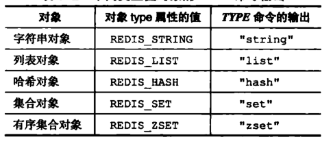
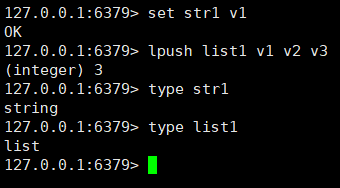
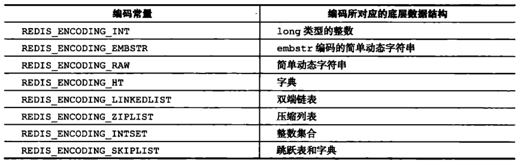
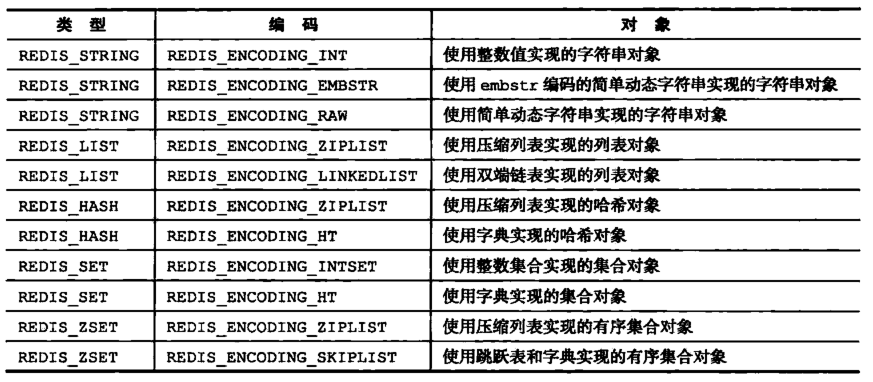

# 字节跳动面试题收集-Java后台

## 一、Java基础与设计模式

### 集合结构

#### HashSet相关：

##### HashSet底层实现：

实现了Set接口，仅存储对象V，使用成员对象计算hashcode值。

#### HashMap相关

##### HashMap底层实现：

实现了Map接口，非同步/线程不安全，与之对比，hashtable（默认容量11）线程安全但代价巨大，锁表。JDK1.7以前：**数组+链表**，1.8以后：**数组+链表+红黑树**（超8树化），默认entry length=16，loadfactor=0.75，允许一个null的K（0地址节点）、多个null的V，扩容时entry翻倍。

- put 方法：**首先**判断key是否为null，如果key==null ,放置在Entry[]的0号位置。**其次**通过计算hash值确定key在Entry[]数组的存储位置，调用indexFor()方法判断该位置上是否已有元素：**如果已经有元素存在**，则遍历该Entry[]数组位置上的单链表，判断key是否存在，如果key已经存在，则用新的value值，替换点旧的value值，并将旧的value值返回；**如果key不存在于HashMap中**，程序继续向下执行。将key-vlaue, 生成Entry实体，添加到HashMap中的Entry[]数组中。
- get方法：**首先**判断key是否为null，如果key==null，用getForNullKey()方法取放置在Entry[]的0号位置。**其次**进入getEntry(key)方法计算hash值，**然后**调用indexFor()方法得到该key在table中的存储位置，得到该位置的单链表，遍历列表找到key和指定key内容相等的Entry，返回entry.value值。
- remove方法：**首先**计算指定key的hash值，计算出table中的存储位置，**然后**判断当前位置是否Entry实体存在，如果没有直接返回，若当前位置有Entry实体存在，则开始遍历列表。
- containsKey：**首先**计算hash，使用hash和table.length取模得到index值，**然后**遍历table[index]元素查找是否包含key相同的值。

##### ConcurrentHashMap底层实现：

同步/线程安全，在JDK1.7版本中，ConcurrentHashMap的数据结构是由**ReentrantLock+Segment数组+多个HashEntry**组成，Segment数组的意义就是将**一个大的table分割成多个小的table**来进行加锁。JDK1.8的实现已经摒弃了Segment的概念，而是直接用**synchronized+CAS+Node数组+链表+红黑树**的数据结构来实现，并发控制使用Synchronized和CAS来操作，整个看起来就像是优化过且线程安全的HashMap，虽然在JDK1.8中还能看到Segment的数据结构，但是已经简化了属性，只是为了兼容旧版本。Node是ConcurrentHashMap存储结构的基本单元，继承于HashMap中的Entry。初始化操作在put方法中实现，而不是构造函数中实现。

- put方法：**如果**没有初始化就先调用initTable() 方法来进行初始化过程；**如果**没有hash冲突就直接CAS插入；**如果**还在进行扩容操作就先进行扩容；**如果**存在hash冲突，就加锁来保证线程安全，这里有两种情况，一种是链表形式就直接遍历到尾端插入，一种是红黑树就按照红黑树结构插入；**如果**Hash冲突时会形成Node链表，在链表长度超过8，Node数组超过64时会将链表结构转换为红黑树的结构，break再一次进入循环；**如果**添加成功就调用addCount() 方法统计size，并且检查是否需要扩容

- get方法：**首先**计算hash值，定位到该table索引位置，如果是首节点符合就返回；**如果**遇到扩容的时候，会调用标志正在扩容节点ForwardingNode的find方法，查找该节点，匹配就返回；**如果**以上都不符合的话，就往下遍历节点，匹配就返回，否则最后就返回null

  


## 二、Java虚拟机与并发

### 多线程创建

#### Java线程池

##### 四种线程池创建方法

- **newCachedThreadPool **创建一个可缓存线程池，如果线程池长度超过处理需要，可灵活回收空闲线程，若无可回收，则新建线程。

- **newFixedThreadPool**  创建一个定长线程池，可控制线程最大并发数，超出的线程会在队列中等待。

- **newScheduledThreadPool** 创建一个定长线程池，支持定时及周期性任务执行。

- **newSingleThreadExecutor** 创建一个单线程化的线程池，它只会用唯一的工作线程来执行任务，保证所有任务按照指定顺序(FIFO, LIFO, 优先级)执行。

##### 线程池的构造函数有7个参数

分别是corePoolSize、maximumPoolSize、keepAliveTime、unit、workQueue、threadFactory、handler。

- **corePoolSize 线程池核心线程大小**

线程池中会维护一个最小的线程数量，即使这些线程处理空闲状态，他们也不会被销毁，除非设置了allowCoreThreadTimeOut。这里的最小线程数量即是corePoolSize。

- **maximumPoolSize 线程池最大线程数量**

一个任务被提交到线程池后，首先会缓存到工作队列（后面会介绍）中，如果工作队列满了，则会创建一个新线程，然后从工作队列中的取出一个任务交由新线程来处理，而将刚提交的任务放入工作队列。线程池不会无限制的去创建新线程，它会有一个最大线程数量的限制，这个数量即由maximunPoolSize来指定。

- **keepAliveTime 空闲线程存活时间**

一个线程如果处于空闲状态，并且当前的线程数量大于corePoolSize，那么在指定时间后，这个空闲线程会被销毁，这里的指定时间由keepAliveTime来设定

- **unit 空间线程存活时间单位**

keepAliveTime的计量单位

- **workQueue 工作队列**

新任务被提交后，会先进入到此工作队列中，任务调度时再从队列中取出任务。jdk中提供了四种工作队列：

①ArrayBlockingQueue：**基于数组的有界阻塞队列**，按FIFO排序。新任务进来后，会放到该队列的队尾，有界的数组可以防止资源耗尽问题。当线程池中线程数量达到corePoolSize后，再有新任务进来，则会将任务放入该队列的队尾，等待被调度。如果队列已经是满的，则创建一个新线程，**如果线程数量已经达到maxPoolSize，则会执行拒绝策略**。

②LinkedBlockingQuene：**基于链表的无界阻塞队列**（其实最大容量为Interger.MAX），按照FIFO排序。由于该队列的近似无界性，当线程池中线程数量达到corePoolSize后，再有新任务进来，会一直存入该队列，而不会去创建新线程直到maxPoolSize，**因此使用该工作队列时，参数maxPoolSize其实是不起作用的。**

③SynchronousQuene：**不缓存任务的阻塞队列**，生产者放入一个任务必须等消费者取出这个任务。也就是说新任务进来时，不会缓存，而是直接被调度执行该任务，如果没有可用线程，则创建新线程，如果线程数量达到maxPoolSize，则执行拒绝策略。

④PriorityBlockingQueue：**具有优先级的无界阻塞队列**，优先级通过参数Comparator实现。

- **threadFactory 线程工厂**

创建一个新线程时使用的工厂，可以用来设定线程名、是否为daemon线程等等

- **handler 拒绝策略**

当工作队列中的任务已到达最大限制，并且线程池中的线程数量也达到最大限制，这时如果有新任务提交进来，该如何处理呢。jdk中提供了4中拒绝策略：①**CallerRunsPolicy** 该策略下，在调用者线程中直接执行被拒绝任务的run方法，除非线程池已经shutdown，则直接抛弃任务。②**AbortPolicy** 该策略下，直接丢弃任务，并抛出RejectedExecutionException异常。③**DiscardPolicy** 该策略下，直接丢弃任务，什么都不做。④**DiscardOldestPolicy** 该策略下，抛弃进入队列最早的那个任务，然后尝试把这次拒绝的任务放入队列


## 三、SQL与NoSQL

### 1.MySQL

#### MySQL底层实现

##### MySQL引擎MyISAM与InnoDB 的区别

- InnoDB**支持事务**，MyISAM不支持，对于InnoDB每一条SQL语言都默认封装成事务，**自动提交**，这样会影响速度，所以最好把多条SQL语言放在begin和commit之间，组成一个事务； 

- InnoDB**支持外键**，而MyISAM不支持。对一个包含外键的InnoDB表转为MYISAM会失败； 

- InnoDB是**聚集索引**，**使用B+Tree作为索引结构**，数据文件是和（主键）索引**绑在一起的**（表数据文件本身就是按B+Tree组织的一个索引结构），必须要有主键，通过主键索引效率很高。但是辅助索引需要两次查询，先查询到主键，然后再通过主键查询到数据。因此，主键不应该过大，因为主键太大，其他索引也都会很大。**MyISAM是非聚集索引，也是使用B+Tree作为索引结构**，索引和数据文件是分离的，索引保存的是数据文件的指针。主键索引和辅助索引是独立的。

- 也就是说，InnoDB的B+树主键索引的**叶子节点就是数据文件**，辅助**索引的叶子节点是主键的值**；而MyISAM的B+树**主键索引和辅助索引的叶子节点都是数据文件的地址指针**。

- InnoDB**不保存表的具体行数**，执行select count(\*) from table时需要**全表扫描**。而MyISAM用一个变量保存了整个表的行数，执行上述语句时只需要读出该变量即可，速度很快（注意不能加有任何WHERE条件）；

- MyISAM表格可以被压缩后进行查询操作

- InnoDB支持**表、行(默认)级锁**，而MyISAM支持**表级锁**

- InnoDB表**必须有主键**（用户没有指定的话会自己指定或生产一个主键），而Myisam**可以没有**。

- Innodb存储文件有**frm、ibd**，frm是表定义文件，ibd是数据文件。而Myisam是**frm、MYD、MYI**，frm是表定义文件，myd是数据文件，myi是索引文件。

- **如果表中绝大多数都只是读查询，可以考虑MyISAM，如果既有读也有写，请使用InnoDB。**

- **InnoDB为什么推荐使用自增ID作为主键？**

    答：自增ID可以保证每次插入时B+索引是**从右边扩展的**，可以避免B+树的**频繁合并和分裂**（对比使用UUID）。如果使用字符串主键和随机主键，会使得数据随机插入，效率比较差。

  

  

##### 为什么Mysql用B+树做索引而不用B树

简单来讲

- 首先B树的所有节点都存储数据信息，而B+ 树的所有数据都存储在叶子节点，B+ 树是在B树的基础上的**一种优化**，使其更加适合**外存储索引结构**，InnoDB存储引擎使用B+ 树实现其索引结构。

- B树每个节点中不仅包含数据的**Key值**，还有**data值**，而每一页的存储空间是有限的，如果data数据较大时会导致每一个节点（也就是每一页）**能存储的key的数量很小**，当存储的数据量很大时同时会导致B树的**深度很深**增大磁盘的IO次数，进而影响查询效率，
- 在B+树中，所有数据data节点都是按照**键值大小顺序存放在同一层的叶子节点上**，而非叶子节点上只存储Key值信息和索引，这样可以大大增加每个节点存储的key值数量，降低B+树的高度

复杂来说：

- 应该知道B-树和B+树最重要的一个区别就是**B+树只有叶节点存放数据，其余节点用来索引**，而B-树是每个索引节点都会有Data域。这就决定了B+树**更适合用来存储外部数据**，也就是的**磁盘数据**。从Inoodb的角度来看，B+树一般来说索引非常大，尤其是关系数据库这种数据量大的索引能达到亿级别，所以为了**减少内存的占用**，索引也会被存储在磁盘上。
- B-树（B类树）的特定就是每层节点数目非常多，层数很少，目的本身是为了减少磁盘IO次数，但是B-树的每个节点都有data域（指针），这无疑增大了节点大小，说白了查询时反而增加了磁盘IO次数（磁盘IO一次读出的数据量大小是固定的，单个数据变大，每次读出的就少，IO次数增多），B树在提高了磁盘IO性能的同时**并没有解决元素遍历的效率低下的问题**。正是为了解决这个问题，B+树应运而生。B+树只要遍历叶子节点就可以实现整棵树的遍历。而且在数据库中基于范围的查询是非常频繁的，而B树不支持这样的操作（或者说效率太低）
- **B树相对于红黑树的区别**：在大规模数据存储的时候，红黑树往往出现由于**树的深度过大而造成磁盘IO读写过于频繁**，进而导致效率低下的情况。为什么会出现这样的情况，我们知道要获取磁盘上数据，必须先通过磁盘移动臂移动到数据所在的柱面，然后找到指定盘面，接着旋转盘面找到数据所在的磁道，最后对数据进行读写。磁盘IO代价**主要花费在查找所需的柱面上**，树的深度过大会造成柱面分散，磁盘IO频繁读写，B树可以有多个子女，从几十到上千，可以降低树的高度。

### 2.Redis

#### 1.Redis的基本数据结构

##### 1.Redis对象的类型与编码

Redis使用前面说的五大数据类型来表示键和值，每次在Redis数据库中创建一个键值对时，至少会创建两个对象，一个是键对象，一个是值对象，而Redis中的每个对象都是由 redisObject 结构来表示：

```
typedef struct redisObject{
     //类型
     unsigned type:4;
     //编码
     unsigned encoding:4;
     //指向底层数据结构的指针
     void *ptr;
     //引用计数
     int refcount;
     //记录最后一次被程序访问的时间
     unsigned lru:22;
}robj
```

###### 1.type属性

　　对象的type属性记录了对象的类型，这个类型就是前面讲的五大数据类型：

　　

　　可以通过如下命令来判断对象类型：

```
type key
```

　　

　　注意：在Redis中，键总是一个字符串对象，而值可以是字符串、列表、集合等对象，所以我们通常说的键为字符串键，表示的是这个键对应的值为字符串对象，我们说一个键为集合键时，表示的是这个键对应的值为集合对象。

###### 2.encoding 属性和 *prt 指针

　对象的 prt 指针指向对象底层的数据结构，而数据结构由 encoding 属性来决定。



　　而每种类型的对象都至少使用了两种不同的编码：



　　可以通过如下命令查看值对象的编码：

```
OBJECT ENCODING  key
```

　　比如 string 类型：（可以是 embstr编码的简单字符串或者是 int 整数值实现）

##### 2.Redis有序集合zset的底层实现

###### 1. 编码

zset的编码有**ziplist**和**skiplist**两种。
 底层分别使用**ziplist（压缩链表）**和**skiplist（跳表）**实现。

**什么时候使用ziplist，什么时候使用skiplist？**

当zset满足以下两个条件的时候，使用ziplist：

> 1. 保存的元素少于128个
> 2. 保存的所有元素大小都小于64字节

**不满足这两个条件则使用skiplist。**

 （注意：这两个数值是可以通过`redis.conf`的`zset-max-ziplist-entries` 和 `zset-max-ziplist-value`选项 进行修改。）

###### 2. 实现

- ##### ziplist编码

> 关于什么是ziplist（压缩链表），可以参见这篇文章：[Redis源码分析-压缩列表ziplist](https://www.jianshu.com/p/afaf78aaf615)

ziplist 编码的有序集合对象使用压缩列表作为底层实现，每个集合元素使用两个紧挨在一起的压缩列表节点来保存，第一个节点保存元素的成员，第二个节点保存元素的分值。并且压缩列表内的集合元素按分值从小到大的顺序进行排列，小的放置在靠近表头的位置，大的放置在靠近表尾的位置。


- ##### skiplist编码

skiplist 编码的有序集合对象使用 zet 结构作为底层实现，**一个 zset 结构同时包含一个字典和一个跳表**：

```cpp
typedef struct zset{
     //跳跃表
     zskiplist *zsl;
     //字典
     dict *dice;
} zset;
```

字典的**键保存元素的值**，字典的**值则保存元素的分值**；跳跃表节点的 **object 属性保存元素的成员**，跳跃表节点的 **score 属性保存元素的分值**。

这两种数据结构会**通过指针来共享相同元素的成员和分值**，所以不会产生重复成员和分值，造成内存的浪费。

> **说明**：其实有序集合单独使用字典或跳跃表其中一种数据结构都可以实现，但是这里使用两种数据结构组合起来，原因是假如我们单独使用 字典，虽然能以 O(1) 的时间复杂度查找成员的分值，但是因为字典是以无序的方式来保存集合元素，所以**每次进行范围操作的时候都要进行排序**；假如我们单独使用跳跃表来实现，虽然能执行范围操作，**但是查找操作有 O(1)的复杂度变为了O(logN)**。因此**Redis使用了两种数据结构来共同实现有序集合。**


## 四、网络原理、操作系统

### 1.网络原理

#### TCP三次握手四次挥手

##### TCP的三次握手（Three-Way Handshake）的详解

所谓的三次握手即TCP连接的建立。这个连接必须是一方主动打开，另一方被动打开的。以下为客户端主动发起连接的图解：


握手之前主动打开连接的客户端结束CLOSED阶段，被动打开的服务器端也结束CLOSED阶段，并进入LISTEN阶段。随后开始“三次握手”：

（1）首先客户端向服务器端发送一段TCP报文，其中：

- 标记位为SYN，表示“请求建立新连接”;
- 序号为Seq=X（X一般为1）；
- 随后客户端进入SYN-SENT阶段。

（2）服务器端接收到来自客户端的TCP报文之后，结束LISTEN阶段。并返回一段TCP报文，其中：

- 标志位为SYN和ACK，表示“确认客户端的报文Seq序号有效，服务器能正常接收客户端发送的数据，并同意创建新连接”（即告诉客户端，服务器收到了你的数据）；
- 序号为Seq=y；
- 确认号为Ack=x+1，表示收到客户端的序号Seq并将其值加1作为自己确认号Ack的值；随后服务器端进入SYN-RCVD阶段。

（3）客户端接收到来自服务器端的确认收到数据的TCP报文之后，明确了从客户端到服务器的数据传输是正常的，结束SYN-SENT阶段。并返回最后一段TCP报文。其中：

- 标志位为ACK，表示“确认收到服务器端同意连接的信号”（即告诉服务器，我知道你收到我发的数据了）；
- 序号为Seq=x+1，表示收到服务器端的确认号Ack，并将其值作为自己的序号值；
- 确认号为Ack=y+1，表示收到服务器端序号Seq，并将其值加1作为自己的确认号Ack的值；
- 随后客户端进入ESTABLISHED阶段。

服务器收到来自客户端的“确认收到服务器数据”的TCP报文之后，明确了从服务器到客户端的数据传输是正常的。结束SYN-SENT阶段，进入ESTABLISHED阶段。

在客户端与服务器端传输的TCP报文中，双方的确认号Ack和序号Seq的值，都是在彼此Ack和Seq值的基础上进行计算的，这样做保证了TCP报文传输的连贯性。一旦出现某一方发出的TCP报文丢失，便无法继续"握手"，以此确保了"三次握手"的顺利完成。

此后客户端和服务器端进行正常的数据传输。这就是“三次握手”的过程。

##### **TCP的四次挥手（Four-Way Wavehand）**

所谓的四次挥手即TCP连接的释放(解除)。连接的释放必须是一方**主动释放**，另一方**被动释放**。以下为客户端主动发起释放连接的图解：


挥手之前主动释放连接的客户端结束ESTABLISHED阶段。随后开始“四次挥手”：

（1）**首先客户端想要释放连接，向服务器端发送一段TCP报文**，其中：

- **标记位为FIN**，表示“请求释放连接“；
- 序号为**Seq=U**；
- 随后客户端进入**FIN-WAIT-1阶段**，即半关闭阶段。并且停止在客户端到服务器端方向上发送数据，但是客户端**仍然能接收从服务器端传输过来的数据**。注意：这里**不发送的是正常连接时传输的数据**(非确认报文)，**而不是一切数据**，所以客户端仍然能发送ACK确认报文。

（2）服务器端接收到从客户端发出的TCP报文之后，确认了客户端想要释放连接，随后**服务器端结束ESTABLISHED阶段，进入CLOSE-WAIT阶段（半关闭状态）并返回一段TCP报文**，其中：

- **标记位为ACK**，表示“接收到客户端发送的释放连接的请求”；
- 序号为**Seq=V**；
- 确认号为**Ack=U+1**，表示是在收到客户端报文的基础上，将其序号Seq值加1作为本段报文确认号Ack的值；随后服务器端**开始准备释放服务器端到客户端方向上的连接**。
- 客户端收到从服务器端发出的TCP报文之后，确认了服务器收到了客户端发出的释放连接请求，随后客户端**结束FIN-WAIT-1阶段，进入FIN-WAIT-2阶段**。

前"两次挥手"**既让服务器端知道了客户端想要释放连接，也让客户端知道了服务器端了解了自己想要释放连接的请求**。于是，可以确认关闭客户端到服务器端方向上的连接了

（3）服务器端自从发出ACK确认报文之后，经过**CLOSED-WAIT阶段**，做好了释放服务器端到客户端方向上的连接准备，再次向客户端发出一段TCP报文，其中：

- 标记位为**FIN，ACK**，表示“已经准备好释放连接了”。注意：这里的ACK并不是确认收到服务器端报文的确认报文。
- 序号为**Seq=W**；
- 确认号为**Ack=U+1**；表示是在收到**客户端报文**的基础上，将其序号Seq值加1作为本段报文确认号Ack的值。
- 随后服务器端结束CLOSE-WAIT阶段，**进入LAST-ACK阶段**。并且停止在服务器端到客户端的方向上发送数据，但是服务器端仍然能够**接收从客户端传输过来的数据**。

（4）客户端收到从服务器端发出的TCP报文，确认了服务器端已做好释放连接的准备，**结束FIN-WAIT-2阶段，进入TIME-WAIT阶段**，并向服务器端发送一段报文，其中：

- 标记位为ACK，表示“接收到服务器准备好释放连接的信号”。

- 序号为Seq=U+1；表示是在收到了服务器端报文的基础上，将其确认号Ack值作为本段报文序号的值。

- 确认号为Ack=W+1；表示是在收到了服务器端报文的基础上，将其序号Seq值作为本段报文确认号的值。

  随后客户端开始在TIME-WAIT阶段等待2MSL

**为什么要客户端要等待2MSL呢？**

服务器端收到从客户端发出的TCP报文之后结束LAST-ACK阶段，进入CLOSED阶段。由此正式确认关闭服务器端到客户端方向上的连接。

客户端等待完2MSL之后，结束TIME-WAIT阶段，进入CLOSED阶段，由此完成“四次挥手”。

后“两次挥手”既让客户端知道了服务器端准备好释放连接了，也让服务器端知道了客户端了解了自己准备好释放连接了。于是，可以确认关闭服务器端到客户端方向上的连接了，由此完成“四次挥手”。

与“三次挥手”一样，在客户端与服务器端传输的TCP报文中，双方的确认号Ack和序号Seq的值，都是在彼此Ack和Seq值的基础上进行计算的，这样做保证了TCP报文传输的连贯性，一旦出现某一方发出的TCP报文丢失，便无法继续"挥手"，以此确保了"四次挥手"的顺利完成。

## 五、容器、分布式、消息队列

## 六、算法题-表、树、排序

## 七、算法题-贪心、动规

## 八、算法题-智力