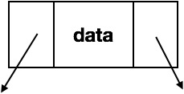
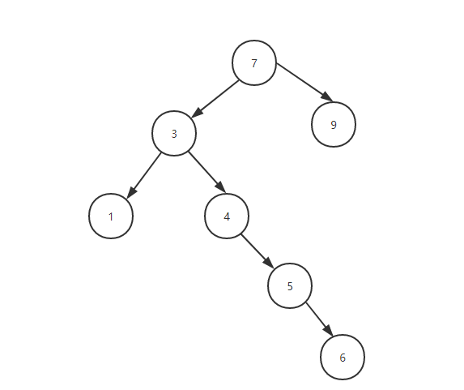
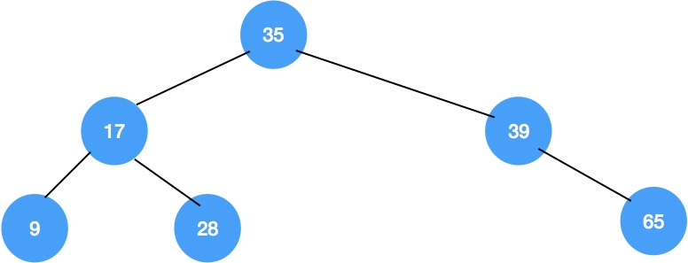
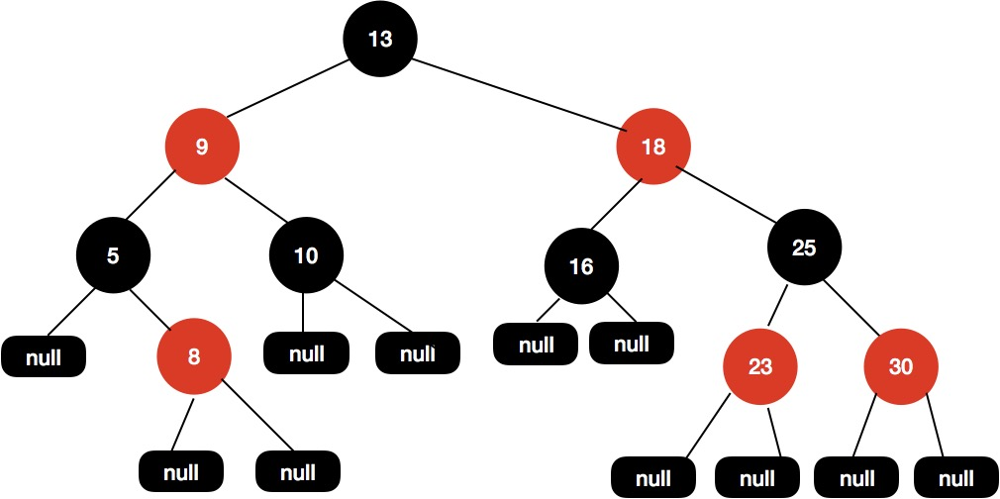
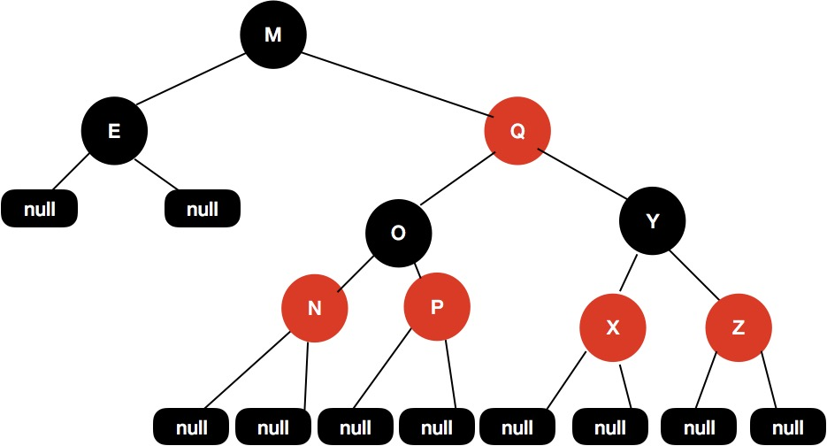

# 一、递归算法分析

### 递归的三大要素

**第一要素：明确你这个函数想要干什么**

对于递归，我觉得很重要的一个事就是，**这个函数的功能是什么**，他要完成什么样的一件事，而这个，是完全由你自己来定义的。也就是说，我们先不管函数里面的代码什么，而是要先明白，你这个函数是要用来干什么。

例如，我定义了一个函数

```
1// 算 n 的阶乘(假设n不为0)
2int f(int n){
3
4}
```

这个函数的功能是算 n 的阶乘。好了，我们已经定义了一个函数，并且定义了它的功能是什么，接下来我们看第二要素。

**第二要素：寻找递归结束条件**

所谓递归，就是会在函数内部代码中，调用这个函数本身，所以，我们必须要找出**递归的结束条件**，不然的话，会一直调用自己，进入无底洞。也就是说，我们需要找出**当参数为啥时，递归结束，之后直接把结果返回**，请注意，这个时候我们必须能根据这个参数的值，能够**直接**知道函数的结果是什么。

例如，上面那个例子，当 n = 1 时，那你应该能够直接知道 f(n) 是啥吧？此时，f(1) = 1。完善我们函数内部的代码，把第二要素加进代码里面，如下

```
1// 算 n 的阶乘(假设n不为0)
2int f(int n){
3    if(n == 1){
4        return 1;
5    }
6}
```

有人可能会说，当 n = 2 时，那我们可以直接知道 f(n) 等于多少啊，那我可以把 n = 2 作为递归的结束条件吗？

当然可以，只要你觉得参数是什么时，你能够直接知道函数的结果，那么你就可以把这个参数作为结束的条件，所以下面这段代码也是可以的。

```
1// 算 n 的阶乘(假设n>=2)
2int f(int n){
3    if(n == 2){
4        return 2;
5    }
6}
```

注意我代码里面写的注释，假设 n >= 2，因为如果 n = 1时，会被漏掉，当 n <= 2时，f(n) = n，所以为了更加严谨，我们可以写成这样：

```
1// 算 n 的阶乘(假设n不为0)
2int f(int n){
3    if(n <= 2){
4        return n;
5    }
6}
```

**第三要素：找出函数的等价关系式**

第三要素就是，我们要**不断缩小参数的范围**，缩小之后，我们可以通过一些辅助的变量或者操作，使原函数的结果不变。

例如，f(n) 这个范围比较大，我们可以让 f(n) = n * f(n-1)。这样，范围就由 n 变成了 n-1 了，范围变小了，并且为了原函数f(n) 不变，我们需要让 f(n-1) 乘以 n。

说白了，就是要找到原函数的一个等价关系式，f(n) 的等价关系式为 n * f(n-1)，即

f(n) = n * f(n-1)。

> 这个等价关系式的寻找，可以说是最难的一步了，如果你不大懂也没关系，因为你不是天才，你还需要多接触几道题，**我会在接下来的文章中，找 10 道递归题，让你慢慢熟悉起来**。

找出了这个等价，继续完善我们的代码，我们把这个等价式写进函数里。如下：

```
1// 算 n 的阶乘(假设n不为0)
2int f(int n){
3    if(n <= 2){
4        return n;
5    }
6    // 把 f(n) 的等价操作写进去
7    return f(n-1) * n;
8}
```

至此，递归三要素已经都写进代码里了，所以这个 f(n) 功能的内部代码我们已经写好了。


### 案例1：斐波那契数列

> 斐波那契数列的是这样一个数列：1、1、2、3、5、8、13、21、34….，即第一项 f(1) = 1,第二项 f(2) = 1…..,第 n 项目为 f(n) = f(n-1) + f(n-2)。求第 n 项的值是多少。

**1、第一递归函数功能**

假设 f(n) 的功能是求第 n 项的值，代码如下：

```
1int f(int n){
2
3}
```

**2、找出递归结束的条件**

显然，当 n = 1 或者 n = 2 ,我们可以轻易着知道结果 f(1) = f(2) = 1。所以递归结束条件可以为  n <= 2。代码如下：

```
1int f(int n){
2    if(n <= 2){
3        return 1;
4    }
5}
```

**第三要素：找出函数的等价关系式**

题目已经把等价关系式给我们了，所以我们很容易就能够知道 f(n) = f(n-1) + f(n-2)。我说过，等价关系式是最难找的一个，而这个题目却把关系式给我们了，这也太容易，好吧，我这是为了兼顾几乎零基础的读者。

所以最终代码如下：

```java
1int f(int n){
2    // 1.先写递归结束条件
3    if(n <= 2){
4        return n;
5    }
6    // 2.接着写等价关系式
7    return f(n-1) + f(n - 2);
8}
```


### 案例3：反转单链表。

> 反转单链表。例如链表为：1->2->3->4。反转后为 4->3->2->1

链表的节点定义如下：

```
1class Node{
2    int date;
3    Node next;
4}
```

虽然是 Java语言，但就算你没学过 Java，我觉得也是影响不大，能看懂。

还是老套路，三要素一步一步来。

**1、定义递归函数功能**

假设函数 reverseList(head) 的功能是反转单链表，其中 head 表示链表的头节点。代码如下：

```
1Node reverseList(Node head){
2
3}
```

**2. 寻找结束条件**

当链表只有一个节点，或者如果是空表的话，你应该知道结果吧？直接啥也不用干，直接把 head 返回呗。代码如下：

```
1Node reverseList(Node head){
2    if(head == null || head.next == null){
3        return head;
4    }
5}
```

**3. 寻找等价关系**

这个的等价关系不像 n 是个数值那样，比较容易寻找。但是我告诉你，它的等价条件中，一定是范围不断在缩小，对于链表来说，就是链表的节点个数不断在变小，所以，如果你实在找不出，你就先对 reverseList(head.next) 递归走一遍，看看结果是咋样的。

我们就缩小范围，先对 2->3->4递归下试试，即代码如下

```
1Node reverseList(Node head){
2    if(head == null || head.next == null){
3        return head;
4    }
5    // 我们先把递归的结果保存起来，先不返回，因为我们还不清楚这样递归是对还是错。，
6    Node newList = reverseList(head.next);
7}
```

我们在第一步的时候，就已经定义了 reverseLis t函数的功能可以把一个单链表反转，所以，我们对 2->3->4反转之后的结果应该是这样：


我们把 2->3->4 递归成 4->3->2。不过，1 这个节点我们并没有去碰它，所以 1 的 next 节点仍然是连接这 2。

接下来呢？该怎么办？

其实，接下来就简单了，我们接下来只需要**把节点 2 的 next 指向 1，然后把 1 的 next 指向 null,不就行了？**，即通过改变 newList 链表之后的结果如下：

也就是说，reverseList(head) 等价于 ** reverseList(head.next)** + **改变一下1，2两个节点的指向**。好了，等价关系找出来了，代码如下(有详细的解释)：

```
 1//用递归的方法反转链表
 2public static Node reverseList2(Node head){
 3    // 1.递归结束条件
 4    if (head == null || head.next == null) {
 5             return head;
 6         }
 7         // 递归反转 子链表
 8         Node newList = reverseList2(head.next);
 9         // 改变 1，2节点的指向。
10         // 通过 head.next获取节点2
11         Node t1  = head.next;
12         // 让 2 的 next 指向 2
13         t1.next = head;
14         // 1 的 next 指向 null.
15        head.next = null;
16        // 把调整之后的链表返回。
17        return newList;
18    }
```

这道题的第三步看的很懵？正常，因为你做的太少了，可能没有想到还可以这样，多练几道就可以了。但是，我希望通过这三道题，给了你以后用递归做题时的一些思路，你以后做题可以按照我这个模式去想。通过一篇文章是不可能掌握递归的，还得多练，我相信，只要你认真看我的这篇文章，多看几次，一定能找到一些思路！！


### 有关递归的一些优化思路

**1. 考虑是否重复计算**

告诉你吧，如果你使用递归的时候不进行优化，是有非常非常非常多的**子问题**被重复计算的。

> 啥是子问题？ f(n-1),f(n-2)….就是 f(n) 的子问题了。

例如对于案例2那道题，f(n) = f(n-1) + f(n-2)。

递归计算的时候，重复计算了两次 f(5)，五次 f(4)。。。。这是非常恐怖的，n 越大，重复计算的就越多，所以我们必须进行优化。

如何优化？一般我们可以把我们计算的结果保证起来，例如把 f(4) 的计算结果保证起来，当再次要计算 f(4) 的时候，我们先判断一下，之前是否计算过，如果计算过，直接把 f(4) 的结果取出来就可以了，没有计算过的话，再递归计算。

用什么保存呢？可以用数组或者 HashMap 保存，我们用数组来保存把，把 n 作为我们的数组下标，f(n) 作为值，例如 arr[n] = f(n)。f(n) 还没有计算过的时候，我们让 arr[n] 等于一个特殊值，例如 arr[n] = -1。

当我们要判断的时候，如果 arr[n] = -1，则证明 f(n) 没有计算过，否则， f(n) 就已经计算过了，且 f(n) = arr[n]。直接把值取出来就行了。代码如下：

```
 1// 我们实现假定 arr 数组已经初始化好的了。
 2int f(int n){
 3    if(n <= 1){
 4        return n;
 5    }
 6    //先判断有没计算过
 7    if(arr[n] != -1){
 8        //计算过，直接返回
 9        return arr[n];
10    }else{
11        // 没有计算过，递归计算,并且把结果保存到 arr数组里
12        arr[n] = f(n-1) + f(n-1);
13        reutrn arr[n];
14    }
15}
```

也就是说，使用递归的时候，必要
须要考虑有没有重复计算，如果重复计算了，一定要把计算过的状态保存起来。

**2. 考虑是否可以自底向上**

对于递归的问题，我们一般都是**从上往下递归**的，直到递归到最底，再一层一层着把值返回。

不过，有时候当 n 比较大的时候，例如当 n = 10000 时，那么必须要往下递归10000层直到 n <=1 才将结果慢慢返回，如果n太大的话，可能栈空间会不够用。

对于这种情况，其实我们是可以考虑自底向上的做法的。例如我知道

f(1) = 1;

f(2) = 2;

那么我们就可以推出 f(3) = f(2) + f(1) = 3。从而可以推出f(4),f(5)等直到f(n)。因此，我们可以考虑使用自底向上的方法来取代递归，代码如下：

```
 1public int f(int n) {
 2       if(n <= 2)
 3           return n;
 4       int f1 = 1;
 5       int f2 = 2;
 6       int sum = 0;
 7
 8       for (int i = 3; i <= n; i++) {
 9           sum = f1 + f2;
10           f1 = f2;
11           f2 = sum;
12       }
13       return sum;
14   }
```

这种方法，其实也被称之为**递推**。


# 二、动态规划算法分析

**第一步骤**：定义**数组元素的含义**，上面说了，我们会用一个数组，来保存历史数组，假设用一维数组 dp[] 吧。这个时候有一个非常非常重要的点，就是规定你这个数组元素的含义，例如你的 dp[i] 是代表什么意思？

**第二步骤**：找出**数组元素之间的关系式**，我觉得动态规划，还是有一点类似于我们高中学习时的**归纳法**的，当我们要计算 dp[n] 时，是可以利用 dp[n-1]，dp[n-2]…dp[1]，来推出 dp[n] 的，也就是可以利用**历史数据**来推出新的元素值，所以我们要找出数组元素之间的关系式，例如 dp[n] = dp[n-1] + dp[n-2]，这个就是他们的关系式了。而这一步，也是最难的一步，后面我会讲几种类型的题来说。

> 学过动态规划的可能都经常听到**最优子结构**，把大的问题拆分成小的问题，说时候，最开始的时候，我是对**最优子结构**一梦懵逼的。估计你们也听多了，所以这一次，我将**换一种形式来讲，不再是各种子问题，各种最优子结构**。所以大佬可别喷我再乱讲，因为我说了，这是我自己平时做题的套路。

**第三步骤**：找出**初始值**。学过**数学归纳法**的都知道，虽然我们知道了数组元素之间的关系式，例如 dp[n] = dp[n-1] + dp[n-2]，我们可以通过 dp[n-1] 和 dp[n-2] 来计算 dp[n]，但是，我们得知道初始值啊，例如一直推下去的话，会由 dp[3] = dp[2] + dp[1]。而 dp[2] 和 dp[1] 是不能再分解的了，所以我们必须要能够直接获得 dp[2] 和 dp[1] 的值，而这，就是**所谓的初始值**。

由了**初始值**，并且有了**数组元素之间的关系式**，那么我们就可以得到 dp[n] 的值了，而 dp[n] 的含义是由你来定义的，你想**求什么，就定义它是什么**，这样，这道题也就解出来了。


### 案例一.简单的一维 DP

> 问题描述：一只青蛙一次可以跳上1级台阶，也可以跳上2级。求该青蛙跳上一个n级的台阶总共有多少种跳法。

##### （1）、定义数组元素的含义

按我上面的步骤说的，首先我们来定义 dp[i] 的含义，我们的问题是要求青蛙跳上 n 级的台阶总共由多少种跳法，那我们就定义 dp[i] 的含义为：**跳上一个 i 级的台阶总共有 dp[i] 种跳法**。这样，如果我们能够算出 dp[n]，不就是我们要求的答案吗？所以第一步定义完成。

##### （2）、找出数组元素间的关系式

我们的目的是要求 dp[n]，动态规划的题，如你们经常听说的那样，就是把一个**规模**比较大的问题分成几个**规模**比较小的问题，然后由小的问题推导出大的问题。也就是说，dp[n] 的规模为 n，比它规模小的是 n-1, n-2, n-3… 也就是说，dp[n] 一定会和 dp[n-1], dp[n-2]…存在某种关系的。我们要找出他们的关系。

**那么问题来了，怎么找？**

这个怎么找，**是最核心最难的一个**，我们必须回到问题本身来了，来寻找他们的关系式，dp[n] 究竟会等于什么呢？

对于这道题，由于情况可以选择跳一级，也可以选择跳两级，所以青蛙到达第 n 级的台阶有两种方式

一种是从第 n-1 级跳上来

一种是从第 n-2 级跳上来

由于我们是要算**所有可能的跳法的**，所以有 dp[n] = dp[n-1] + dp[n-2]。

##### （3）、找出初始条件

当 n = 1 时，dp[1] = dp[0] + dp[-1]，而我们是数组是不允许下标为负数的，所以对于 dp[1]，我们必须要**直接给出它的数值**，相当于初始值，显然，dp[1] = 1。一样，dp[0] = 0.（因为 0 个台阶，那肯定是 0 种跳法了）。于是得出初始值：dp[0] = 0. dp[1] = 1.即 n <= 1 时，dp[n] = n.（**这也就是初始条件，必须提前判断**）

三个步骤都做出来了，那么我们就来写代码吧，代码会详细注释滴。

```java
int f( int n ){
	if(n <= 1)
	return n;
	// 先创建一个数组来保存历史数据
	int[] dp = new int[n+1];
	// 给出初始值
	dp[0] = 0;
	dp[1] = 1;
	// 通过关系式来计算出 dp[n]
	for(int i = 2; i <= n; i++){
		dp[i] = dp[i-1] + dp[i-2];
	}
	// 把最终结果返回
	return dp[n];
}
```

##### （4）、再说初始化

大家先想以下，你觉得，上面的代码有没有问题？

​		是错的，错在**对初始值的寻找不够严谨**，这也是我故意这样弄的，意在告诉你们，关于**初始值的严谨性**。例如对于上面的题，当 n = 2 时，dp[2] = dp[1] + dp[0] = 1。这显然是错误的，你可以模拟一下，应该是 dp[2] = 2。也就是说，在寻找初始值的时候，一定要注意不要找漏了，dp[2] 也算是一个初始值，不能通过公式计算得出。


### 案例二：二维数组的 DP

我做了几十道 DP 的算法题，可以说，80% 的题，都是要用二维数组的，所以下面的题主要以二维数组为主，当然有人可能会说，要用一维还是二维，我怎么知道？这个问题不大，接着往下看。

##### 问题描述

一个机器人位于一个 m x n 网格的左上角 （起始点在下图中标记为“Start” ）。

机器人每次只能向下或者向右移动一步。机器人试图达到网格的右下角（在下图中标记为“Finish”）。

问总共有多少条不同的路径？


> 这是 leetcode 的 62 号题：https://leetcode-cn.com/problems/unique-paths/

还是老样子，三个步骤来解决。

##### 步骤一、定义数组元素的含义

由于我们的目的是从左上角到右下角一共有多少种路径，那我们就定义 dp[i] [j]的含义为：**当机器人从左上角走到(i, j) 这个位置时，一共有 dp[i] [j] 种路径**。那么，dp[m-1] [n-1] 就是我们要的答案了。

> 注意，这个网格相当于一个二维数组，数组是从下标为 0 开始算起的，所以 右下角的位置是 (m-1, n - 1)，所以 dp[m-1] [n-1] 就是我们要找的答案。

##### 步骤二：找出关系数组元素间的关系式

想象以下，机器人要怎么样才能到达 (i, j) 这个位置？由于机器人可以向下走或者向右走，所以有两种方式到达

一种是从 (i-1, j) 这个位置走一步到达

一种是从(i, j - 1) 这个位置走一步到达

因为是计算所有可能的步骤，所以是把所有可能走的路径都加起来，所以关系式是 dp[i] [j] = dp[i-1] [j] + dp[i] [j-1]。

##### 步骤三、找出初始值

显然，当 dp[i] [j] 中，如果 i 或者 j 有一个为 0，那么还能使用关系式吗？答是不能的，因为这个时候把 i - 1 或者 j - 1，就变成负数了，数组就会出问题了，所以我们的初始值是计算出所有的 dp[0] [0….n-1] 和所有的 dp[0….m-1] [0]。这个还是非常容易计算的，相当于计算机图中的最上面一行和左边一列。因此初始值如下：

dp[0] [0….n-1] = 1; // 相当于最上面一行，机器人只能一直往左走

dp[0…m-1] [0] = 1; // 相当于最左面一列，机器人只能一直往下走

##### 撸代码

三个步骤都写出来了，直接看代码

```java
public static int uniquePaths(int m, int n) {
    if (m <= 0 || n <= 0) {
        return 0;
    }

    int[][] dp = new int[m][n]; // 
    // 初始化
    for(int i = 0; i < m; i++){
      dp[i][0] = 1;
    }
    for(int i = 0; i < n; i++){
      dp[0][i] = 1;
    }
    // 推导出 dp[m-1][n-1]
    for (int i = 1; i < m; i++) {
        for (int j = 1; j < n; j++) {
            dp[i][j] = dp[i-1][j] + dp[i][j-1];
        }
    }
    return dp[m-1][n-1];
}
```

> O(n*m) 的空间复杂度可以优化成 O(min(n, m)) 的空间复杂度的。


### 案例三、二维数组 DP

下面这道题也不难，比上面的难一丢丢，不过也是非常类似

##### 问题描述

给定一个包含非负整数的 *m* x *n* 网格，请找出一条从左上角到右下角的路径，使得路径上的数字总和为最小。

**说明：**每次只能向下或者向右移动一步。

```
举例：
输入:
arr = [
  [1,3,1],
  [1,5,1],
  [4,2,1]
]
输出: 7
解释: 因为路径 1→3→1→1→1 的总和最小。
```

和上面的差不多，不过是算最优路径和，这是 leetcode 的第64题：https://leetcode-cn.com/problems/minimum-path-sum/

> 还是老样子，可能有些人都看烦了，哈哈，但我还是要按照步骤来写，让那些不大懂的加深理解。有人可能觉得，这些题太简单了吧，别慌，小白先入门，这些属于 medium 级别的，后面在给几道 hard 级别的。

##### 步骤一、定义数组元素的含义

由于我们的目的是从左上角到右下角，最小路径和是多少，那我们就定义 dp[i] [j]的含义为：**当机器人从左上角走到(i, j) 这个位置时，最下的路径和是 dp[i] [j]**。那么，dp[m-1] [n-1] 就是我们要的答案了。

> 注意，这个网格相当于一个二维数组，数组是从下标为 0 开始算起的，所以 由下角的位置是 (m-1, n - 1)，所以 dp[m-1] [n-1] 就是我们要走的答案。

##### 步骤二：找出关系数组元素间的关系式

想象以下，机器人要怎么样才能到达 (i, j) 这个位置？由于机器人可以向下走或者向右走，所以有两种方式到达

一种是从 (i-1, j) 这个位置走一步到达

一种是从(i, j - 1) 这个位置走一步到达

不过这次不是计算所有可能路径，而是**计算哪一个路径和是最小的**，那么我们要从这两种方式中，选择一种，使得dp[i] [j] 的值是最小的，显然有

```Java
dp[i] [j] = min(dp[i-1][j]，dp[i][j-1]) + arr[i][j];// arr[i][j] 表示网格中的值
1
```

##### 步骤三、找出初始值

显然，当 dp[i] [j] 中，如果 i 或者 j 有一个为 0，那么还能使用关系式吗？答是不能的，因为这个时候把 i - 1 或者 j - 1，就变成负数了，数组就会出问题了，所以我们的初始值是计算出所有的 dp[0] [0….n-1] 和所有的 dp[0….m-1] [0]。这个还是非常容易计算的，相当于计算机图中的最上面一行和左边一列。因此初始值如下：

dp[0] [j] = arr[0] [j] + dp[0] [j-1]; // 相当于最上面一行，机器人只能一直往左走

dp[i] [0] = arr[i] [0] + dp[i] [0]; // 相当于最左面一列，机器人只能一直往下走

##### 代码如下

```java
public static int uniquePaths(int[][] arr) {
    int m = arr.length;
    int n = arr[0].length;
    if (m <= 0 || n <= 0) {     //边界条件
        return 0;
    }

    int[][] dp = new int[m][n]; // 
    // 初始化
    dp[0][0] = arr[0][0];       //初始位置，其余值都要用到这个值
    // 初始化最左边的列
    for(int i = 1; i < m; i++){ //第一列的每个初值
      dp[i][0] = dp[i-1][0] + arr[i][0];
    }
    // 初始化最上边的行
    for(int i = 1; i < n; i++){ //第一行的每个初值
      dp[0][i] = dp[0][i-1] + arr[0][i];
    }
    // 推导出 dp[m-1][n-1]    推导公式要灵活掌握
    for (int i = 1; i < m; i++) {
        for (int j = 1; j < n; j++) {
            dp[i][j] = Math.min(dp[i-1][j], dp[i][j-1]) + arr[i][j]; //灵活使用min函数，未优化的动态规划方法
        }
    }
    return dp[m-1][n-1];
}
```

> O(n*m) 的空间复杂度可以优化成 O(min(n, m)) 的空间复杂度的，不过这里先不讲


### 案例 4：编辑距离

这次给的这道题比上面的难一些，在 leetcdoe 的定位是 hard 级别。好像是 leetcode 的第 72 号题。

**问题描述**

给定两个单词 word1 和 word2，计算出将 word1 转换成 word2 所使用的最少操作数 。

你可以对一个单词进行如下三种操作：

插入一个字符
删除一个字符
替换一个字符

```示例
输入: word1 = "horse", word2 = "ros"
输出: 3
解释: 
horse -> rorse (将 'h' 替换为 'r')
rorse -> rose (删除 'r')
rose -> ros (删除 'e')
123456
```

**解答**

还是老样子，按照上面三个步骤来，并且我这里可以告诉你，90% 的字符串问题都可以用动态规划解决，并且90%是采用二维数组。

##### 步骤一、定义数组元素的含义

由于我们的目的求将 word1 转换成 word2 所使用的最少操作数 。那我们就定义 dp[i] [j]的含义为：**当字符串 word1 的长度为 i，字符串 word2 的长度为 j 时，将 word1 转化为 word2 所使用的最少操作次数为 dp[i] [j]**。

> 有时候，数组的含义并不容易找，所以还是那句话，我给你们一个套路，剩下的还得看你们去领悟。

##### 步骤二：找出关系数组元素间的关系式

接下来我们就要找 dp[i] [j] 元素之间的关系了，比起其他题，这道题相对比较难找一点，但是，不管多难找，大部分情况下，dp[i] [j] 和 dp[i-1] [j]、dp[i] [j-1]、dp[i-1] [j-1] 肯定存在某种关系。因为我们的目标就是，**从规模小的，通过一些操作，推导出规模大的**。对于这道题，我们可以对 word1 进行三种操作

插入一个字符
删除一个字符
替换一个字符

由于我们是要让操作的次数最小，所以我们要寻找最佳操作。那么有如下关系式：

一、如果我们 word1[i] 与 word2 [j] 相等，这个时候不需要进行任何操作，显然有 dp[i] [j] = dp[i-1] [j-1]。（别忘了 dp[i] [j] 的含义哈）。

二、如果我们 word1[i] 与 word2 [j] 不相等，这个时候我们就必须进行调整，而调整的操作有 3 种，我们要选择一种。三种操作对应的关系试如下（注意字符串与字符的区别）：

（1）、如果把字符 word1[i] 替换成与 word2[j] 相等，则有 dp[i] [j] = dp[i-1] [j-1] + 1;

（2）、如果在字符串 word1末尾插入一个与 word2[j] 相等的字符，则有 dp[i] [j] = dp[i] [j-1] + 1;

（3）、如果把字符 word1[i] 删除，则有 dp[i] [j] = dp[i-1] [j] + 1;

那么我们应该选择一种操作，使得 dp[i] [j] 的值最小，显然有

**dp[i] [j] = min(dp[i-1] [j-1]，dp[i] [j-1]，dp[[i-1] [j]]) + 1;**

于是，我们的关系式就推出来了，

##### 步骤三、找出初始值

显然，当 dp[i] [j] 中，如果 i 或者 j 有一个为 0，那么还能使用关系式吗？答是不能的，因为这个时候把 i - 1 或者 j - 1，就变成负数了，数组就会出问题了，所以我们的初始值是计算出所有的 dp[0] [0….n] 和所有的 dp[0….m] [0]。这个还是非常容易计算的，因为当有一个字符串的长度为 0 时，转化为另外一个字符串，那就只能一直进行插入或者删除操作了。

##### 代码如下

```java
public int minDistance(String word1, String word2) {
    int n1 = word1.length();
    int n2 = word2.length();
    int[][] dp = new int[n1 + 1][n2 + 1];
    dp[0][0] = 0;
    // dp[0][0...n2]的初始值
    for (int j = 1; j <= n2; j++) 
      dp[0][j] = dp[0][j - 1] + 1;
    // dp[0...n1][0] 的初始值
    for (int i = 1; i <= n1; i++) 
      dp[i][0] = dp[i - 1][0] + 1;
    // 通过公式推出 dp[n1][n2]
    for (int i = 1; i <= n1; i++) {
        for (int j = 1; j <= n2; j++) {
            // 如果 word1[i] 与 word2[j] 相等。第 i 个字符对应下标是 i-1
            if (word1.charAt(i - 1) == word2.charAt(j - 1)){
              p[i][j] = dp[i - 1][j - 1];
            }else {
               dp[i][j] = Math.min(Math.min(dp[i - 1][j - 1], dp[i][j - 1]), dp[i - 1][j]) +  1;
            }         
        }
    }
    return dp[n1][n2];  
}
```

最后说下，如果你要练习，可以去 leetcode，选择动态规划专题，然后连续刷几十道，保证你以后再也不怕动态规划了。当然，遇到很难的，咱还是得挂。

Leetcode 动态规划直达：https://leetcode-cn.com/tag/dynamic-programming/


# 三、排序

#### **冒泡排序**

```java
public void bubbleSort(int array[]) {
		int t = 0;
		for (int i = 0; i < array.length - 1; i++)
			for (int j = 0; j < array.length - 1 - i; j++)
				if (array[j] > array[j + 1]) {
					t = array[j];
					array[j] = array[j + 1];
					array[j + 1] = t;
				}
	}

private static <T extends Comparable<? super T>> void bubbleSort(T[] nums) {
    if (null == nums || nums.length == 0) {
      throw new RuntimeException("数组为null或长度为0");
    }

    T temp = null;
    int length = nums.length;
    //用于标识是否已经将序列排好序
    boolean isOrdered = false;
    for (int i = 0; i < length - 1; i++) {
      //每一趟开始前都假设已经有序
      isOrdered = true;
      for (int j = 0; j < length - 1 - i; j++) {
        if (nums[j].compareTo(nums[j + 1]) > 0) {
          temp = nums[j];
          nums[j] = nums[j + 1];
          nums[j + 1] = temp;
          //如果出现有元素交换，则表明此躺可能没有完成排序
          isOrdered = false;
        }
      }
      //如果当前趟都没有进行元素的交换，证明前面一趟比较已经排好序
      //直接跳出循环
      if (isOrdered) {
        break;
      }
    }
  }
```

 


#### 快速排序

**特点：高效，时间复杂度为nlogn。**
**采用分治法的思想：首先设置一个轴值pivot，然后以这个轴值为划分基准将待排序序列分成比pivot大和比pivot小的两部分，接下来对划分完的子序列进行快排直到子序列为一个元素为止。**

```java
public void quickSort(int array[], int low, int high) {// 传入low=0，high=array.length-1;
		int pivot, p_pos, i, t;// pivot->位索引;p_pos->轴值。
		if (low < high) {
			p_pos = low;
			pivot = array[p_pos];
			for (i = low + 1; i <= high; i++)
				if (array[i] > pivot) {
					p_pos++;
					t = array[p_pos];
					array[p_pos] = array[i];
					array[i] = t;
				}
			t = array[low];
			array[low] = array[p_pos];
			array[p_pos] = t;
			// 分而治之
			quickSort(array, low, p_pos - 1);// 排序左半部分
			quickSort(array, p_pos + 1, high);// 排序右半部分
		}
```


测试demo：

```ruby
import java.util.Arrays;
public class sortTest {
	// 冒泡排序
	public void bubbleSort(int array[]) {
		int t = 0;
		for (int i = 0; i < array.length - 1; i++)
			for (int j = 0; j < array.length - 1 - i; j++)
				if (array[j] > array[j + 1]) {
					t = array[j];
					array[j] = array[j + 1];
					array[j + 1] = t;
				}
	}

	// 选择排序
	public void selectSort(int array[]) {
		int t = 0;
		for (int i = 0; i < array.length - 1; i++){
			int index=i;
			for (int j = i + 1; j < array.length; j++)
				if (array[index] > array[j])
					index=j;
			if(index!=i){ //找到了比array[i]小的则与array[i]交换位置
				t = array[i];
				array[i] = array[index];
				array[index] = t;
			}
		}
	}

public void insertionSort(int array[]) {
		int i, j, t = 0;
		for (i = 1; i < array.length; i++) {
			if(a[i]<a[i-1]){
				t = array[i];
				for (j = i - 1; j >= 0 && t < array[j]; j--)
					array[j + 1] = array[j];
				//插入array[i]
				array[j + 1] = t;
			}
		}
}

	// 分治法快速排序
	public void quickSort(int array[], int low, int high) {// 传入low=0，high=array.length-1;
		int pivot, p_pos, i, t;// pivot->位索引;p_pos->轴值。
		if (low < high) {
			p_pos = low;
			pivot = array[p_pos];
			for (i = low + 1; i <= high; i++)
				if (array[i] > pivot) {
					p_pos++;
					t = array[p_pos];
					array[p_pos] = array[i];
					array[i] = t;
				}
			t = array[low];
			array[low] = array[p_pos];
			array[p_pos] = t;
			// 分而治之
			quickSort(array, low, p_pos - 1);// 排序左半部分
			quickSort(array, p_pos + 1, high);// 排序右半部分
		}
	}

	public static void main(String[] args) {
		// TODO Auto-generated method stub
		int[] array = { 37, 47, 23, 100, 19, 56, 56, 99, 9 };
		sortTest st = new sortTest();
		// st.bubbleSort(array);
		// st.selectSort(array);
		// st.insertionSort(array);
		st.quickSort(array, 0, array.length - 1);
		System.out.println("排序后：" + Arrays.toString(array));
	}
}
```


# 四、二叉排序树与红黑树

讲红黑树之前，我们首先来了解下下面几个概念：**二叉树，排序二叉树以及平衡二叉树**。

#### 一、二叉树

二叉树指的是每个节点最多只能有两个字数的有序树。通常左边的子树称为`左子树` ，右边的子树称为`右子树` 。这里说的有序树强调的是二叉树的左子树和右子树的次序不能随意颠倒。

二叉树简单的示意图如下：



代码定义：

```java
class Node {
    T data;
    Node left;
    Node right;
}
12345
```

#### 二、排序二叉树

所谓排序二叉树，顾名思义，排序二叉树是有顺序的，它是一种特殊结构的二叉树，我们可以对树中所有节点进行排序和检索。

**性质**

- 若它的左子树不空，则左子树上所有节点的值均小于它的根节点的值；
- 若她的右子树不空，则右子树上所有节点的值均大于它的根节点的值；
- 具有递归性，排序二叉树的左子树、右子树也是排序二叉树。

排序二叉树简单示意图：



#### 三、排序二叉树退化成链表

​		排序二叉树的左子树上所有节点的值小于根节点的值，右子树上所有节点的值大于根节点的值，当我们插入一组元素正好是有序的时候，这时会让排序二叉树退化成链表。

​		正常情况下，排序二叉树是如下图这样的：



​		但是，当插入的一组元素正好是有序的时候，排序二叉树就变成了下边这样了，就变成了普通的链表结构，如下图所示:


​		正常情况下的排序二叉树检索效率类似于二分查找，二分查找的时间复杂度为 O(log n)，但是如果排序二叉树退化成链表结构，那么检索效率就变成了线性的 O(n) 的，这样相对于 O(log n) 来说，检索效率肯定是要差不少的。

**思考，二分查找和正常的排序二叉树的时间复杂度都是 O(log n)，那么为什么是O(log n) ？**

​		关于 O(log n) 的分析下面这篇文章讲解的非常好，感兴趣的可以看下这篇文章 [二分查找的时间复杂度](https://github.com/JasonGaoH/KnowledgeSummary/blob/master/Docs/Algorithm/为什么说二分查找的时间复杂度是O(log n).md)，文章是拿二分查找来举例的，二分查找和平衡二叉树的时间复杂度是一样的，理解了二分查找的时间复杂度，再来理解平衡二叉树就不难了，这里就不赘述了。

​		继续回到我们的主题上，为了解决排序二叉树在特殊情况下会退化成链表的问题（链表的检索效率是 O(n) 相对正常二叉树来说要差不少），所以有人发明了`平衡二叉树`和`红黑树`类似的平衡树。

#### 四、平衡二叉树

​		平衡二叉数又被称为 AVL 树，AVL 树的名字来源于它的发明作者 G.M. Adelson-Velsky 和 E.M. Landis，取自两人名字的首字母。

​		官方定义：它或者是一颗空树，或者具有以下性质的排序二叉树：它的左子树和右子树的深度之差(平衡因子)的绝对值不超过1，且它的左子树和右子树都是一颗平衡二叉树。

​		两个条件：

- 平衡二叉树必须是排序二叉树，也就是说平衡二叉树他的左子树所有节点的值必须小于根节点的值，它的右子树上所有节点的值必须大于它的根节点的值。
- 左子树和右子树的深度之差的绝对值不超过1。

#### 五、红黑树

​		讲了这么多概念，接下来主角红黑树终于要上场了。

​		**为什么有红黑树？**

​		其实红黑树和上面的平衡二叉树类似，本质上都是为了解决排序二叉树在极端情况下退化成链表导致检索效率大大降低的问题，红黑树最早是由 Rudolf Bayer 于 1972 年发明的。**红黑树首先肯定是一个排序二叉树**，它在**每个节点上增加了一个存储位来表示节点的颜色**，可以是 RED 或 BLACK 。

​		Java 中实现红黑树大概结构图如下所示：



##### 1.红黑树的特性

- 性质1：每个节点要么是红色，要么是黑色。
- 性质2：根节点永远是黑色的。
- 性质3：所有的叶子节点都是空节点（即null），并且是黑色的。
- 性质4：每个红色节点的两个子节点都是黑色。（从每个叶子到根的路径上不会有两个连续的红色节点。）
- 性质5：从任一节点到其子树中每个叶子节点的路径都包含相同数量的黑色节点。

​        针对上面的 5 种性质，我们简单理解下，**对于性质 1 和性质 2** ，相当于是对红黑树每个节点的约束，根节点是黑色，其他的节点要么是红色，要么是黑色。

​		**对于性质 3** 中指定红黑树的每个叶子节点都是空节点，而且叶子节点都是黑色，但 Java 实现的红黑树会使用 null 来代表空节点，因此我们在遍历 Java里的红黑树的时候会看不到叶子节点，而看到的是每个叶子节点都是红色的，这一点需要注意。

​		**对于性质 5**，这里我们需要注意的是，这里的描述是从任一节点，从任一节点到它的子树的每个叶子节点黑色节点的数量都是相同的，这个数量被称为这个节点的黑高。如果我们从根节点出发到每个叶子节点的路径都包含相同数量的黑色节点，这个黑色节点的数量被称为树的黑色高度。**树的黑色高度和节点的黑色高度是不一样的**，这里要注意区分。

​		其实到这里有人可能会问了，红黑树的性质说了一大堆，那是不是说只要保证红黑树的节点是红黑交替就能保证树是平衡的呢？其实不是这样的，我们可以看来看下面这张图：



​		左边的子树都是黑色节点，但是这个红黑树依然是平衡的，5 条性质它都满足。这个树的黑色高度为 3，从根节点到叶子节点的最短路径长度是 2，该路径上全是黑色节点，包括叶子节点，从根节点到叶子节点最长路径为 4，每个黑色节点之间会插入红色节点。

​		**通过上面的性质 4 和性质 5，其实上保证了没有任何一条路径会比其他路径长出两倍，所以这样的红黑树是平衡的。**其实这算是一个推论，红黑树在**最差情况下**，最长的路径都不会比最短的路径长出两倍。其实红黑树**并不是真正的平衡二叉树**，它只能保证大致是平衡的，因为红黑树的**高度不会无限增高**，在实际应用用，红黑树的统计性能要高于平衡二叉树，但极端性能略差。


##### 2.红黑树的操作

​		红黑树的基本操作和其他树形结构一样，一般都包括查找、插入、删除等操作。前面说到，红黑树是一种自平衡的二叉查找树，既然是二叉查找树的一种，那么**查找过程和二叉查找树一样，比较简单**，这里不再赘述。相对于查找操作，红黑树的插入和删除操作就要复杂的多。尤其是删除操作，要处理的情况比较多，不过大家如果静下心来去看，会发现其实也没想的那么难。

###### 1.旋转操作

​		在分析插入和删除操作前，这里需要插个队，先说明一下旋转操作，这个操作在后续操作中都会用得到。旋转操作分为**左旋和右旋**，左旋是将某个节点旋转为其右孩子的左孩子，而右旋是节点旋转为其左孩子的右孩子。

###### 2.插入操作

​		红黑树的插入过程和二叉查找树插入过程基本类似，不同的地方在于，红黑树插入新节点后，需要**进行调整，以满足红黑树的性质**。性质1规定红黑树节点的颜色要么是红色要么是黑色，那么在插入新节点时，这个节点应该是红色还是黑色呢？**答案是红色**，原因也不难理解。如果插入的节点是黑色，那么这个节点所在路径比其他路径多出一个黑色节点，这个调整起来会比较麻烦（参考红黑树的删除操作，就知道为啥多一个或少一个黑色节点时，调整起来这么麻烦了）。**如果插入的节点是红色，此时所有路径上的黑色节点数量不变**，仅可能会出现两个连续的红色节点的情况。这种情况下，**通过变色和旋转进行调整即可，比之前的简单多了**。

​		首先约定**插入的新节点的颜色都为红色**。然后将该节点插入的按二叉查找树的规则插入到树中。这个节点后文称为N。

1.  **根节点为空**。这种情况，将N的颜色改为黑色即可。
2.  **N的父节点为黑色**。这种情况不需要做修改。
3.  **N的父节点为红色**（根据性质3，**N的祖父节点必为黑色**）。

-   **N的叔父节点为红色**。这种情况，将N的父节点和叔父节点的**颜色都改为黑色**，若祖父节点是跟节点就将其改为黑色，否则将其颜色改为红色，并以祖父节点为插入的目标节点从情况1开始递归检测。


-   **N的叔父节点为黑色， 且N和N的父节点在同一边**（即父节点为祖父的左儿子时，N也是父节点的左儿子。父节点为祖父节点的右儿子时。N也是父节点的右儿子）。以父节点为祖父节的左儿子为例，**将父节点改为黑色，祖父节点改为红色，然后以祖父节点为基准右旋**。（N为父节点右儿子时做相应的左旋。）


-   **N的叔父节点为黑色，切N和N的父节点不在同一边**（即父节点为祖父的左儿子时，N是父节点的右儿子。父节点为祖父节点的右儿子时。N也是父节点左右儿子）。以父节点为祖父节点的左儿子为例。**以父节点为基准，进行左旋，然后以父节点为目标插入节点进入情况3的b情况进行操作**。


###### 3.删除操作

​		删除的节点有两个儿子时，可以**转化为删除的节点只有一个儿子时的问题**。对于二叉查找树，在删除带有两个非叶子儿子的节点的时候，我们找到要么在它的**左子树中的最大元素**、要么在它的**右子树中的最小元素**，并把它的**值转移到要删除的节点中**。接着删除我们从中复制出值的那个节点，它必定有少于两个非叶子的儿子。因为只是复制了一个值，不违反任何性质，这就把问题简化为如何删除最多有一个儿子的节点的问题。它不关心这个节点是最初要删除的节点还是我们从中复制出值的那个节点。

​		那么所有情况都可以转化为删除只有一个儿子的节点的情况，我们约定这个要删除的节点为N（若N“没有”儿子节点，并用他的任意一个为叶子节点的儿子节点顶替即可）

1.  **N为红色节点时**。直接删除N，用它的黑色儿子代替它的位置。
2.  **N为黑色节点，且父节点为红色**。直接删除N，用它的儿子节点代替它的位置，并将该儿子节点改为黑色。
3.  **N为黑色节点，且父节点为黑色**。我们之间删除N，用它的儿子节点代替它，该儿子节点成为N'，将N’的颜色改为黑色。

-   N’的兄弟节点和兄弟节点的2个儿子都为黑色。交换兄弟节点和父节点的颜色即可。


-   N‘的兄弟节点为黑色、且兄弟节点的红色儿子和兄弟节点在一边（即兄弟节点为左儿子时，红色儿子也为左儿子。兄弟节点为右儿子时，红色儿子也为右儿子）。我们以兄弟节点为右儿子为例。将祖父节点和兄弟节点的颜色互换，并将红色右儿子的颜色改为黑色，然后以祖父节点为基准左旋。（若兄弟节点为左儿子，则相应的右旋）


-   N‘的兄弟节点为黑色、且兄弟节点的红儿子和兄弟节点不在一边（即兄弟节点为左儿子时，红色儿子也为右儿子。兄弟节点为右儿子时，红色儿子也为左儿子）。我们以兄弟结点为右儿子为例。将兄弟节点和它的红色儿子的颜色互换，然后以兄弟节点为基准右旋。此时对于N’来说就进入了上文b情况。（若兄弟节点为右儿子，则相应的左旋）


-   N‘的兄弟节点为红色。以兄弟节点为右儿子为例，将父节点和兄弟节点的颜色互换，然后以父节点为基准左旋（若兄弟节点为左儿子则相应的右旋），此N’有一个黑色的兄弟节点，接下来N就可以进入a、b、c三种情况分别操作了。


-   N‘的兄弟节为黑色，父节点也为黑色。此时将兄弟节点的颜色改为红色。然后以父节点为目标插入节点从头开始依次判断。


# 五、位运算技巧

### 判断奇偶数

如果把 n 以二进制的形式展示的话，其实我们只需要判断最后一个二进制位是 1 还是 0 就行了，如果是 1 的话，代表是奇数，如果是 0 则代表是偶数，所以采用位运算的方式的话，代码如下：

```
if(n & 1 == 1){

    // n 是个奇数。 }
```


### 交换两个数

交换两个数相信很多人天天写过，我也相信你每次都会使用一个额外来变量来辅助交换，例如，我们要交换 x 与 y 值，传统代码如下：

```
int tmp = x;
x = y;
y = tmp;
```


这样写有问题吗？没问题，通俗易懂，万一哪天有人要为难你，**不允许你使用额外的辅助变量来完成交换呢？**你还别说，有人面试确实被问过，这个时候，位运算大法就来了。代码如下：

```
x = x ^ y   // （1）
y = x ^ y   // （2）
x = x ^ y   // （3）
```


我靠，牛逼！三个都是 x ^ y，就莫名交换成功了。在此我解释下吧，我们知道，两个相同的数异或之后结果会等于 0，即 n ^ n = 0。并且任何数与 0 异或等于它本身，即 n ^ 0 = n。所以，解释如下：

把（1）中的 x 带入 （2）中的 x，有

y = x^y = (xy)y = x(yy) = x^0 = x。 x 的值成功赋给了 y。

对于（3）,推导如下：

x = x^y = (xy)x = (xx)y = 0^y = y。

这里解释一下，异或运算支持运算的**交换律和结合律**哦。


### 找出没有重复的数

给你一组整型数据，这些数据中，其中有一个数只出现了一次，其他的数都出现了两次，让你来找出一个数 。
这道题可能很多人会用一个哈希表来存储，每次存储的时候，记录 某个数出现的次数，最后再遍历哈希表，看看哪个数只出现了一次。这种方法的时间复杂度为 O(n)，空间复杂度也为 O(n)了。

然而我想告诉你的是，采用位运算来做，绝对高逼格！

我们刚才说过，两个相同的数异或的结果是 0，一个数和 0 异或的结果是它本身，所以我们把这一组整型全部异或一下，例如这组数据是：1， 2， 3， 4， 5， 1， 2， 3， 4。其中 5 只出现了一次，其他都出现了两次，把他们全部异或一下，结果如下：

由于异或支持交换律和结合律，所以:

123451234 = （11)(22)(33)(44)5= 00005 = 5。

也就是说，那些出现了两次的数异或之后会变成0，那个出现一次的数，和 0 异或之后就等于它本身。就问这个解法牛不牛逼？所以代码如下

```
int find(int[] arr){
    int tmp = arr[0];
    for(int i = 1;i < arr.length; i++){
        tmp = tmp ^ arr[i];
    }
    return tmp;
}
```


时间复杂度为 O(n)，空间复杂度为 O(1)，而且看起来很牛逼。


### m的n次方

如果让你求解 m 的 n 次方，并且不能使用系统自带的 pow 函数，你会怎么做呢？这还不简单，连续让 n 个 m 相乘就行了，代码如下：

```
int pow(int n){
    int tmp = 1;
    for(int i = 1; i <= n; i++) {
        tmp = tmp * m;
    }
    return tmp;
}
```


不过你要是这样做的话，我只能呵呵，时间复杂度为 O(n) 了，怕是小学生都会！如果让你用位运算来做，你会怎么做呢？

我举个例子吧，例如 n = 13，则 n 的二进制表示为 1101, 那么 m 的 13 次方可以拆解为:

m^1101 = m^0001 * m^0100 * m^1000。

我们可以通过 & 1和 >>1 来逐位读取 1101，为1时将该位代表的乘数累乘到最终结果。直接看代码吧，反而容易理解：

```
int pow(int n){
    int sum = 1;
    int tmp = m;
    while(n != 0){
        if(n & 1 == 1){
            sum *= tmp;
        }
        tmp *= tmp;
        n = n >> 1;
    }
    return sum;
}
```


时间复杂度近为 O(logn)，而且看起来很牛逼。

这里说一下，位运算很多情况下都是很二进制扯上关系的，所以我们要判断是否是否位运算，很多情况下都会把他们拆分成二进制，然后观察特性，或者就是利用与，或，异或的特性来观察，总之，我觉得多看一些例子，加上自己多动手，就比较容易上手了。所以呢，继续往下看，注意，先别看答案，先看看自己会不会做。