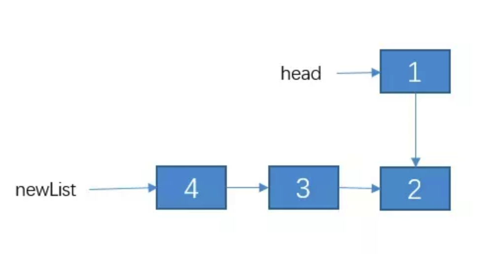
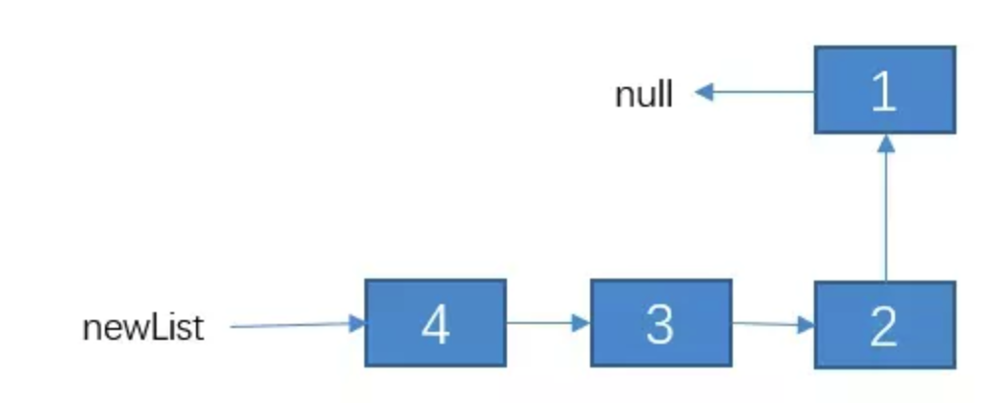

# 递归算法分析

### 递归的三大要素

**第一要素：明确你这个函数想要干什么**

对于递归，我觉得很重要的一个事就是，**这个函数的功能是什么**，他要完成什么样的一件事，而这个，是完全由你自己来定义的。也就是说，我们先不管函数里面的代码什么，而是要先明白，你这个函数是要用来干什么。

例如，我定义了一个函数

```
1// 算 n 的阶乘(假设n不为0)
2int f(int n){
3
4}
```

这个函数的功能是算 n 的阶乘。好了，我们已经定义了一个函数，并且定义了它的功能是什么，接下来我们看第二要素。

**第二要素：寻找递归结束条件**

所谓递归，就是会在函数内部代码中，调用这个函数本身，所以，我们必须要找出**递归的结束条件**，不然的话，会一直调用自己，进入无底洞。也就是说，我们需要找出**当参数为啥时，递归结束，之后直接把结果返回**，请注意，这个时候我们必须能根据这个参数的值，能够**直接**知道函数的结果是什么。

例如，上面那个例子，当 n = 1 时，那你应该能够直接知道 f(n) 是啥吧？此时，f(1) = 1。完善我们函数内部的代码，把第二要素加进代码里面，如下

```
1// 算 n 的阶乘(假设n不为0)
2int f(int n){
3    if(n == 1){
4        return 1;
5    }
6}
```

有人可能会说，当 n = 2 时，那我们可以直接知道 f(n) 等于多少啊，那我可以把 n = 2 作为递归的结束条件吗？

当然可以，只要你觉得参数是什么时，你能够直接知道函数的结果，那么你就可以把这个参数作为结束的条件，所以下面这段代码也是可以的。

```
1// 算 n 的阶乘(假设n>=2)
2int f(int n){
3    if(n == 2){
4        return 2;
5    }
6}
```

注意我代码里面写的注释，假设 n >= 2，因为如果 n = 1时，会被漏掉，当 n <= 2时，f(n) = n，所以为了更加严谨，我们可以写成这样：

```
1// 算 n 的阶乘(假设n不为0)
2int f(int n){
3    if(n <= 2){
4        return n;
5    }
6}
```

**第三要素：找出函数的等价关系式**

第三要素就是，我们要**不断缩小参数的范围**，缩小之后，我们可以通过一些辅助的变量或者操作，使原函数的结果不变。

例如，f(n) 这个范围比较大，我们可以让 f(n) = n * f(n-1)。这样，范围就由 n 变成了 n-1 了，范围变小了，并且为了原函数f(n) 不变，我们需要让 f(n-1) 乘以 n。

说白了，就是要找到原函数的一个等价关系式，f(n) 的等价关系式为 n * f(n-1)，即

f(n) = n * f(n-1)。

> 这个等价关系式的寻找，可以说是最难的一步了，如果你不大懂也没关系，因为你不是天才，你还需要多接触几道题，**我会在接下来的文章中，找 10 道递归题，让你慢慢熟悉起来**。

找出了这个等价，继续完善我们的代码，我们把这个等价式写进函数里。如下：

```
1// 算 n 的阶乘(假设n不为0)
2int f(int n){
3    if(n <= 2){
4        return n;
5    }
6    // 把 f(n) 的等价操作写进去
7    return f(n-1) * n;
8}
```

至此，递归三要素已经都写进代码里了，所以这个 f(n) 功能的内部代码我们已经写好了。


### 案例1：斐波那契数列

> 斐波那契数列的是这样一个数列：1、1、2、3、5、8、13、21、34….，即第一项 f(1) = 1,第二项 f(2) = 1…..,第 n 项目为 f(n) = f(n-1) + f(n-2)。求第 n 项的值是多少。

**1、第一递归函数功能**

假设 f(n) 的功能是求第 n 项的值，代码如下：

```
1int f(int n){
2
3}
```

**2、找出递归结束的条件**

显然，当 n = 1 或者 n = 2 ,我们可以轻易着知道结果 f(1) = f(2) = 1。所以递归结束条件可以为  n <= 2。代码如下：

```
1int f(int n){
2    if(n <= 2){
3        return 1;
4    }
5}
```

**第三要素：找出函数的等价关系式**

题目已经把等价关系式给我们了，所以我们很容易就能够知道 f(n) = f(n-1) + f(n-2)。我说过，等价关系式是最难找的一个，而这个题目却把关系式给我们了，这也太容易，好吧，我这是为了兼顾几乎零基础的读者。

所以最终代码如下：

```java
1int f(int n){
2    // 1.先写递归结束条件
3    if(n <= 2){
4        return n;
5    }
6    // 2.接着写等价关系式
7    return f(n-1) + f(n - 2);
8}
```


### 案例3：反转单链表。

> 反转单链表。例如链表为：1->2->3->4。反转后为 4->3->2->1

链表的节点定义如下：

```
1class Node{
2    int date;
3    Node next;
4}
```

虽然是 Java语言，但就算你没学过 Java，我觉得也是影响不大，能看懂。

还是老套路，三要素一步一步来。

**1、定义递归函数功能**

假设函数 reverseList(head) 的功能是反转单链表，其中 head 表示链表的头节点。代码如下：

```
1Node reverseList(Node head){
2
3}
```

**2. 寻找结束条件**

当链表只有一个节点，或者如果是空表的话，你应该知道结果吧？直接啥也不用干，直接把 head 返回呗。代码如下：

```
1Node reverseList(Node head){
2    if(head == null || head.next == null){
3        return head;
4    }
5}
```

**3. 寻找等价关系**

这个的等价关系不像 n 是个数值那样，比较容易寻找。但是我告诉你，它的等价条件中，一定是范围不断在缩小，对于链表来说，就是链表的节点个数不断在变小，所以，如果你实在找不出，你就先对 reverseList(head.next) 递归走一遍，看看结果是咋样的。

我们就缩小范围，先对 2->3->4递归下试试，即代码如下

```
1Node reverseList(Node head){
2    if(head == null || head.next == null){
3        return head;
4    }
5    // 我们先把递归的结果保存起来，先不返回，因为我们还不清楚这样递归是对还是错。，
6    Node newList = reverseList(head.next);
7}
```

我们在第一步的时候，就已经定义了 reverseLis t函数的功能可以把一个单链表反转，所以，我们对 2->3->4反转之后的结果应该是这样：



我们把 2->3->4 递归成 4->3->2。不过，1 这个节点我们并没有去碰它，所以 1 的 next 节点仍然是连接这 2。

接下来呢？该怎么办？

其实，接下来就简单了，我们接下来只需要**把节点 2 的 next 指向 1，然后把 1 的 next 指向 null,不就行了？**，即通过改变 newList 链表之后的结果如下：

也就是说，reverseList(head) 等价于 ** reverseList(head.next)** + **改变一下1，2两个节点的指向**。好了，等价关系找出来了，代码如下(有详细的解释)：

```
 1//用递归的方法反转链表
 2public static Node reverseList2(Node head){
 3    // 1.递归结束条件
 4    if (head == null || head.next == null) {
 5             return head;
 6         }
 7         // 递归反转 子链表
 8         Node newList = reverseList2(head.next);
 9         // 改变 1，2节点的指向。
10         // 通过 head.next获取节点2
11         Node t1  = head.next;
12         // 让 2 的 next 指向 2
13         t1.next = head;
14         // 1 的 next 指向 null.
15        head.next = null;
16        // 把调整之后的链表返回。
17        return newList;
18    }
```

这道题的第三步看的很懵？正常，因为你做的太少了，可能没有想到还可以这样，多练几道就可以了。但是，我希望通过这三道题，给了你以后用递归做题时的一些思路，你以后做题可以按照我这个模式去想。通过一篇文章是不可能掌握递归的，还得多练，我相信，只要你认真看我的这篇文章，多看几次，一定能找到一些思路！！


### 有关递归的一些优化思路

**1. 考虑是否重复计算**

告诉你吧，如果你使用递归的时候不进行优化，是有非常非常非常多的**子问题**被重复计算的。

> 啥是子问题？ f(n-1),f(n-2)….就是 f(n) 的子问题了。

例如对于案例2那道题，f(n) = f(n-1) + f(n-2)。

递归计算的时候，重复计算了两次 f(5)，五次 f(4)。。。。这是非常恐怖的，n 越大，重复计算的就越多，所以我们必须进行优化。

如何优化？一般我们可以把我们计算的结果保证起来，例如把 f(4) 的计算结果保证起来，当再次要计算 f(4) 的时候，我们先判断一下，之前是否计算过，如果计算过，直接把 f(4) 的结果取出来就可以了，没有计算过的话，再递归计算。

用什么保存呢？可以用数组或者 HashMap 保存，我们用数组来保存把，把 n 作为我们的数组下标，f(n) 作为值，例如 arr[n] = f(n)。f(n) 还没有计算过的时候，我们让 arr[n] 等于一个特殊值，例如 arr[n] = -1。

当我们要判断的时候，如果 arr[n] = -1，则证明 f(n) 没有计算过，否则， f(n) 就已经计算过了，且 f(n) = arr[n]。直接把值取出来就行了。代码如下：

```
 1// 我们实现假定 arr 数组已经初始化好的了。
 2int f(int n){
 3    if(n <= 1){
 4        return n;
 5    }
 6    //先判断有没计算过
 7    if(arr[n] != -1){
 8        //计算过，直接返回
 9        return arr[n];
10    }else{
11        // 没有计算过，递归计算,并且把结果保存到 arr数组里
12        arr[n] = f(n-1) + f(n-1);
13        reutrn arr[n];
14    }
15}
```

也就是说，使用递归的时候，必要
须要考虑有没有重复计算，如果重复计算了，一定要把计算过的状态保存起来。

**2. 考虑是否可以自底向上**

对于递归的问题，我们一般都是**从上往下递归**的，直到递归到最底，再一层一层着把值返回。

不过，有时候当 n 比较大的时候，例如当 n = 10000 时，那么必须要往下递归10000层直到 n <=1 才将结果慢慢返回，如果n太大的话，可能栈空间会不够用。

对于这种情况，其实我们是可以考虑自底向上的做法的。例如我知道

f(1) = 1;

f(2) = 2;

那么我们就可以推出 f(3) = f(2) + f(1) = 3。从而可以推出f(4),f(5)等直到f(n)。因此，我们可以考虑使用自底向上的方法来取代递归，代码如下：

```
 1public int f(int n) {
 2       if(n <= 2)
 3           return n;
 4       int f1 = 1;
 5       int f2 = 2;
 6       int sum = 0;
 7
 8       for (int i = 3; i <= n; i++) {
 9           sum = f1 + f2;
10           f1 = f2;
11           f2 = sum;
12       }
13       return sum;
14   }
```

这种方法，其实也被称之为**递推**。